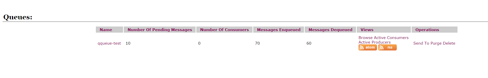
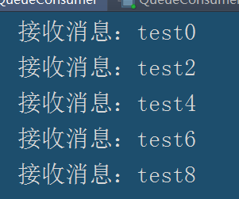
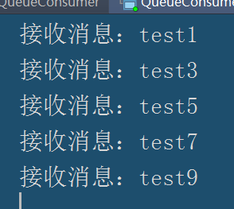

# 环境
**jdk1.8**

**ActiveMQ环境并启动**

**ActiveMQ的依赖包**

	<dependencies>
	    <dependency>
	        <groupId>org.apache.activemq</groupId>
	        <artifactId>activemq-all</artifactId>
	        <version>5.9.0</version>
	    </dependency>
	</dependencies>

# 队列模式

**新建类队列模式生产者**

``` java

public class QueueProducer {
    private static final String queneName = "qqueue-test";
    public static void main(String[] args) throws JMSException {
        //创建连接工厂
        ConnectionFactory connectionFactory=new ActiveMQConnectionFactory(ActiveMQConnection.DEFAULT_USER, ActiveMQConnection.DEFAULT_PASSWORD, ActiveMQConnection.DEFAULT_BROKER_URL);
        //创建连接
        Connection connection= connectionFactory.createConnection();
        //启动连接
        connection.start();
        //创建会话
        Session session=connection.createSession(false, Session.AUTO_ACKNOWLEDGE);
        //创建一个目标
        Destination destination= session.createQueue(queneName);
        //创建一个生产者
        MessageProducer producer=session.createProducer(destination);

        for (int i = 0; i <10 ; i++) {
            TextMessage textMessage=session.createTextMessage("test"+i);
            producer.send(textMessage);
            System.out.println("发送消息:"+textMessage.getText());

        }
        //关闭连接
        connection.close();
    }
}
```


因为是默认启动，所以连接工厂的用户名、密码以及ip均是默认。

然后我们输入默认网址：127.0.0.1:8161  初始帐号密码是admin/admin

可以查看队列的详细信息。




我们可以在这里看一下信息：

**name：名称**

**Number Of Pending Messages ：被挂起的消息，指的是还未被消费的信息。**

**Number Of Consumers  ：连接的消费者，0代表当前连接的消费者为0.**

**Messages Enqueued ：发送消息的总数。**

**Messages Dequeued：消息出队，已经被消费的消息。**

然后我们创建消费者进行消费

```java
public class QueueConsumer {
    private static final String queneName = "qqueue-test";
    public static void main(String[] args) throws JMSException {
        //创建工厂
        ConnectionFactory connectionFactory=new ActiveMQConnectionFactory("admin","admin","failover://tcp://localhost:61616");
        //新建连接
        Connection connection=connectionFactory.createConnection();
        //启动连接
        connection.start();
        //创建会话，并且设置会话的模式
        Session  session=connection.createSession(false, Session.AUTO_ACKNOWLEDGE);
        //创建一个目标
        Destination destination=session.createQueue(queneName);

        //创建一个消费者
        MessageConsumer consumer=session.createConsumer(destination);
        //创建一个监听
        consumer.setMessageListener(new MessageListener() {
            @Override
            public void onMessage(Message message) {
                TextMessage textMessage= (TextMessage) message;
                try {
                    System.out.printf("接收消息："+textMessage.getText());
                } catch (JMSException e) {
                    e.printStackTrace();
                }
            }
        });
        //连接不能在这里关闭，可以让监听一直启动，因为lisener是异步的，当线程还没执行完任务时，连接就已经关闭了。
        //connection.close();
    }
}
```
**然后我们运行QueueConsumer，那么十条信息会被消费者消费。然后我们再启动一个消费者，即有两个消费者时，在运行QueueProducer，两个消费者会依次消费信息**

 