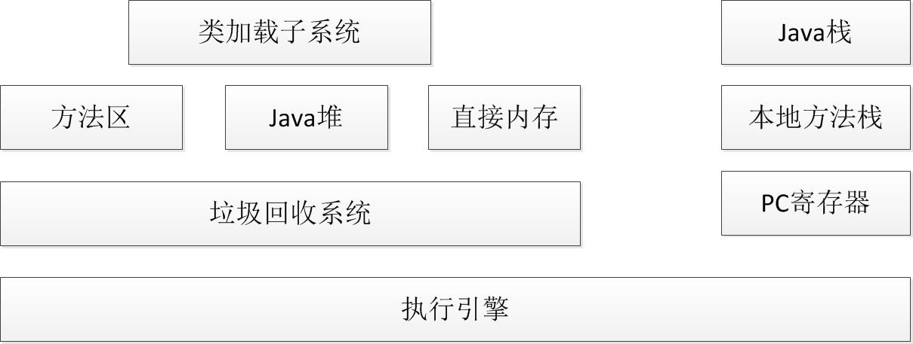

# 类加载子系统：

**类加载子系统是负责从文件系统或者网络中加载class信息。（class信息，是已经编译过的java文件，所以这也就是为什么我们在linux系统上，需要上传WebRoot文件或者用ant编译工具进行编译）**
# 方法区：
**加载的类信息放在方法区中的内存空间中，除了类的基本信息之外，还保存了运行时常量池信息，包括字符串字面量和数字常量。**

# java堆：
**java堆是在虚拟机启动的时候建立，是java程序中最主要的内存工作区域。几乎所有的java对象都会放在java堆中。堆空间所有线程共享。**

# 直接内存：
**java的NIO库允许java程序使用直接内存，直接内存是在java堆外、直接向系统申请的内存空间，所以它的大小不会直接受限于Xmx指定的最大堆大小。但是系统的内存是有限的，所以java堆内存和直接内存的总和受限于操作系统内存的大小。**

# java栈：
**每一个虚拟机线程都会有一个私有的java栈。一个线程的java栈在线程创建的时候被创建，java栈中保存着帧信息，java栈中保存着局部变量、方法参数、同时与方法的调用、返回密切相关。**

# PC寄存器：
**也是每个线程的私有空间，java虚拟机会为每一个java线程穿件PC寄存器。在任意时刻，一个java线程总是执行一个方法，这个正在被执行的方法成为当前方法。如果当前方法不是本地方法，PC寄存器就会指向当前正在被执行的指令。如果当前方法是本地方法，那么PC寄存器的值就是undifined。**
# 执行引擎：
**是java虚拟机最核心的组件之一，它负责执行虚拟机的字节码。现代虚拟机为了提高执行效率，会使用即使编译技术讲方法编译成机器码后再执行。**