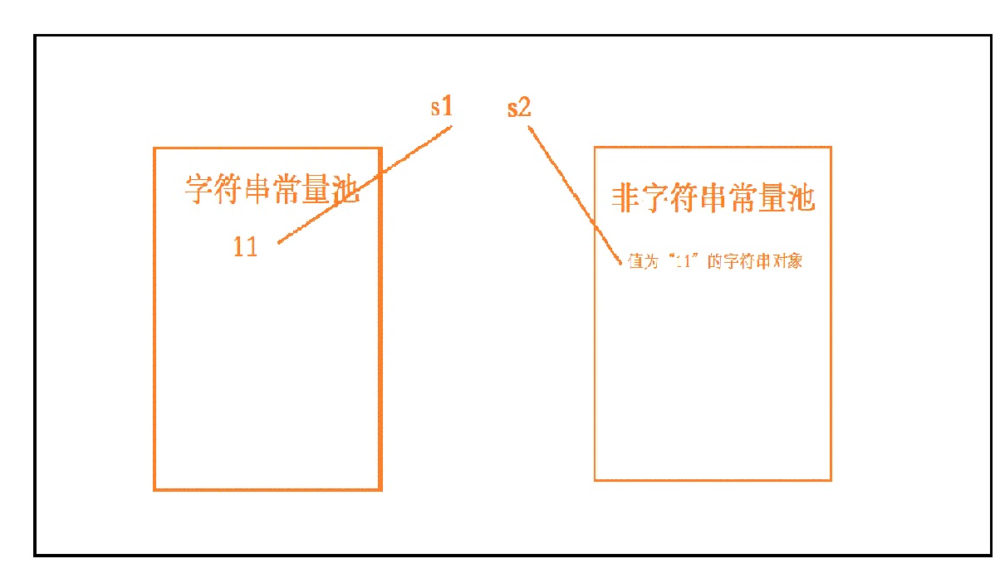

# 知识点：

**在jvm中，字符串有着非常“高等的地位”。在1.7以后，堆空间分为字符串常量池（也有叫做缓冲区）和非字符串常量池。**

**字符串常量池：用来存储字符串的字面量。**

**非字符串常量池：存储字符串对象以及其他普通的对象。**

# 为什么要有字符串常量池：

**字符串的分配，和其他的对象分配一样，耗费高昂的时间与空间代价。JVM为了提高性能和减少内存开销，在实例化字符串常量的时候进行了一些优化。为了减少在JVM中创建的字符串的数量，字符串类维护了一个字符串池，每当代码创建字符串常量时，JVM会首先检查字符串常量池。如果字符串已经存在池中，就返回池中的实例引用。如果字符串不在池中，就会实例化一个字符串并放到池中。Java能够进行这样的优化是因为字符串是不可变的，可以不用担心数据冲突进行共享。**

# 字符串的创建方式：

**字符串有两种创建方式，一种是通过双引号直接赋值和通过构造器来创建。**


## 双引号赋值：
String s1="11";
创建一个对象的时候，会判断字符串常量池是否会有"11"，没有在字符串常量池添加"11"，并在非字符串常量池创建String对象，这时s1变量是指向字符串常量的"11"的。

## 构造器创建：

String s2=new String("11");

创建对象，并不会在字符串常量池进行操作，只会在非字符串常量池建立对象，s2指向指向这个对象。




所以再用“==”判断的时候是false，因为两个变量的指向是不一样的。

# equals、==、intern()之间的区别

equals：是父类Object的方法，String重类写了这一方法，判断是否是首先判断是否是同一对象，是的话返回true。接着判断是否是String类型、如果是再判断是否值相同。
==：判断两个对象是否是同一对象，即两个对象的指向是否相同。
intern()：其实并不是用来判断是否相等的用途，它是在非字符串常量池添加字面量，所以他通常和new String()结合使用，可以在非字符串常量池建立变量并且指向它。
实例：

``` java

String s1="ab";
String s2="abcd";
String s3="ab"+"cd";
String s4=s1+"cd";
         
System.out.println("----第一部分  ----");
System.out.println(s2==s3);//true
System.out.println(s2==s3.intern());//true
System.out.println(s2.intern()==s3);//true
         
System.out.println("---- 第二部分 ----");
System.out.println(s2==s4);//false
System.out.println(s2==s4.intern());//true
System.out.println(s2.intern()==s4);//false
System.out.println("---- 第三部分 ----");
System.out.println(s3==s4);//false
System.out.println(s3==s4.intern());//true
System.out.println(s3.intern()==s4);//false

```

## 第一部分解析：

1、当String由两个字面量相加的时候，会判断字符串常量池，所以全是true。
## 第二部分解析：

1、当String是变量和字面量相加的时候，不会在字符串常量池进行判断，所以两个对象指向不同，false。
2、对s4这个对象进行intern()操作时，它会在字符串常量池进行判断，如果有的话，那么他不添加，没有的话就添加，所以为true。但是，记住即使s4.intern()不会改变s4的指向，他的指向还在非字符串常量池。如果想改变s4的指引的话，需要赋值。s4=s4.intern();所以说intern()应该跟new String(）结合使用，即 String s4=new String("abcd").intern()要不还需要有赋值的操作。
3、还是如二所说，s4的指向还是非字符串常量池，所以不相等。
## 第三部分解析：

根据第二部分自己看吧~

**注：在字符串尽量少使用 String ss="ab"+"cd"这样的操作，因为这样的操作如同新建了StringBuilder，然后进行append，这好像并没有什么不妥，但是要记住，当你要遍历时，每次都会新建一个StringBuilder，这样很浪费资源。**
