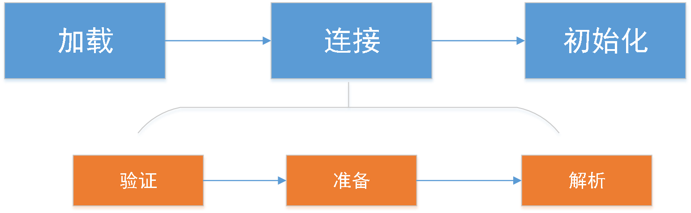
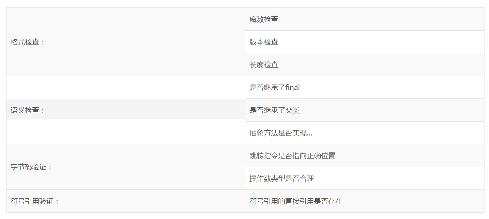

**Class类型通常以文件的形式存在（当然，任何二进制流都可以是class类型），只有被java虚拟机装在的class类型才能在程序中使用。系统装载Class类型可以分为加载、连接和初始化3个步骤。其中连接又可分为验证、准备、解析3步。**



# 装载类的条件：

**Class只有在必要的时候才会被装载，JVM虚拟机不会无条件地加载Class类型。Java虚拟机规定，一个类或接口在初次使用前，必须要进行初始化。这里指的“使用”，是主动使用、主动使用只有下列几种情况。**

1、当创建一个类的实例的时候，new关键字、或者通过反射、克隆、反序列化。

2、当调用类的静态方法时，即当使用了字节码invokestatic指令。

3、当使用类或接口的静态字段时（final常量外）。

4、当使用java.lang.reflect包中的方法反射类的方法时。

5、初始化子类时，要求先初始化父类。

6、作为启动虚拟机，含有main()方法的那个类。

 

1、创建实例
``` java

public class Student {

public static String name ="liumou";

static{

System.out.println("student完成装载");

}

}

public class test {

public static void main(String[] args) {

Student student=new Student();

}

}
```

输出结果是：student完成装载，说明student已经装载完成。

2、删除main中的方法改为
``` java

public static void main(String[] args) {

String name=Student.name;

}
```

 输出结果：student完成装载，说明调用类的静态变量可以完成该类的装载。

3、在student类中添加静态变量方法
``` java

public static void staticMethod(){

System.out.println("调用了student的静态方法");

}
```

在test类中用调用staticMethod()方法。

输出结果：
		
		student完成装载

		调用了student的静态方法

说明：调用类的静态方法是可以完成类的装载。

4、同样是student类，继承Person。
``` java

public class Student extends Person{

public final static  String name ="liumou";

 

static{

System.out.println("student完成装载");

}

public static void staticMethod(){

System.out.println("调用了student的静态方法");

}

public static void main(String[] args) {

System.out.println("student可以被装载");

}

}

 

public class Person {

static {

System.out.println("父类Person完成装载");

}

public static void methodStatic(){

System.out.println("父类PerSon的方法");

}

}
``` 

（1） 在test类中，新建student对象。

输出结果：父类Person完成装载

student完成装载

调用了student的静态方法

**结论：对象装载之前需先装载其父类，然后才能装载自己。**

（2）在test类中，调用子类调用父类的静态方法methodStatic（），（子类并未覆盖此方法）。

  输出结果：父类Person完成装载

父类PerSon的方法

**结论：当子类调用父类的静态方法，子类是不会进行装载的。此时的装载，代表的是此时的子类student并未初始化，但是已经被系统加载。使用-XX:+TraceClassLoading可以看日志装载情况。**   

 （3）在test方法中，调用Student的name属性（final修饰的静态变量）。

输出结果：只有“liumou”

结论：说明调用类的final修饰的静态变量不会进行类的装载。此时类连加载都没有。  

注：这里说明其他类调用一个类的final修饰的变量时，是不会存在类的加载的，是在编译时直接放在常量池的。     

 

# 加载类

加载类处于类加载的第一个阶段。在加载类时，Java虚拟机必须完成以下工作：

   通过类的全名，获取类的二进制数据流
   解析类的二进制数据流为方法区内的数据结构
   创建java.lang.Class类的实例，表示该类型
# 验证   

## 验证类 

## 准备


当一个类验证通过时，虚拟机就会进入准备阶段。在这个阶段，虚拟机就会为这个类分配相应的内存空间，并设置初始值。
int：0

long:0L

short:(short)0

char: \u000

boolean: false

reference: null

float: 0f

double: 0f 
 
 当类中存在常量字段，分情况。在准备阶段，是不会发生字节码行为的。
 public static final String constString ="const";
 当静态变量被final修饰后，该常量 constString在准备阶段被附上字符串"const"
 
 但是如果没有final修饰过，仅仅作为普通变量：
 public static String cString="const"
 此时，   cString的赋值在函数<clinit>中发生，属于java字节码的行为，此时是在初始化中赋值（后面会说到）
 

## 解析类

在准备阶段完成后，进入解析阶段。解析阶段的工作就是讲类、接口、字段和方法的符号引用转化为直接引用。
符号引用就是字面量的引用。就是在class类文件中，通过常量池进行大量的符号引用。

# 初始化

类的初始化是类的装载的最后一个阶段。如果前面的步骤都没有问题，那么表示类可以顺利的装载到系统中。此时，类才会执行java字节码。初始化阶段的重要是执行类的初始化方法<clinit>。方法<clinit>是由编译器自动生成的，他是有类静态成员的赋值语句以及static语句块合并产生的。
由于加载一个类之前，虚拟机总是试图尝试加载该类的父类，因此父类的<clinit>总是在子类<clinit>之前被调用。也就是说，子类的static块优先级高于父类。
 
**注：classLoader只负责类的加载，连接和初始化与classLoader无关。**


