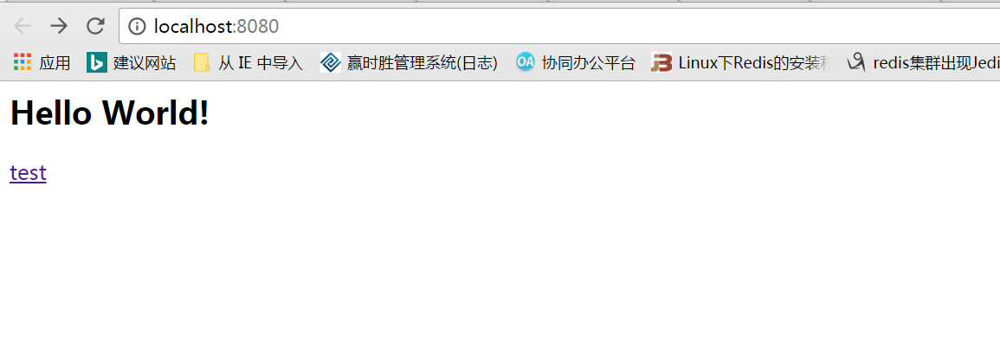
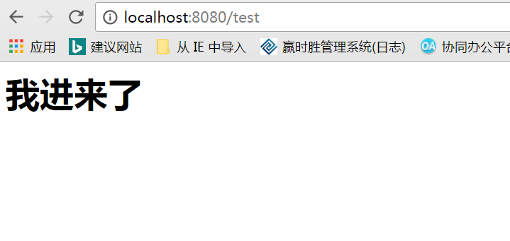
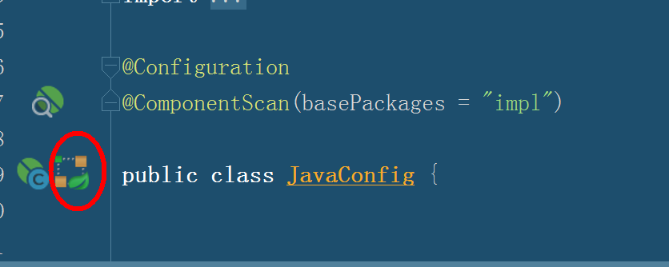
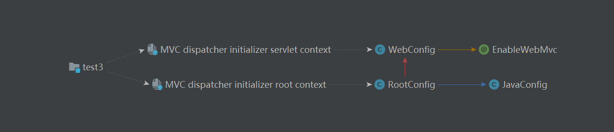

首先将包依赖导入。

``` xml
<project xmlns="http://maven.apache.org/POM/4.0.0" xmlns:xsi="http://www.w3.org/2001/XMLSchema-instance"
  xsi:schemaLocation="http://maven.apache.org/POM/4.0.0 http://maven.apache.org/maven-v4_0_0.xsd">
  <modelVersion>4.0.0</modelVersion>
  <groupId>com.test</groupId>
  <artifactId>test3</artifactId>
  <packaging>war</packaging>
  <version>1.0-SNAPSHOT</version>
  <name>test3 Maven Webapp</name>
  <url>http://maven.apache.org</url>

  <properties>
    <project.build.sourceEncoding>UTF-8</project.build.sourceEncoding>
    <maven.build.timestamp.format>yyyyMMddHHmmss</maven.build.timestamp.format>
    <spring.version>3.2.9.RELEASE</spring.version>
  </properties>
  <dependencies>

    <dependency>
      <groupId>junit</groupId>
      <artifactId>junit</artifactId>
      <version>4.10</version>
      <!-- <scope>test</scope> -->
    </dependency>
    <dependency>
      <groupId>org.springframework</groupId>
      <artifactId>spring-core</artifactId>
      <version>${spring.version}</version>
    </dependency>

    <dependency>
      <groupId>org.springframework</groupId>
      <artifactId>spring-test</artifactId>
      <version>${spring.version}</version>
    </dependency>

    <dependency>
      <groupId>org.springframework</groupId>
      <artifactId>spring-webmvc</artifactId>
      <version>${spring.version}</version>
    </dependency>

    <dependency>
      <groupId>javax.servlet</groupId>
      <artifactId>javax.servlet-api</artifactId>
      <version>4.0.0-b07</version>
      <scope>provided</scope>
    </dependency>
  </dependencies>
  <build>
    <finalName>test3</finalName>
  </build>
</project>

```

** 注意：一定要引servlet-api包，因为SpringMVC的关键dispatcherservlet是需要继承Servlet的。**

# SpringMVC配置

## 配置DispatcherServlet和ContextLoaderListener

``` java

package config;

import org.springframework.web.servlet.support.AbstractAnnotationConfigDispatcherServletInitializer;

public class SpitterWebAppInitializer extends AbstractAnnotationConfigDispatcherServletInitializer{
	
	/**
     * 创建ContextLoaderListener（Servlet监听器）
     * @return
     */
    protected Class<?>[] getRootConfigClasses() {
        //System.out.println("加载rootconfig");
        return new Class<?>[]{RootConfig.class};
    }


	/**
     * 创建DispacherServlet
     * @return
     */
    protected Class<?>[] getServletConfigClasses() {
        //System.out.println("加载ServletConfigClasses");
        return new Class<?>[]{WebConfig.class};
    }


    protected String[] getServletMappings() {
        //System.out.println("加载getServletMappings");
        return new String[]{"/"};
    }
}

```
**我在java下建立一个包config，这个包用来装java的配置来。**

在这里我们新建一个类什么名字都无所谓，在这里我们使用了SpitterWebAppInitializer这个名字，使它继承

**AbstractAnnotationConfigDispatcherServletInitializer**类。


我们不需要任何配置，只要项目启动，那么Spring就会找谁扩展了**AbstractAnnotationConfigDispatcherServletInitializer**，就会自动配置DispacherSevlet和Spring应用上下文，spring的应用上下文位于应用程序的Servlet上下文之中。

## getServletMappings()方法

它将一个或多个路径映射到DispacherServlet上，我们设置的是"/",它会处理进入应用的所有请求。如果设置为"/*.do"，那么它只会处理以".do"结尾的请求，起到了过滤的作用。

## DispatcherServlet和ContextLoaderListener的区别

当DispatcherServlet启动的时候，它会创建Spring应用上下文，并加载配置或配置类中所生命的bean（即getServletConfigClasses()中所需要干的事)。

除了DispatcherServlet创建的应用上下文，还有另外一个应用上下文。它是由ContextLoaderListener创建的（即getRootConfigClasses()干的事）。它也叫做Servlet监听器

我们希望DispatcherServlet加载包含Web组件的bean，如控制器，试图解析器，以及处理器映射,而ContextLoaderListener要加载应用中的其他bean，这些bean通常是驱动应用后端的中间层和数据层的组件。简单的说，DispatcherServlet配置的都是与springMVC请求和流程有关的bean。而ContextLoaderListener是配置项目支撑的bean。

## DispatcherServlet和ContextLoaderListener加载顺序

看到我们注掉的东西了么，这是为了哪个容器需要先加载，项目运行，看控制台的输出，发现ContextLoaderListener先被加载，之后是DispatcherServlet。

## 配置DispacherServlet

``` java
package config;

import org.springframework.context.annotation.Bean;
import org.springframework.context.annotation.ComponentScan;
import org.springframework.context.annotation.Configuration;
import org.springframework.web.servlet.ViewResolver;
import org.springframework.web.servlet.config.annotation.DefaultServletHandlerConfigurer;
import org.springframework.web.servlet.config.annotation.EnableWebMvc;
import org.springframework.web.servlet.config.annotation.WebMvcConfigurerAdapter;
import org.springframework.web.servlet.view.InternalResourceViewResolver;


@Configuration
@EnableWebMvc
@ComponentScan("action")
public class WebConfig extends WebMvcConfigurerAdapter{

	/**
     * 配置jsp视图解析器
     * @return
     */
    @Bean
    public ViewResolver viewResolver(){
        InternalResourceViewResolver resolver=new InternalResourceViewResolver();
        resolver.setPrefix("/WEB-INF/views/");
        resolver.setSuffix(".jsp");
        resolver.setExposeContextBeansAsAttributes(true);
        return resolver;
    }

	/**
     * 配置静态资源的处理
     * @return
     */
    @Override
    public void configureDefaultServletHandling(DefaultServletHandlerConfigurer configurer){
        configurer.enable();
    }

}

```
## 配置ContextLoaderListener

``` java 
package config;

import org.springframework.context.annotation.ComponentScan;
import org.springframework.context.annotation.Configuration;
import org.springframework.context.annotation.FilterType;
import org.springframework.web.servlet.config.annotation.EnableWebMvc;

@Configuration
@ComponentScan(basePackages = {"config"},excludeFilters = {
        @ComponentScan.Filter(type = FilterType.ANNOTATION,value= EnableWebMvc.class)})
public class RootConfig {


}
```
刚才对ContextLoaderListener有过介绍，这模块主要是对SpringMVC进行配置，这个以后涉及到数据库连接池等的时候，我们再详细配置。

**@Configuration:之前说过，让spring知道你这个是java配置类。**

**@EnableWebMvc：启动SpringMVC注解,这个注解相当于xml中的"<mvc:annotation-driven>"**

**@ComponentScan("action")：启动组件扫描，这样SpringMVC就会寻找action中带有@Controller中的注解了。**

**为什么要继承WebMvcConfigurerAdapter**
因为我们有时候要处理对静态资源的请求，但是DispatcherServlet会处理所有的请求，所以我们继承WebMvcConfigurerAdapter类，当处理静态资源的时候，将请求交给默认的servlet。

## 测试控制器
``` java
package action.pay;

import org.springframework.stereotype.Controller;
import org.springframework.web.bind.annotation.RequestMapping;
import org.springframework.web.bind.annotation.RequestMethod;

@Controller
public class DoAction {
    @RequestMapping(value = "/test",method = RequestMethod.GET)
    public String home(){
        return "home";
    }
}

```

## 首页index.jsp
``` html
<html>
<body>
<h2>Hello World!</h2>
    <a href="/test">test</a>
</body>
</html>
```



## 跳转页面home.jsp

WEB-INF/views/下新建一个就可以了，看看能否跳转成功。




**至此，springmvc的全注解配置就结束了。**

# Spring配置

之前已经介绍过Spring的配置了，那么我在这里就不在累赘了。

## 配置javaConfig

javaConfig是用来告诉spring哪些类需要进行加载的。

``` java
package config;

import org.springframework.context.annotation.ComponentScan;
import org.springframework.context.annotation.Configuration;

@Configuration
@ComponentScan(basePackages = "impl")

public class JavaConfig {

｝
```

**@Configuration:告诉spring自己的java配置类**

**@ComponentScan(basePackages = "impl")：将哪些文件进行spring的装配**

**注意：这个文件一定要放在之前配置RootConfig所指定的包下，即config，否则spring是不会找到这个配置类的。**

如果你用的工具是idea，那么当你配置正确的时候，就会出现下图的标记。



点进去可以查看他们的映射关系



所以我们也可以看到ContextLoaderListener和DispacherServlet各司其职。

## 编写接口

``` java

package service.pay;

public interface Payservice {

    void pay(Integer num);

}

```

## 编写实现类

``` java
package impl.pay;

import org.springframework.stereotype.Component;
import service.pay.Payservice;

public class ComputerPayServiceImpl implements Payservice{
    public void pay(Integer num) {
        System.out.println("使用电脑支付了"+num);
    }
}
```

## 修改action
``` java

package action.pay;

import org.springframework.beans.factory.annotation.Autowired;
import org.springframework.stereotype.Controller;
import org.springframework.web.bind.annotation.RequestMapping;
import org.springframework.web.bind.annotation.RequestMethod;
import service.pay.Payservice;

@Controller
public class DoAction {

    @Autowired
    private Payservice payservice;

    @RequestMapping(value = "/test",method = RequestMethod.GET)
    public String home(){
        payservice.pay(100);
        return "home";
    }
}

```


