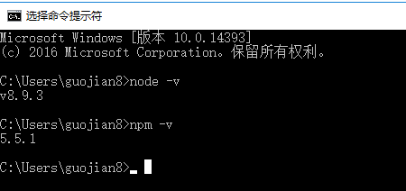
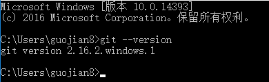
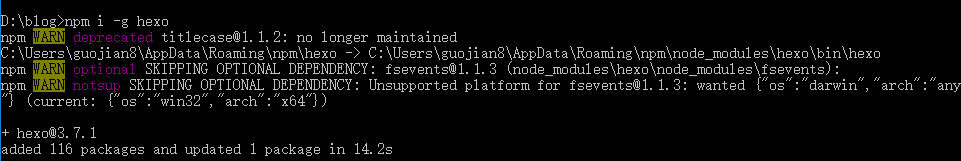
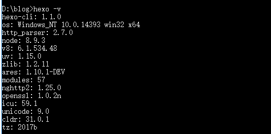
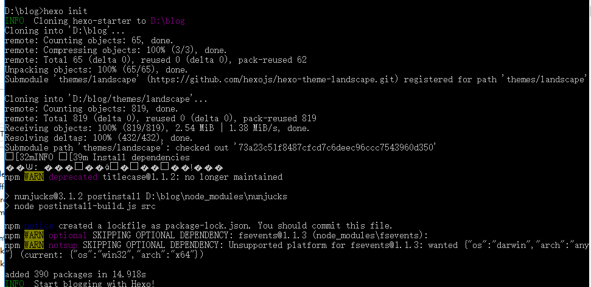
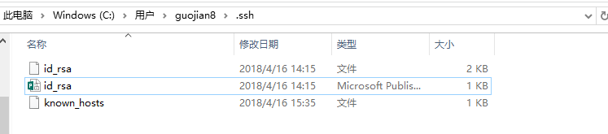
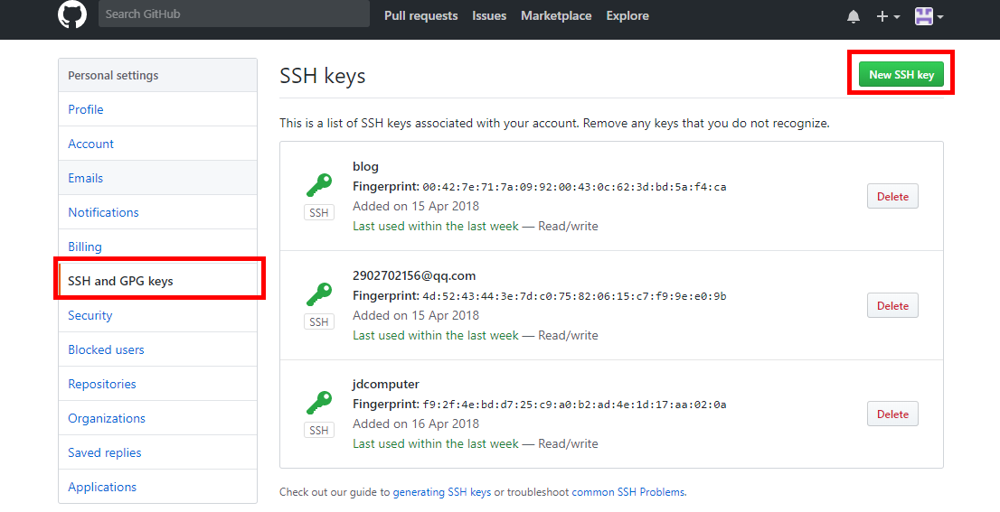
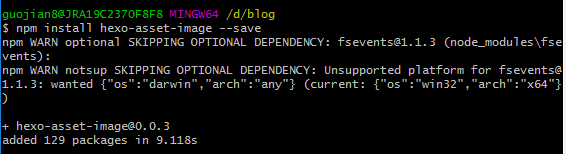
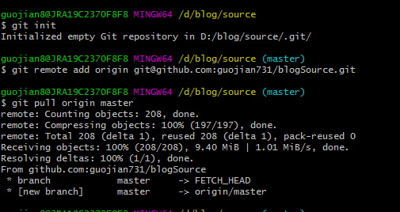
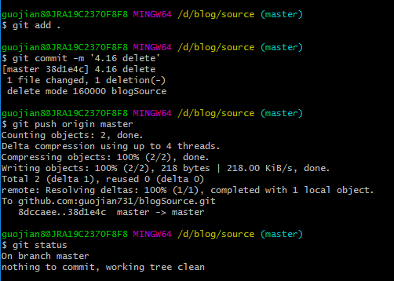

# 安装 #
**前言:我之前记录一下事情的时候都是在有道云笔记，17年的3月份开始写博客，后来了解到了markdown语法，并尝试用hexo/github搭建属于自己的博客。由于公司调用所以我之前写博客的电脑没有了，促成我这次博客迁移（如何新建博客挺多的）。**

## nodejs安装 ##
如我所愿，我有了一台新的电脑，我下载了nodejs并且安装，安装后检查是否安装成功。
``` shell
node -v
```
``` shell
npm -v
```



## git安装 ##

### 安装git，查看是否安装成功 ### 

``` shell
git --version
```



## hwxo安装 ##

### 建立hexo的根据地，我选择d盘的blog里来放我的博客文件。会出现warn警告，不用关心，像java一样... ### 




### 查看hexo是否安装成功



### 初始化hexo，命令为 hexo init



# Git配置 #

## Git个人信息配置 ##

### 如果你之前已经配置好git个人信息，请跳过这一个 步骤，直接来到


- ### 设置Git的user name和email：(如果是第一次的话)

	git config --global user.name "username"
	git config --global user.email "username@163.com"

- ### 生成密钥
	ssh-keygen -t rsa -C "username@163.com"

- ### 在这里会在C:\Users\用户名\.ssh 文件下生成三个文件，如下图。


- ### 将id_rsa.pub文件里的内容，添加到github上，这样我们就可以根据ssh key方式下载代码了。




## 配置Deployment ##

- ### 同样在_config.yml文件中，找到Deployment，然后按照如下修改（记住，在这里“：”后面一定要有空格，否则hexo是一点反应都没有，找错都不知道上哪找去。）：

``` shell
deploy:
  type: git
  repo: git@github.com:yourname/yourname.github.io.git
  branch: master
```

- ### 修改参数，可以上传文件：

- ### hexo如果想支持文章中显示图片，需要下载插件并配置_config.yml。

- ### post_asset_folder 设置为true

- ### npm install hexo-asset-image --save 设置上传图片的插件



**这时候，使用hexo new "test"命令，如果你发现在新建一个test.md文件的同时，出现一个test的文件夹，那么说明成功了。**

# 移植 #
***现在正式到我们的移植部分了，source是你写的文件，themes是主题。将这两个文件夹覆盖了，我们就完成了移植的部分了。我们现在做的是扩展的作用，当你使用hexo写博客的时候，其实上传到github上的是md文件生成的静态界面，而不是原始文件。如果我有两个电脑，我在B上写了文章，用hexo提交后，A电脑是无法更新到的，因为没办法转义。因为这个需求，我将真实的文件（source）也上传到github上，这样我在B写了文章，将source提交到github上，a那边更新source就会获取b更新的文件，实现同步了，同时你也起到了备份的作用。当然了，也可以使用更刺激的方法，将整个blog文件夹提交到github上也是一个不错的选择。***

- ### git 初始化（git init） ###
- ### git 添加关联（git remote add origin git@github.com:-----.git） ###
- ### 使用ssh方式下载项目 (git pull origin master)###




- ### 修改、添加完文件后 ###
- ### 使用git将改动的文件添加到本地库（git add .） ###
- ### 提交并写注释 (git commit -m '4.16 commit')###
- ### push到github上(git push origin master) ###
- ### 查看git状态(git status) ###



  