# idea配置maven

在File-OtherSettings-Default Settings...下进行maven配置

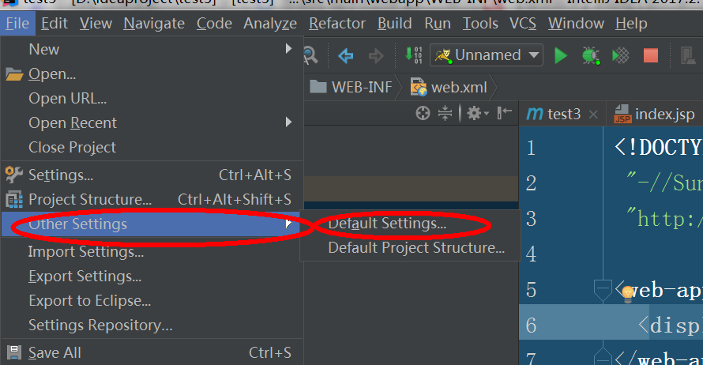

选择maven进行maven项目配置。

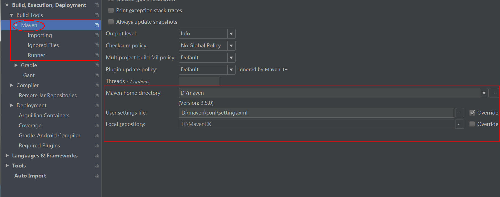

然后设置maven下的runner

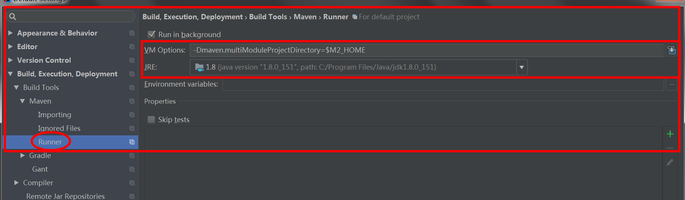

# 新建项目

点击File-new...-project

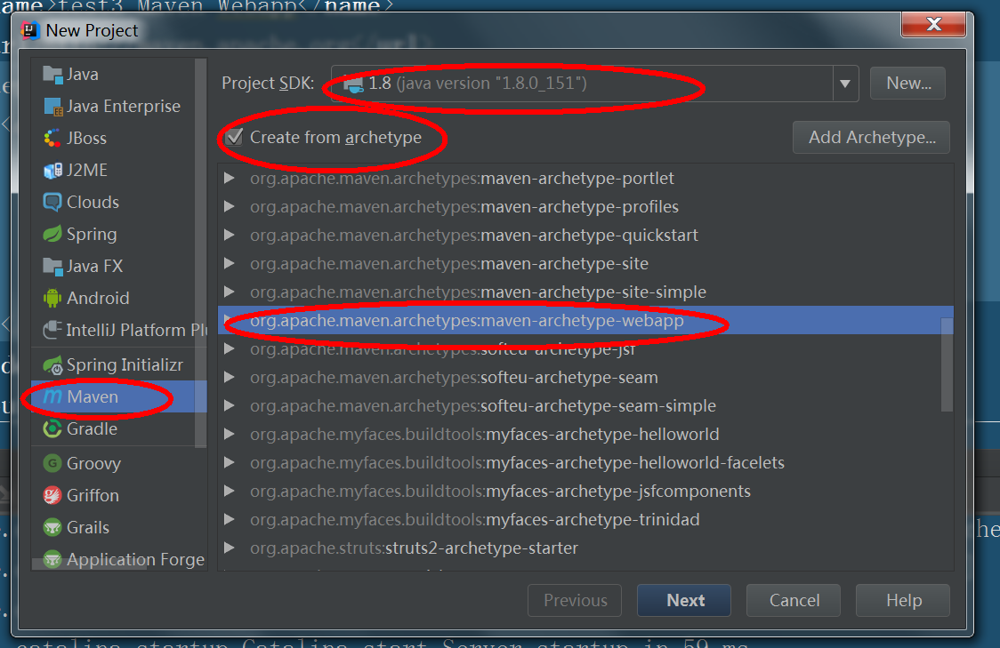

groupId 是组，ArtifactId是项目名称。

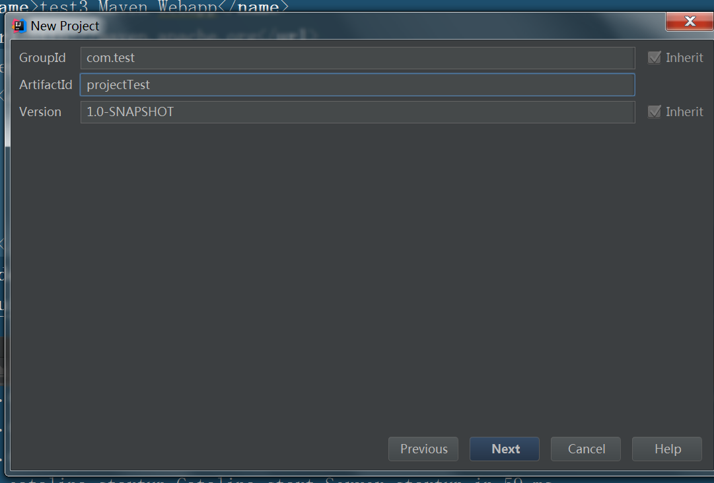

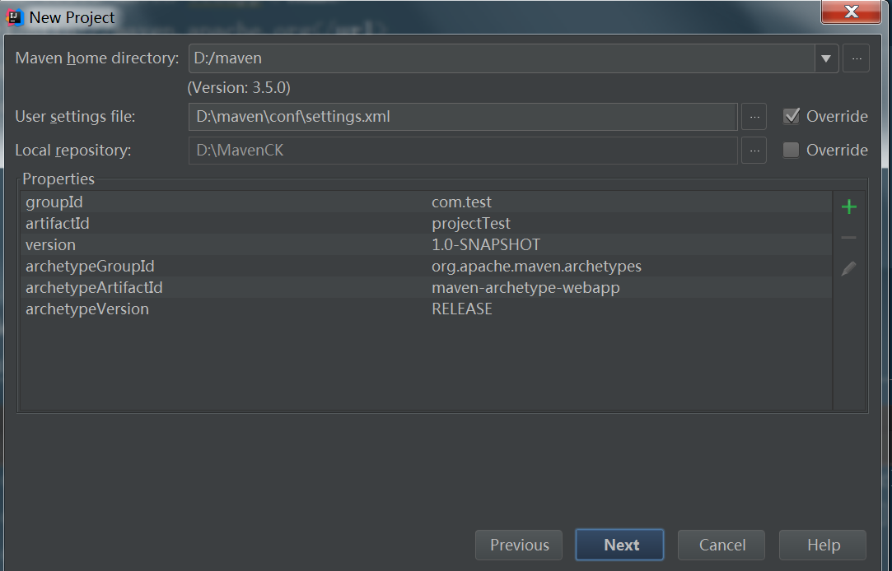

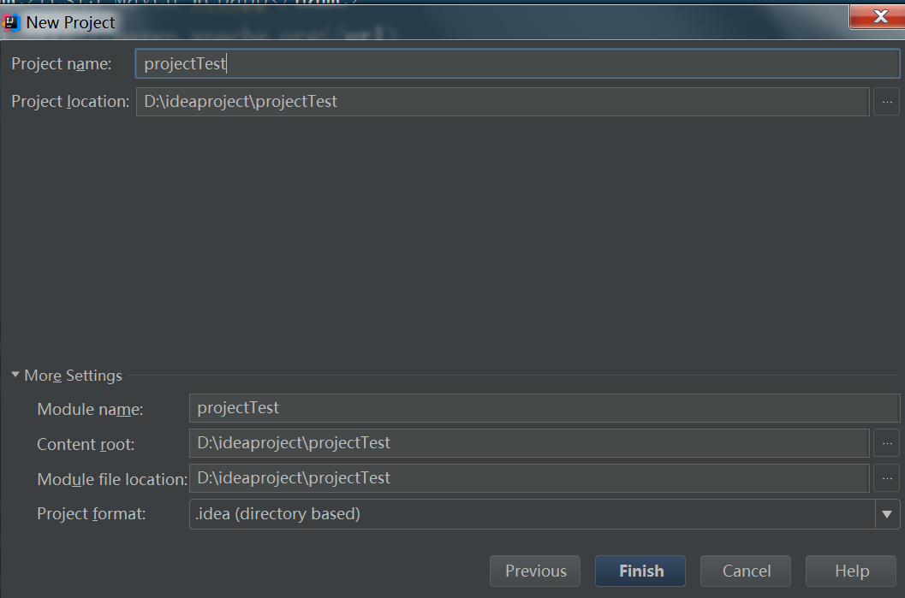

然后进行项目构建，当maven显示构建成功，完成后，说明我们的项目构建成功了。构建完成的标志就是下图所示

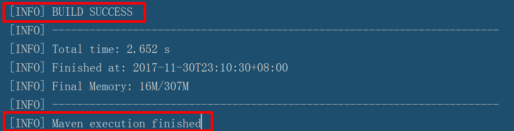

期间错误：

有时候会显示maven一直在下载，浪费很长时间也没有下载下来，这个时候可以修改一下maven的Settings.xml的配置文件，增加一个国内的镜像，我添加的是阿里巴巴的镜像。

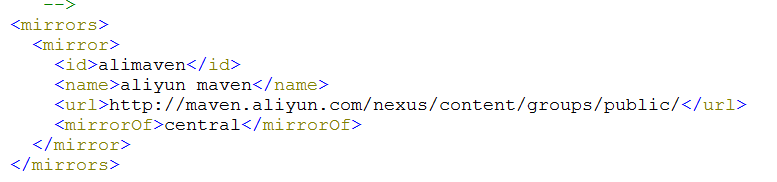

**建议：期间先使用mvn -v 命令查看maven和jdk版本，最好与idea配置的maven一致。**

# 配置项目

在main下新建一个java文件，并设置为Sources用来存放java文件，将resources设置为Resources。配置完成后是样子。

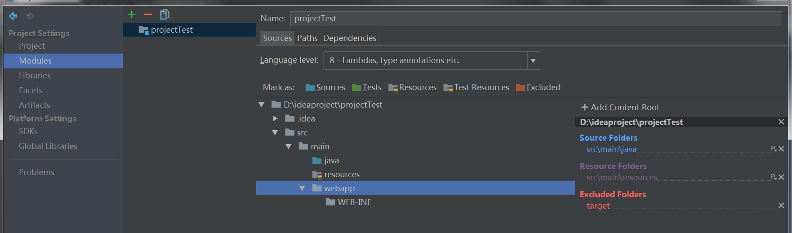

设置Artfacts，这个是设置输出目录，如果这个不设置，之后就算是配置了tomcat也无法启动项目，因为tomcat找不到相应的目录。

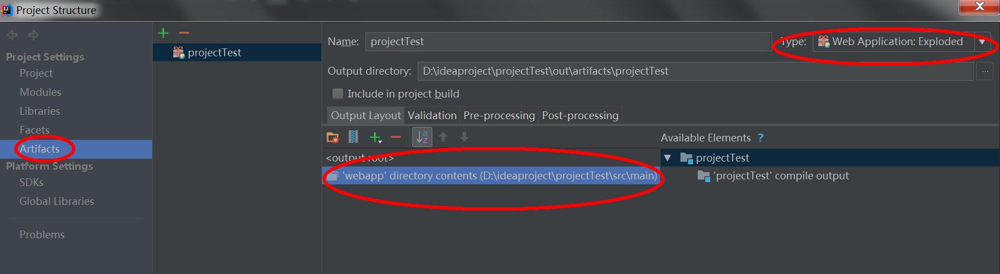

# 配置Tomcat

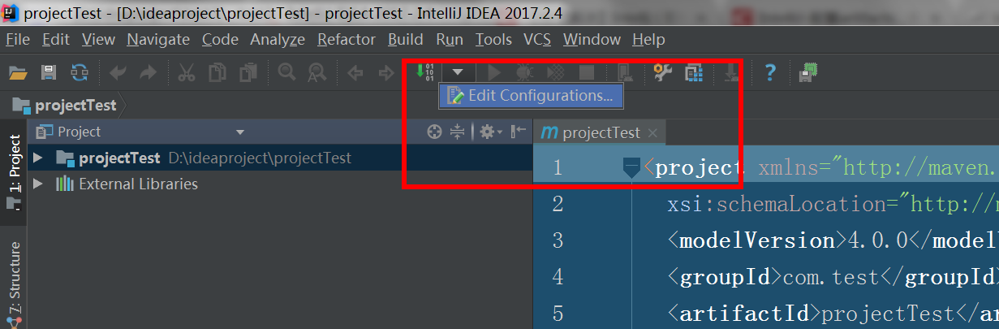

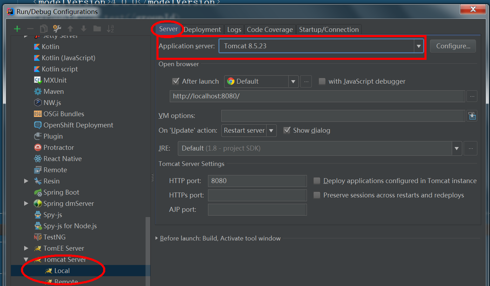

然后选择Deployment选项，选择我们刚才设置的Artfacts。Application Context是设置项目名称，不设置就是没有。

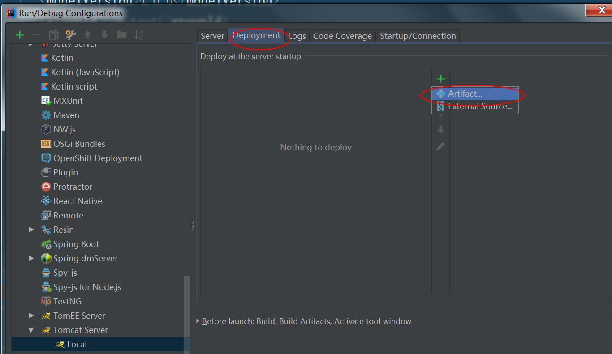

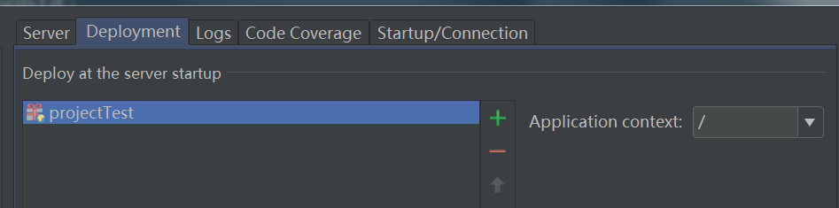

然后启动tomcat，配置完成

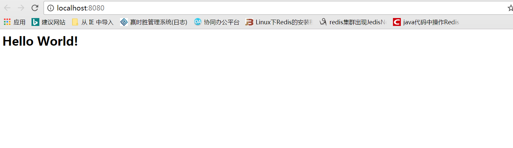