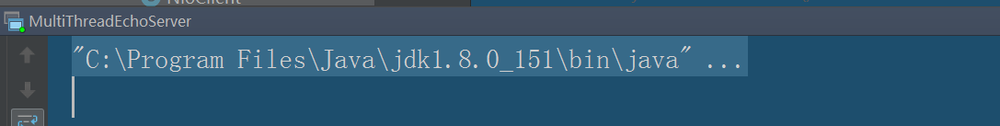
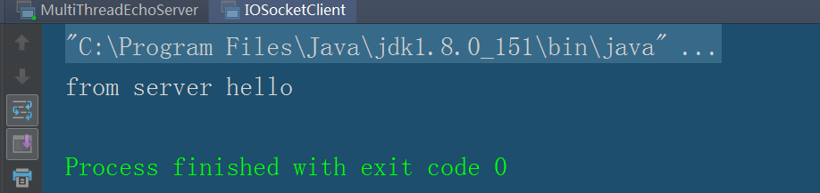
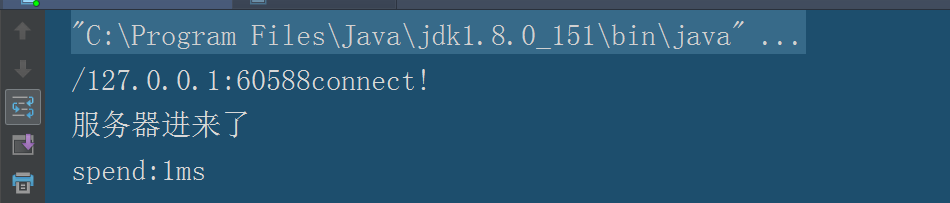
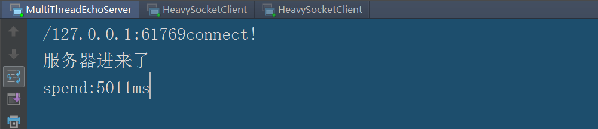
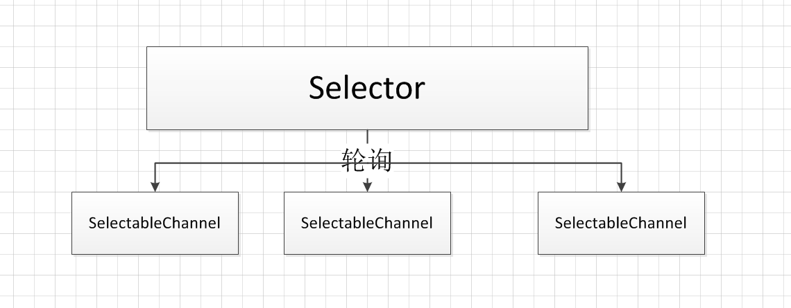

# 基础概念

## 同步与异步

**同步（Synchronous）和异步（Asynchronous）通常用来形容一次方法的调用。同步方法一旦调用，调用者必须等到方法调用返回后，才能进行后续的操作。就像我们普通的java程序一样，在一个线程内有顺序的方法A，B，C。程序在A执行完返回后才能执行B，B执行完返回后才能执行C；而异步是更像是消息传递，当线程调用A的时候，就会立即返回，不会等A执行过，调用者就会进行后续的操作。而A方法会在另一个线程下继续工作。整个过程不影响调用者的工作，对于调用者来说，调用方法A()相当于一瞬间完成的。如果A方法完成并且有结果的时候，后通知调用者。我们经常用到的ajax默认就是异步的呢，我曾经遇到过这种情况，在一个function下，创建一个变量var ss="",然后调用ajax向后台进行业务逻辑，返回ss的值。然后function下在对ss进行操作，但是发生了一种情况，在debug时，发现ss已经在后台赋予了非空的值，但是接收的时候ss还是为空，那就是因为ajax是异步实现的方式，使用了另一个线程在运行线程，而function还会往下进行，这时候ajax还没有返回值，ss依旧是空。**

## 阻塞和非阻塞

**阻塞（Blocking）和非阻塞（Non-Blocking）通常用来多线程的相互影响，比如一个线程占用了临界区资源，那个其他所有需要这个资源的线程就必须在这个临界区中进行等待。等待会导致线程的挂起，这种情况就是阻塞。此时，如果占用资源的线程一直不愿意释放资源，那么其他所有阻塞在这个临界区上的线程都不能工作。非阻塞的意思与之相反，它强调没有一个线程可以妨碍其他线程执行，所有的线程都会尝试不断向前执行。**

# IO比较
**IO操作分为两种，一种是文件IO，另一种是网络IO；那么从网络IO中进行比较，这篇文章是看《实战Java高并发程序设计》中作为启蒙，很推荐这本书，也非常感谢。**

## BIO
BIO就是使用IO包进行操作，它的意思是"Blocking-IO",也就是（同步）阻塞IO。服务端在接收信息时，需要等客户端执行过后才能进行下面的操作，如果客户端存在网络延迟，那么服务器端就会一直等待。
网络IO分为服务器端和客户端进行通讯，一般情况下，服务器端一直运行等待客服端的连接，而服务器端是创建一个连接，处理完成够客户端就进行关闭。在java中，服务器端使用ServerSocket，而客户端使用Socket，它们都在java.net包下。在下面的介绍中，如果我说的是socket那么代表的就是客户端，如果是服务器端，我会进行特殊说明。

### BIO Server

```java

package io;

import java.io.*;
import java.net.ServerSocket;
import java.net.Socket;
import java.util.concurrent.ExecutorService;
import java.util.concurrent.Executors;

public class MultiThreadEchoServer {
	
	//创建一个线程池
    private static ExecutorService tp= Executors.newCachedThreadPool();
	
	
    static  class  HandleMsg implements Runnable{
        Socket clientSocket;

        public HandleMsg(Socket clientSocket){
            this.clientSocket=clientSocket;
        }

        public void run() {

            BufferedReader is=null;
            PrintWriter os=null;

            try {
                is =new BufferedReader(new InputStreamReader(clientSocket.getInputStream()));
                os=new PrintWriter(clientSocket.getOutputStream(),true);
                //从InputStream当中读取客户端所发送的数据
                String inputLine=null;
                long b=System.currentTimeMillis();

                while ((inputLine=is.readLine())!=null){
                    System.out.println("服务器进来了");
                    os.println(inputLine);
                }

                long e=System.currentTimeMillis();
                System.out.println("spend:"+(e-b)+"ms");


            } catch (IOException e) {
                e.printStackTrace();
            }finally {

                    try {

                        if (is!=null) is.close();

                        if (os!=null) os.close();

                        clientSocket.close();

                    } catch (IOException e) {
                        e.printStackTrace();
                    }
            }
        }
    }


    public static void main(String[] args) {
        ServerSocket echoServer=null;
        Socket clientSocket=null;
        try {
            echoServer=new ServerSocket(8000);

        } catch (IOException e) {
            e.printStackTrace();
        }

        while (true){
            try {
                clientSocket=echoServer.accept();
                System.out.println(clientSocket.getRemoteSocketAddress()+"connect!");
                tp.execute(new HandleMsg(clientSocket));
            } catch (IOException e) {
                e.printStackTrace();
            }
        }

    }

}

```

我们开始从main函数开始讲解。
在main()函数我们先建立ServerSocket并设置端口号8000和客户端socket，客户端的socket需要从echoServer.accept()中获取，这个方法是阻塞的，如果这里没有连接进行连接，那么就会一直被阻塞，主线程会一直运行，并且你在控制台永远看不到输出的"connect"。当有客户端进行连接并成功后，那么就会输出客户端的地址连接。
我们使用线程池来处理客户端每一个连接，这样的好处就是服务器端支持多线程，在相同的可支持的的线程范围内，可以尽量多的支持客户端的数量。我们定义的是HandleMsg线程，它的构造器要求它传入一个客户端socket，它的任务是读取socket的内容并将其返回，任务成功后，客户端的socket就会正常关闭。在HandleMsg中，我们记录了服务器线程处理客户端一次请求所使用的时间。
在HandleMsg的run()方法中，我们设计是从客户端获取数据并且向客户端返回数据，在输入流和输出流都指向客户端，所以我们在输入流和输出流定义时，要赋值客户端的socket。

### BIO 简单的客户端

``` java
package io;

import java.io.*;
import java.net.InetSocketAddress;
import java.net.Socket;

/**
 * io客户端 同步阻塞
 */
public class IOSocketClient {

    public static void main(String[] args) throws IOException{

        Socket client=null;
        PrintWriter writer=null;
        BufferedReader reader=null;


        try {
            client=new Socket();
            client.connect(new InetSocketAddress("localhost",8000));
            writer=new PrintWriter(client.getOutputStream(),true);
            writer.println("hello");
            writer.flush();

            reader=new BufferedReader(new InputStreamReader(client.getInputStream()));
            System.out.println("from server " +reader.readLine());
        } catch (IOException e) {
            e.printStackTrace();
        }finally {
             try {
                 if (client!=null) client.close();
                 if (writer!=null) writer.close();
                 if (reader!=null) reader.close();
            } catch (IOException e) {
                e.printStackTrace();
            }

        }

    }
}

```
我们测试一下我们的服务端是否能够正常启动，运行main()函数，查看一下运行结果，发现的确一直在阻塞状态。



启动客户端。



查看服务器端控制台。



### BIOClient 存在网络延迟
前面的例子，发现速度很快完成了客服端和服务器端的交互，但是会出现一种情况，就是客户端存在网络延迟，那么客户端运行了多长时间，那么服务器端就会在处理这个线程的时候被阻塞多长时间。我们在测试的时候，会用到Thread.sleep()来模拟网络延迟，我们看一下效果。

``` java
package io;

import java.io.*;
import java.net.InetSocketAddress;
import java.net.Socket;
import java.net.SocketAddress;
import java.util.concurrent.Executor;
import java.util.concurrent.ExecutorService;
import java.util.concurrent.Executors;

/**
 * 客户端存在网络延迟
 */
public class HeavySocketClient {

    private static ExecutorService tp= Executors.newCachedThreadPool();

    private final static  int sleep_time=1000;

    public  static  class EchoClient implements Runnable{


        public void run() {
            synchronized (this){

            }
            Socket client=null;
            PrintWriter writer=null;
            BufferedReader reader=null;
            
            try {
                client=new Socket();
                client.connect(new InetSocketAddress("localhost",8000));
                writer=new PrintWriter(client.getOutputStream(),true);
                writer.print("h");
                Thread.sleep(sleep_time);
                writer.print("e");
                Thread.sleep(sleep_time);
                writer.print("l");
                Thread.sleep(sleep_time);
                writer.print("l");
                Thread.sleep(sleep_time);
                writer.print("o");
                Thread.sleep(sleep_time);
                writer.println();
                writer.flush();
                reader=new BufferedReader(new InputStreamReader(client.getInputStream()));
                System.out.println("form server : "+reader.readLine());
            } catch (IOException e) {
                e.printStackTrace();
            }catch (InterruptedException e) {
                e.printStackTrace();
            }finally {
                try {
                    if (writer!=null) writer.close();
                    if (reader!=null) reader.close();
                    if (client!=null) client.close();
                } catch (IOException e) {
                    e.printStackTrace();
                }
            }
        }
    }

    public static void main(String[] args) {
        EchoClient echoClient=new EchoClient();
        //for (int i=0;i<=5;i++) {
            tp.execute(echoClient);
        //}
    }

}

```




可以看到,服务器端耗费了比较长的时间。因为服务器要先读入客户端的输入，而客户端缓慢的处理速度使的服务器花费了更多的时间。在这个案例中，我们可以将main函数的for循环打开，就会有产生五个线程。但是我们有100线程同时请求，假设我们线程池里面只有10个线程可供使用，那么其他的90个就会等待线程池里的线程里可以使用的线程，那么这样服务器因为客户端的缓慢势必会影响到并发。
在这个案例中，服务器请求缓慢不是因为服务器端有多少繁重的任务，而是因为服务器线程在等待IO。 让告诉运转的CPU去等待效率低下的网络IO是极其不合算的。我们如何使用一种方式，使网络IO的等待时间从线程中分离出来。

## NIO 
 
上述的问题，使用NIO就可以将网络IO的等待时间从线程中分离出来。
NIO中一个关键组件是channel()，他的意思是管道。channel类似于流，一个channel可以跟一个文件或者网络Socket对应。如果一个channel对应一个文件和网络Socket，那么往这个channel中写数据，就相当于往Socket中写数据。
和channel结合使用的是另一个组件Buffer，Buffer相当于一个内存区域或者byte数组。数据需要包装成Buffer形式才能与channel进行交互(写入或者读取)。
另外一个与channel组件相关的是Selector(选择器)。在channel的众多实现中，有一个SelectableChannel的实现，表示可以被选择的通道。任何一个SelectableChannel都可以注册到一个selector中。这样，这个channel就会被selector管理。而一个selector可以管理多个channel。当SelectableChannel的数据准备好之后，Selector就会接到通知，得到那些已经准备好的数据。而SocketChannel就是SelectableChannel的一种。



我们创建一个线程Selector来管理channel，而一个SocketChannel代表一个客户端的连接，因此是selector处理多个客户端连接，当客户端的数据没有准备好的时候，selector处于准备状态，一旦有任何一个SocketChannel准备好数据之后，Selector就能立即得到通知，获取数据进行处理。

### NIO Server

package io;

import java.io.IOException;
import java.net.InetAddress;
import java.net.InetSocketAddress;
import java.net.Socket;
import java.nio.ByteBuffer;
import java.nio.channels.SelectionKey;
import java.nio.channels.Selector;
import java.nio.channels.ServerSocketChannel;
import java.nio.channels.SocketChannel;
import java.nio.channels.spi.SelectorProvider;
import java.util.*;
import java.util.concurrent.ExecutorService;
import java.util.concurrent.Executors;

``` java
public class NioServer {
    private Selector selector;
    private ExecutorService tp= Executors.newCachedThreadPool();
    public static Map<Socket,Long> time_stat=new HashMap<Socket, Long>(10240);

    private void startServer(){
        try {

	//通过工厂创建一个selector
	selector= SelectorProvider.provider().openSelector();
            
	//获得一个服务器端channel的实例
	ServerSocketChannel scc=ServerSocketChannel.open();
            
	//将服务器端设置为非阻塞模式
	scc.configureBlocking(false);
    
	InetSocketAddress isa=new InetSocketAddress(8000);
			
	//为服务器channel绑定地址和端口号
	scc.socket().bind(isa);

	//注释1 将服务器channel绑定到selector上，并且将selector感兴趣的事件记录为"accept"
	SelectionKey acceptkey=scc.register(selector,SelectionKey.OP_ACCEPT);
			
	//for循环，它的任务就是等待-分发网络消息
            for (;;){
		
		/**
		*select()方法是一个阻塞的方法，当没有任何数据准备的时候，他就会等待。
		*一旦有数据，他就会立即返回。他的返回值是已经准备就绪的selectionKey。
		**/
                selector.select();
		
		/**
		*获取准备好的selectionKey，因为Selector为多个Channel服务，所以
		*已经就绪的Channel可能是多个，所以是一个集合。
		**/		
                Set readyKeys = selector.selectedKeys();
                Iterator i = readyKeys.iterator();

                long e=0;

                while(i.hasNext()){

					SelectionKey sk= (SelectionKey) i.next();
					
					//将SelectionKey移除，如果不移除，就会重复处理相同的SelectionKey
					i.remove();
		
					//判断selectionKey的状态是否是可接收状态，如果是，就执行doAccept()方法。
                    if (sk.isAcceptable()){
                        doAccept(sk);
                    }

                    else if(sk.isValid()  && sk.isReadable()){
                        if (!time_stat.containsKey( ((SocketChannel)sk.channel()).socket())){
                            time_stat.put(((SocketChannel)sk.channel()).socket(),System.currentTimeMillis());
                        }
                        doRead(sk);
                    }
                    else if(sk.isValid() && sk.isWritable()){
                        doWrite(sk);
                        e=System.currentTimeMillis();
                        long b=time_stat.remove(((SocketChannel)sk.channel()).socket());
                        System.out.println("spend="+(e-b)+"ms");
                    }
                }


            }

        } catch (IOException e) {
            e.printStackTrace();
        }
    }

    private void doRead(SelectionKey sk) {
         SocketChannel channel=(SocketChannel) sk.channel();
         ByteBuffer bb=ByteBuffer.allocate(8192);
         int len;

        try {
            len =channel.read(bb);
            if (len<0) {
                disconnect(sk);
                return;
            }
        } catch (IOException e) {
            System.out.println("Failed to read form client !!");
            e.printStackTrace();
            disconnect(sk);
            return;
        }
        bb.flip();
        tp.execute(new HandleMsg(sk,bb));
    }

    private void disconnect(SelectionKey sk) {

    }

    private void doWrite(SelectionKey sk) {
        SocketChannel channel= (SocketChannel) sk.channel();
        EchoClient echoClient= (EchoClient) sk.attachment();
        LinkedList<ByteBuffer> outq=echoClient.getOutputQueue();

        ByteBuffer bb= outq.getLast();

        try {
            int len=channel.write(bb);
            if (len == -1){
                disconnect(sk);
                return;
            }

            if (bb.remaining()==0){
                outq.removeLast();
            }
        } catch (IOException e) {
            System.out.println("Failed to write client.");
            e.printStackTrace();
            disconnect(sk);
        }

        if (outq.size()==0){
            sk.interestOps(SelectionKey.OP_READ);
        }

    }

    private void doAccept(SelectionKey sk) {
        //System.out.println("doAccept");
		
        ServerSocketChannel server=(ServerSocketChannel) sk.channel();
        SocketChannel clientChannel;

        try {
			//根据ServerSocketChannel获取clientChannel	
            clientChannel= server.accept();
            clientChannel.configureBlocking(false);
            SelectionKey clientKey=clientChannel.register(selector,SelectionKey.OP_READ);
            EchoClient echoClient=new EchoClient();
            clientKey.attach(echoClient);
            InetAddress clientAddress=clientChannel.socket().getInetAddress();
            System.out.println("Accepted connection from  "+clientAddress.getHostAddress());
        } catch (IOException e) {
            System.out.println("fail to accept new client.");
            e.printStackTrace();
        }


    }

    class HandleMsg implements  Runnable{
        SelectionKey sk;
        ByteBuffer bb;

        public HandleMsg(SelectionKey sk,ByteBuffer bb){
            this.sk=sk;
            this.bb=bb;
        }
        public void run() {
            EchoClient  echoClient= (EchoClient) sk.attachment();
            echoClient.enqueue(bb);
            sk.interestOps(SelectionKey.OP_READ | SelectionKey.OP_WRITE);
            selector.wakeup();
        }
    }

    public static void main(String[] args) {
        NioServer nioServer=new NioServer();
        nioServer.startServer();
    }
} 

```

我们先创建一个选择器Selector和连接池。连接池是为客户端建立线程，每一个请求都会委托线程池中的线程来进行实际的处理。
为了能够统计一个线程在服务器中所话费的时间，我们定义了与时间有关的类：

``` java
public static Map<Socket,Long> time_stat=new HashMap<Socket, Long>(10240);
```
他是一个hashMap，key是一个socket，value是代表服务器端处理该请求处理的时间。

**注释1：因为我们设置selector感兴趣的事件为SelectionKey.OP_ACCEPT，那么只要当客户端进行连接时，就会通知ServerSocketChannel进行处理。register()的返回值是一个SelectionKey，SelectionKey代表这selector和channel的一种关系。当channel注册到selector上时，就已经确立了两者的服务关系。那么selector就是这个契约，如果selector或者channel被关闭时，他们对应的selectionKey就会失效。**

### NIO Client

``` java

package io;

import java.io.IOException;
import java.net.InetSocketAddress;
import java.net.SocketAddress;
import java.nio.ByteBuffer;
import java.nio.channels.SelectionKey;
import java.nio.channels.Selector;
import java.nio.channels.SocketChannel;
import java.nio.channels.spi.SelectorProvider;
import java.util.Iterator;

public class NioClient {
    private Selector selector;

    public void init (String ip,int port){
        try {

            SocketChannel channel=SocketChannel.open();
            channel.configureBlocking(false);
            this.selector= SelectorProvider.provider().openSelector();
            channel.connect(new InetSocketAddress(ip, port));
            channel.register(selector, SelectionKey.OP_CONNECT);

        } catch (IOException e) {
            e.printStackTrace();
        }
    }


    public void working(){
        while (true){

            if (!selector.isOpen()){
                break;
            }
            try {
                selector.select();
                Iterator<SelectionKey> iterator= this.selector.selectedKeys().iterator();
                while (iterator.hasNext()){
                    SelectionKey key=iterator.next();
                    iterator.remove();

                    if (key.isConnectable()){
                        connect(key);
                    }else if(key.isReadable()){
                        read(key);
                    }
                }
            } catch (IOException e) {
                e.printStackTrace();
            }
        }
    }

    private void read(SelectionKey key) {
        try {
            SocketChannel channel= (SocketChannel) key.channel();
            ByteBuffer buffer=ByteBuffer.allocate(100);
            channel.read(buffer);
            byte[] data=buffer.array();
            String msg=new String(data).trim();
            System.out.println("客户端收到消息"+msg);
            channel.close();
            key.selector().close();
        } catch (IOException e) {
            e.printStackTrace();
        }
    }

    private void connect(SelectionKey key) {

        SocketChannel channel= (SocketChannel) key.channel();
        try {
            if (channel.isConnectionPending()){
                channel.finishConnect();
            }
            Thread.sleep(10000);
            channel.configureBlocking(false);
            channel.write(ByteBuffer.wrap(new String("hello server!\r\n").getBytes()));
            channel.register(this.selector,SelectionKey.OP_READ);
        } catch (IOException e) {
            e.printStackTrace();
        }catch (InterruptedException e) {
            e.printStackTrace();
        }
    }

    public static void main(String[] args) {
        NioClient client=new NioClient();
        client.init("localhost" ,8000);
        client.working();
    }

}
```


## AIO

**AIO中的"A"代表这ASynchronized，就是异步的意思，我们在用AIO的时候，解决了阻塞的问题，但是NIO中的IO操作还是同步的。对于NIO来说，我们的业务线程是在IO操作准备好的时候，得到通知，接着由这个线程自行进行IO操作，IO操作本身依旧是同步的。
对于AIO来说，则更近一步，他不是在IO准备好时通知线程，而是在IO操作已经完成后通知线程。因此，AIO是完全不阻塞的。此时，我们的业务逻辑变成了一个回调函数，等待IO操作结束后系统自动触发。**


### AIO Server

异步的IO使用异步通道ASynchronousServerSocketChannel。


``` java

	public abstract <A> void accept(A attachment,
                                    CompletionHandler<AsynchronousSocketChannel,? super A> handler);

	/**
     * Invoked when an operation has completed.
     *
     * @param   result
     *          The result of the I/O operation.
     * @param   attachment
     *          The object attached to the I/O operation when it was initiated.
     */
    void completed(V result, A attachment);

    /**
     * Invoked when an operation fails.
     *
     * @param   exc
     *          The exception to indicate why the I/O operation failed
     * @param   attachment
     *          The object attached to the I/O operation when it was initiated.
     */
    void failed(Throwable exc, A attachment);
```

ASynchronousServerSocketChannel.accept()方法会立即返回，它并不会真正的等待客户端的到来。它的第一个参数是一个附件，可以是任意一个类型，作用是让当前线程和后续的回调方法共享信息。他会在后续的调用用，传递给handler。第二个参数是CompletionHandler接口，我们需要实现他的两个方法completed和failed，completed是连接成功后执行的方法，failed是连接失败的时候执行的方法。


``` java

package io;

import java.io.IOException;
import java.net.InetSocketAddress;
import java.nio.ByteBuffer;
import java.nio.channels.AsynchronousServerSocketChannel;
import java.nio.channels.AsynchronousSocketChannel;
import java.nio.channels.CompletionHandler;
import java.util.concurrent.ExecutionException;
import java.util.concurrent.Future;
import java.util.concurrent.TimeUnit;
import java.util.concurrent.TimeoutException;

public class AioServer {
    public final  Integer port=8000;
    private AsynchronousServerSocketChannel server;

    public AioServer() throws  IOException{
        server =AsynchronousServerSocketChannel.open().bind(new InetSocketAddress(port));
    }

    public void start(){
        System.out.println("server listen on  "+port);
        server.accept(null, new CompletionHandler<AsynchronousSocketChannel, Object>() {
            final ByteBuffer buffer=ByteBuffer.allocate(1024);
            @Override
            public void completed(AsynchronousSocketChannel result, Object attachment) {
                System.out.println(Thread.currentThread().getName());
                Future<Integer> writeResult=null;
                try {
                    buffer.clear();
                    result.read(buffer).get(100, TimeUnit.SECONDS);
                    buffer.flip();
                    writeResult=result.write(buffer);
                } catch (InterruptedException e) {
                    e.printStackTrace();
                } catch (ExecutionException e) {
                    e.printStackTrace();
                } catch (TimeoutException e) {
                    e.printStackTrace();
                }finally {

                    try {
                        server.accept(null,this);
                        writeResult.get();
                        result.close();
                    } catch (InterruptedException e) {
                        e.printStackTrace();
                    } catch (ExecutionException e) {
                        e.printStackTrace();
                    }catch (IOException e) {
                        e.printStackTrace();
                    }
                }
            }

            @Override
            public void failed(Throwable exc, Object attachment) {
                System.out.println("failed :"+exc);
            }
        });
    }

    public static void main(String[] args) throws InterruptedException, IOException {
        new AioServer().start();
        while (true){
            Thread.sleep(1000);
        }

    }
}

```

### AIO Client 

``` java
package io;

import java.io.IOException;
import java.net.InetSocketAddress;
import java.nio.ByteBuffer;
import java.nio.channels.AsynchronousSocketChannel;
import java.nio.channels.CompletionHandler;

public class AioClient {
    public static void main(String[] args) throws IOException, InterruptedException {
        final AsynchronousSocketChannel client=AsynchronousSocketChannel.open();
        client.connect(new InetSocketAddress("localhost",8000), null, new CompletionHandler<Void, Object>() {
            @Override
            public void completed(Void result, Object attachment) {
                client.write(ByteBuffer.wrap("hello".getBytes()), null, new CompletionHandler<Integer, Object>() {

                    @Override
                    public void completed(Integer result, Object attachment) {
                        final ByteBuffer buffer=ByteBuffer.allocate(1024);
                        client.read(buffer, buffer, new CompletionHandler<Integer, ByteBuffer>() {
                            @Override
                            public void completed(Integer result, ByteBuffer attachment) {
                                System.out.println("jinlailema");
                                buffer.flip();
                                System.out.println(new String(buffer.array()));

                                try {
                                    client.close();
                                } catch (IOException e) {
                                    e.printStackTrace();
                                }
                            }

                            @Override
                            public void failed(Throwable exc, ByteBuffer attachment) {

                            }
                        });
                    }

                    @Override
                    public void failed(Throwable exc, Object attachment) {

                    }
                });
            }

            @Override
            public void failed(Throwable exc, Object attachment) {

            }
        });
        Thread.sleep(1000);

    }

}

```

# 应用场景

BIO:BIO服务器端有一个连接，那么我们就要在服务器端建立一个线程来处理，进行一对一的处理。需要等待客户端的准备过程，对服务器的资源占用是很明显的，是一个连接一个线程。
NIO:NIO是使用一个selector选择器来进行轮询，当发现请求的时候，selector才会启动一个线程进行处理。属于一个请求一个线程，所以很适合高并发的场景。但是，当你接收之后，可能会写入数据库的操作，也就是请求应用的资源，但是现在数据库内的连接都是满的，那就需要一直等待连接池内的等待。是一个请求一个线程。
AIO：AIO的出现就解决了NIO应用资源占用的这个问题，通过调用操作系统以及并发操作解决这类问题。属于一个有效的请求一个线程。

# 总结

再看完这些之后，可能会对同步异步、阻塞非阻塞还有一些疑问，在学习的期间我也很困惑，常常纠结了很久，但是总会有柳暗花明的一天，我想通了期间的差别，它可能是错误的，但是即使是错误的，也是我这段时间学习的结晶。

BIO操作，当客户端与服务器端进行连接的时候，服务器端accept()就会阻塞，这时候服务器端在准备数据(写hello)，这段客服端准备数据的时候，服务器端就会被阻塞；这就像一个或者很多集装箱一样，他负责传输货物的，但是BIO相当于把货物的开膛、清洗、消毒、冷冻、传输等所有的操作都在集装箱进行，就会占用一个集装箱很长时间，如果集装箱满了，其他的货物就进不来；NIO呢，就是货物的开膛、清洗、消毒、冷冻这样的事不应该放在集装箱上进行，我这是负责传输的，你的这些操作应该事先准备好后，然后给我进行传输。那么BIO呢，我们接收到了数据之后，我们还要处理数据（读写操作），我们的读操作和写操作也会耗费一些时间，因为单线程是同步的么。如果货物到了集装箱，我们还要对货物进行检验，重量是否对应，检测是否有流感；我们在进行这些操作的时候，那么火车就不能开动。AIO就是相当于让集装箱开动了，并抽出两个人在同时做货物的检验。

最后在说一下，对于服务器端来说，阻塞非阻塞是相对与客户端来说，而同步异步是从客户端接收完数据之后，自己对数据的操作而言的。


