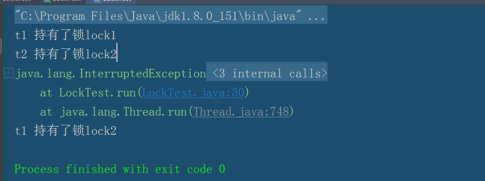
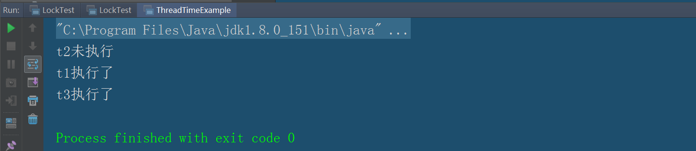
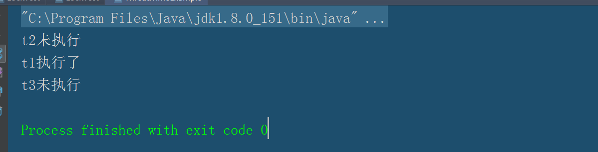
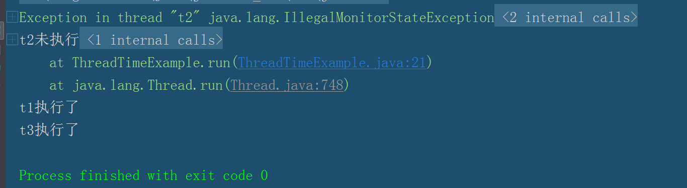
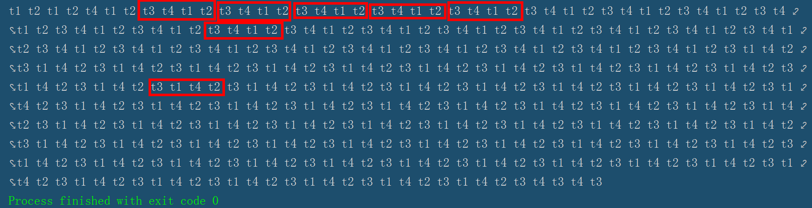

**因为本人的知识有限，并发包里我指挥记录一些我个人理解相对比较深的，之后会在慢慢的学习和实践中继续更近我的博客。**

# 重入锁

重入锁完全可以代替synchronized关键字。在jdk1.5以前，重入锁的性能远大于synchronized，但是在jdk1.6之后，两者的性能差别不大。

## 核心方法

lock.lock():进行上锁操作;
lock.unclock():解锁操作;
lock.lockInterruptibly()：获得锁，但是优先相应中断。
lock.tryLock(): 判断当前锁是否被占用，如果没有被占用，返回true，并且占有锁。如果被占用，返回false，那么直接退出。
lock.tryLock(Long time,TimeUnit unit):time是代表时间，unit代表单位，在设置的给定时间内获得锁。
lock.isHeldByCurrentThread():判断当前线程是否占有锁，true是占有。
lock.interrupt():锁中断；


## 简单的例子

重入锁的使用java.util.concurrent.ReentrantLock类来实现。下面是一个重入锁的例子。

``` java

import java.util.concurrent.locks.ReentrantLock;

public class Test  implements Runnable{
    private  int i=0;
    private static ReentrantLock lock =new ReentrantLock();
    @Override
    public  void run() {
        for (int k=0;k<10000;k++){
            lock.lock();
            try{
                i++;
            }finally {
                lock.unlock();
            }
        }
    }

    public static void main(String[] args) throws InterruptedException {
        Test test=new Test();
        Thread t1=new Thread(test,"t1");
        Thread t2=new Thread(test,"t2");
        t1.start();
        t2.start();
        t1.join();
        t2.join();
        System.out.println(test.i);
    }
}

```

这里使用lock锁住临界区的资源i，确保多线程对i进行操作的安全性，他还有一个好处，就是synchronized是修饰不了int的，只能修饰Integer类型，因为synchronized只能修饰对象，而int不是对象，是基本类型。

为什么ReentrantLock叫做重入锁呢，因为一个锁可以锁对象多次。但是锁住锁和释放锁的数量应该是一样的，只加锁而不释放锁，会让线程一直占有锁，从而使其他线程一直阻塞。

``` java

import java.util.concurrent.locks.ReentrantLock;

public class Test  implements Runnable{
    private  int i=0;
    private static ReentrantLock lock =new ReentrantLock();
    @Override
    public  void run() {
        for (int k=0;k<10000;k++){ 
            lock.lock();
            lock.lock();
            try {
                i++;
            }finally {
                lock.unlock();
                lock.unlock();
            }
        }
    }

    public static void main(String[] args) throws InterruptedException {
        Test test=new Test();
        Thread t1=new Thread(test,"t1");
        Thread t2=new Thread(test,"t2");
        t1.start();
        t2.start();
        t1.join();
        t2.join();
        System.out.println(test.i);
    }
}

```

## 中断响应

** 我们再使用synchronized的时候，如果一个线程在等待锁，要不一直在那等待，要不获得锁继续执行，没有第二种可能。但是如果使用重入锁，那么你将会有第三种可能，就是根据需求取消对锁的请求。如果一个线程正在等待锁，那么他依然可能收到一个通知，被告知无须等待，可以停止工作了，这样就减少了死锁。**

``` java

import java.util.concurrent.locks.ReentrantLock;

public class LockTest  implements Runnable{

    public static ReentrantLock lock1=new ReentrantLock();
    public static ReentrantLock lock2=new ReentrantLock();
    int lock;

    public LockTest(int lock){
        this.lock=lock;
    }
    @Override
    public void run() {
        try {
            if (lock==1){
                lock1.lockInterruptibly();
                System.out.println(Thread.currentThread().getName()+" 持有了锁lock1");
                Thread.sleep(10000);

                lock2.lockInterruptibly();
                System.out.println(Thread.currentThread().getName()+" 持有了锁lock2");
            }else {
                lock2.lockInterruptibly();
                System.out.println(Thread.currentThread().getName()+" 持有了锁lock2");
                try {
                    Thread.sleep(10000);
                } catch (InterruptedException e) {
                    e.printStackTrace();
                }
                lock1.lockInterruptibly();
                System.out.println(Thread.currentThread().getName()+" 持有了锁lock1");
            }
        } catch (InterruptedException e) {
            e.printStackTrace();
        }finally {
            if (lock1.isHeldByCurrentThread()){
                lock1.unlock();
            }
            if (lock2.isHeldByCurrentThread()){
                lock2.unlock();
            }
        }
    }

    public static void main(String[] args) {
        LockTest test1=new LockTest(1);
        LockTest test2=new LockTest(2);
        Thread t1=new Thread(test1,"t1");
        Thread t2=new Thread(test2,"t2");
        t1.start();
        t2.start();
        try {
            Thread.sleep(10000);
        } catch (InterruptedException e) {
            e.printStackTrace();
        }
        t2.interrupt();
    }

}

```

在这个例子中，我们一个类有两个锁，线程t1先持有lock1，在持有lock2。而线程t2持有lock2，在持有lock1，因为我们使用了Thread.sleep(),确定了t1获得了lock1的锁，而t2获得了lock2的锁，这样就会产生死锁，在线程运行的十秒钟里(Thread.sleep(10000))，一直没有人释放资源，就是两个线程就会一直锁死，当主线程出来解决矛盾，让t2取消请求，t2就会释放锁lock2，这样t1就会获得了锁lock2。



## 给请求设置时间

**我们可以用tryLock()方法来给请求设置时间，它有两个参数，一个是数值，另一个是时间单位。lock.tryLock(5, TimeUnit.SECONDS)就是如果请求如果等待了5秒钟以上，就退出。如果为设置参数，那么就是请求的时候有其他线程持有锁，就退出。如果没有线程持有锁，就执行。**

``` java

import java.util.concurrent.TimeUnit;
import java.util.concurrent.locks.ReentrantLock;

public class ThreadTimeExample implements Runnable{

    public static ReentrantLock lock=new ReentrantLock();

    @Override
    public void run() {
        try {
            if (lock.tryLock(5, TimeUnit.SECONDS)) {
                Thread.sleep(6000);
                System.out.println(Thread.currentThread().getName()+"执行了");
            }else {
                System.out.println(Thread.currentThread().getName()+"未执行");
            }
        } catch (InterruptedException e) {
            e.printStackTrace();
        }finally {
            if (lock.isHeldByCurrentThread())
            lock.unlock();
        }
    }

    public static void main(String[] args) {
        ThreadTimeExample t=new ThreadTimeExample();
        Thread t1=new Thread(t,"t1");
        Thread t2=new Thread(t,"t2");
        Thread t3=new Thread(t,"t3");
        t1.start();
        t2.start();
        try {
            Thread.sleep(2000);
        } catch (InterruptedException e) {
            e.printStackTrace();
        }
        t3.start();
    }
}

```


我们新建了三个线程t1，t2,t3三个线程，因为t1,t2几乎同时启动，假设t1先持有锁(因为t1，t2都有机会先获得锁)，持有了锁6s，超过了t2等待时间5s，所以t2就不会运行而是选择退出。当t1运行2s中之后，t3才开始请求锁，相对于t3而言，t1持有锁的时间为大约为4s，没超过5s，所以t3也会执行的。



我们要注意一下finally的方法，当我们把finally的方法去掉，看一下运行情况。



发现只有t1线程获得了锁，其他线程都没获得到锁，t2没有获得锁正常，是在我们的预想之内，为什么t3也没获得锁呢，这是不应该的。那是因为t1在获得锁之后，没有执行lock.unlock()来释放锁，所以它持有锁的时间并不是6s而是更长。
好了，我们知道原因了，我们在finally代码快中添加lock.unlock()方法，运行看一下结果把。



我们发现竟然报错了，为什么呢？其实真正的原因就是线程t2，t2根本没有获得过锁，我们执行lock.unlock()当然报错了，之前我们就说过，锁的持有和释放必须是等对的，t2没有获得锁，却要释放锁，当然要报错了。所以我们要在释放锁之前做一下判断当前线程是否获得过锁 （lock.isHeldByCurrentThread())，如果获得过，释放。

## lock设置公平锁

在锁的竞争中，锁被占用并不是根据来的先后顺序来进行获得锁的，就会出现后来者居上的情况，如何对获得锁需要按照先后顺序来呢，synchronized就无法实现了，但是ReenTrantLock可以。
设置起来也很简单，就是在新建Lock对象的是够，传参true。

``` java
import java.util.concurrent.locks.ReentrantLock;

public class FairReenTrantLock implements Runnable{
    private static ReentrantLock lock=new ReentrantLock(true);
    @Override
    public void run() {

        for (int i=0;i<10;i++){
            lock.lock();
            System.out.print(Thread.currentThread().getName()+" ");
            lock.unlock();
        }

    }
    public static void main(String[] args) {
        FairReenTrantLock lock=new FairReenTrantLock();
        Thread t1=new Thread(lock,"t1");
        Thread t2=new Thread(lock,"t2");
        Thread t3=new Thread(lock,"t3");
        Thread t4=new Thread(lock,"t4");
        t1.start();
        t2.start();
        t3.start();
        t4.start();

    }
}
```



我们看一下结果，因为最开始的时候，有线程还处于未启动状态，当线程全部启动后，他们获取锁是有顺序的，最先得到锁的线程释放锁之后，就或在申请锁，所以轮一圈后，它依旧先获得锁。

# Condition条件

它的作用是在可重入锁下ReentrantLock实现wait(),notify()以及notifyAll()的功能，Object.wait()和Object.notify()必须在synchronized修饰的方法块里才能使用，同样的Condition需要与重入锁相关联，在lock.newCondition()来为重入锁绑定一个Condition实例。下面是一个Condition接口方法以及使用Condition的简单实现。

``` java 
public interface Condition {
    void await() throws InterruptedException;

    void awaitUninterruptibly();

    long awaitNanos(long var1) throws InterruptedException;

    boolean await(long var1, TimeUnit var3) throws InterruptedException;

    boolean awaitUntil(Date var1) throws InterruptedException;

    void signal();

    void signalAll();
}
```

``` java

import java.util.concurrent.locks.Condition;
import java.util.concurrent.locks.ReentrantLock;

public class ReentranctLockConditine implements Runnable{

    public static ReentrantLock lock =new ReentrantLock();
    public static Condition condition=lock.newCondition();

    @Override
    public void run() {
        lock.lock();
        try {
            condition.await();
            System.out.println(Thread.currentThread().getName()+"线程继续运行");
        } catch (InterruptedException e) {
            e.printStackTrace();
        }finally {
            lock.unlock();
        }
    }

    public static void main(String[] args) {
        try {
            ReentranctLockConditine reentranctLockConditine=new ReentranctLockConditine();
            Thread t=new Thread(reentranctLockConditine,"t1");
            t.start();
            Thread.sleep(2000);
            lock.lock();
            condition.signalAll();
            lock.unlock();
            System.out.println("主线程结束了");
        } catch (InterruptedException e) {
            e.printStackTrace();
        }
    }
}

```

首先我们在main()方法中建立一个线程并启动，线程获得锁后，执行 condition.await();，要求condition在这个对象上进行等待，这时候线程会释放锁和资源，当condition.signalAll();会唤醒所有的资源，之前的锁又会尝试绑定之前的锁，这期间，需要获得锁的线程(也就是现在的主线程main方法)释放锁，要不然线程t1就会只与锁进行绑定，而不会获得锁。如果你讲33行的代码注掉的话，你会发现t1是无法执行到输入的语句的。

## Condition优点 ##
其实Condition对比wait()有自己的优势，
- 首先是它的await(long var1, TimeUnit var3)，返回true的时候，说明是其他线程唤醒它的，返回false是因为达到了超时时间自己唤醒的。还有awaitUntil(Date var1)可以设置时间点，在现实场景中应用也是比较广泛的。
- 一个ReentrantLock下可以有多个Condition对象，我们在做业务处理时，可以根据共享变量场景不同，使用不同的Condition，然后避免过早唤醒问题(即一些线程不满足条件依然被唤醒之后，发现条件不符合之后，再次将状态变成等待)。下面我们开始举个例子


**Q：现在有一个房地产开发商发放礼物，总共有十个柜台，如果柜台有空余的话，买房的人(vip)和没买房的人(normal)都可以领取礼物，当时一旦发放礼物的柜台都满的情况下，当空出柜台的时候，优先给vip办理，normal只能在没有vip等待的时候才能过去领取奖励。**

***A：***

柜台代表类：
``` java 
public class Counter {
    private static Lock lock=new ReentrantLock();
    
    private static Condition vipCondition=lock.newCondition();//vip的Condition
    
    private static Condition normalCondition=lock.newCondition();//普通用户的Condition
    
    private ConcurrentHashMap vipWaitMap=new ConcurrentHashMap();//记录等待的vip用户
    
    private AtomicInteger amout=new AtomicInteger(10);//柜台数
    
    public void take(String type,int i) throws InterruptedException {
        lock.lock();
        try {
            while (amout.get()<=0){
                 if (type.equals("vip")){
                    vipWaitMap.put(i,i);//记录等待的vip用户
                    System.out.println(new StringBuffer("vip，号码为:").append(i).append("进行等待"));
                    vipCondition.await();
                }
                 if (type.equals("normal")){
                     System.out.println(new StringBuffer("normal，号码为:").append(i).append("进行等待"));
                     normalCondition.await();
                 }
            }
            System.out.println(new StringBuffer("正在处理，客户类型为：").append(type)
                    .append("，序号为：").append(i).append("的客户"));
            amout.decrementAndGet();//处理业务，需要占用一个柜台
        }finally {
            lock.unlock();
        }
        Thread.sleep(2000);//模拟业务处理耗时
        amout.incrementAndGet();//业务处理完，柜台空余出来
        vipWaitMap.remove(i);//如果这个号码之前被记录过vip等待，移除。
        lock.lock();
        vipCondition.signalAll();//为了更好展现，释放所有vip等待线程
        if (vipWaitMap.size()==0){
            normalCondition.signalAll();//如果vipWaitMap为0，说明没有vip进行等待，唤醒所有普通用户。
        }
        lock.unlock();
    }
}
```

封装线程：

``` java 

public class CounterThread implements Runnable {
    private Counter counter;
    private String type;
    private int i;
    public CounterThread(Counter counter,String type,int i){
        this.counter=counter;
        this.type=type;
        this.i=i;
    }
    @Override
    public void run() {
        try {
            counter.take(type,i);
        } catch (InterruptedException e) {
            e.printStackTrace();
        }
    }
}

```

客户端：

```  java 
public class Client {
    public static void main(String[] args) {
        String [] table={"normal","vip","normal","vip",
                "normal","vip","normal","vip",
                "normal","vip","normal","vip",
                "normal","vip","normal","vip",
                "normal","vip","normal","vip",
                "normal","vip","normal","vip",
                "normal","vip","normal","vip",
                "normal","vip","normal","vip"};
        Counter counter=new Counter();
        for (int i=0;i<table.length;i++){
            Thread thread=new Thread(new CounterThread(counter,table[i],i));
            thread.start();
        }
    }
}
```

``` java 
正在处理，客户类型为：normal，序号为：0的客户
正在处理，客户类型为：vip，序号为：1的客户
正在处理，客户类型为：normal，序号为：2的客户
正在处理，客户类型为：vip，序号为：3的客户
正在处理，客户类型为：normal，序号为：4的客户
正在处理，客户类型为：vip，序号为：5的客户
正在处理，客户类型为：normal，序号为：6的客户
正在处理，客户类型为：vip，序号为：7的客户
正在处理，客户类型为：normal，序号为：8的客户
正在处理，客户类型为：vip，序号为：9的客户
normal，号码为:10进行等待
vip，号码为:11进行等待
normal，号码为:12进行等待
normal，号码为:14进行等待
vip，号码为:15进行等待
normal，号码为:16进行等待
vip，号码为:17进行等待
normal，号码为:18进行等待
vip，号码为:19进行等待
normal，号码为:20进行等待
vip，号码为:21进行等待
normal，号码为:22进行等待
vip，号码为:23进行等待
normal，号码为:24进行等待
vip，号码为:25进行等待
normal，号码为:26进行等待
vip，号码为:27进行等待
normal，号码为:28进行等待
vip，号码为:13进行等待
normal，号码为:30进行等待
vip，号码为:29进行等待
vip，号码为:31进行等待
正在处理，客户类型为：vip，序号为：11的客户
vip，号码为:15进行等待
vip，号码为:17进行等待
vip，号码为:19进行等待
vip，号码为:21进行等待
vip，号码为:23进行等待
vip，号码为:25进行等待
vip，号码为:27进行等待
vip，号码为:13进行等待
vip，号码为:29进行等待
vip，号码为:31进行等待
正在处理，客户类型为：vip，序号为：15的客户
vip，号码为:17进行等待
vip，号码为:19进行等待
正在处理，客户类型为：vip，序号为：21的客户
vip，号码为:23进行等待
正在处理，客户类型为：vip，序号为：25的客户
正在处理，客户类型为：vip，序号为：27的客户
正在处理，客户类型为：vip，序号为：13的客户
vip，号码为:29进行等待
vip，号码为:31进行等待
vip，号码为:17进行等待
正在处理，客户类型为：vip，序号为：19的客户
正在处理，客户类型为：vip，序号为：23的客户
vip，号码为:29进行等待
正在处理，客户类型为：vip，序号为：31的客户
正在处理，客户类型为：vip，序号为：17的客户
vip，号码为:29进行等待
正在处理，客户类型为：vip，序号为：29的客户
正在处理，客户类型为：normal，序号为：10的客户
正在处理，客户类型为：normal，序号为：12的客户
正在处理，客户类型为：normal，序号为：14的客户
正在处理，客户类型为：normal，序号为：16的客户
正在处理，客户类型为：normal，序号为：18的客户
正在处理，客户类型为：normal，序号为：20的客户
正在处理，客户类型为：normal，序号为：22的客户
正在处理，客户类型为：normal，序号为：24的客户
正在处理，客户类型为：normal，序号为：26的客户
正在处理，客户类型为：normal，序号为：28的客户
normal，号码为:30进行等待
正在处理，客户类型为：normal，序号为：30的客户

```

# CountDownLatch:倒计时协调器 #

Thread.join()的实现是一个线程等待另一个线程结束，但是有时候一个线程做到中间的一个关键步骤，就可以使其他线程线程继续运行，而不必等在这个线程终止。我们可以使用代码来执行，但是我们可以使用java.util.concurrent.CountDownLatch来解决。

public CountDownLatch(int i)在创建一个CountDownLatch对象时要传入一个数字作为计数器，CountDownLatch.countDown()每次执行一次就会使计数器-1。CountDownLatch.wait()的方法保护条件，执行的时候判断一下计数器的值是否为0，当不为0的时候，线程将变成等待状态，等到计数器为0的时候，线程被唤醒。CountDownLatch的使用是一次性的，一个CountDownLatch实例只能够实现一次等待和唤醒。

CountDownLatch内部实现了对"全部先决操作已执行完毕"(计数器值为0)这个保护条件的等待和通知的逻辑，所以它在使用await、coutDown的时候都无须加锁，不需要加锁，不需要加锁，不需要加锁！！！

**Q:一个项目有n个服务器，启动命令后，服务开始启动，当每个服务器均启动成功了，才算真正的启动成功，如果有任何一个服务器没有成功，将作为失败，如何实现？**

***A：***


不管我们启动服务成功或者失败，我们都必须调用countDownLatch.countDown()，否则CountDownLatch的计数器会一直无法达到0，就会一直处于等待状态。

服务器类：


``` java 
public class ComputerServer implements Runnable{
   
    private CountDownLatch countDownLatch;
    
    private Boolean isStarted =false;
    
    public ComputerServer(CountDownLatch countDownLatch) {
        this.countDownLatch = countDownLatch;
    }
    
    @Override
    public void run() {
        try{
            doStart();
            isStarted=true;
        }catch (Exception e){
            //异常的时候进行处理
        }finally {
            countDownLatch.countDown();
        }
    }
    
    private void doStart() {
       //服务启动方法
    }
    
    public Boolean isStarted(){
        return isStarted;
    }
    
}

```


``` java
public class Client {
    
    private  static CountDownLatch countDownLatch;
    
    public static void main(String[] args) {
       Boolean isAllOk=true;
       List<ComputerServer>list= servicesStart();
       try {
            countDownLatch.await();
        } catch (InterruptedException e) {
            e.printStackTrace();
        }
    
        for (ComputerServer computerServer:list){
            if (!computerServer.isStarted()){
                isAllOk=false;
                break;
            }else {
                System.out.println("服务器启动成功");
            }
        }
        
    }
    
    private static List servicesStart() {
        countDownLatch=new CountDownLatch(3);
        List<ComputerServer> list =new ArrayList<>();
        list.add(new ComputerServer(countDownLatch));
        list.add(new ComputerServer(countDownLatch));
        list.add(new ComputerServer(countDownLatch));
        for (ComputerServer computterServer:list){
            Thread thread=new Thread(computterServer);
            thread.start();
        }
        return list;
    }
    
}
```


