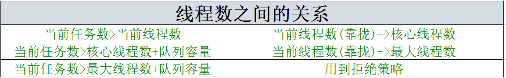
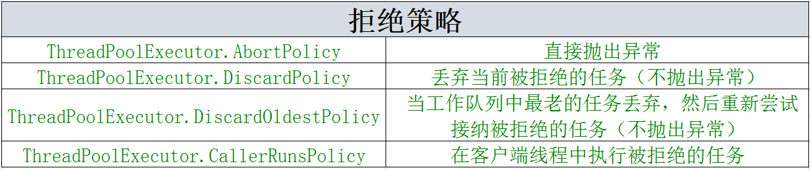
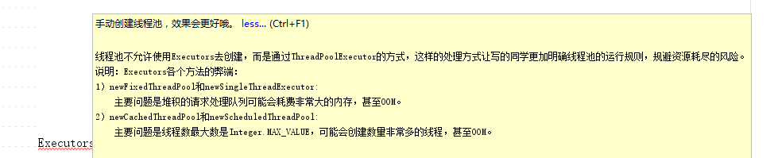

## 为什么要用线程池？##

- **线程是一种昂贵的资源，其开销主要包括以下几个方面：**

线程的创建与启动的开销。与普通的对象相比，Java线程还占用了额外的存储空间--栈空间。并且，线程的启动会产生相应的线程调度开销。
线程的销毁,线程的销毁也有其开销。
线程调度的开销。线程的调度会导致上下文切换，从而增加处理器资源的消耗，使得应用程序本身可以使用的处理器资源减少。
一个系统能够穿件的线程总是受限于该系统所拥有的处理器数目，无论是CPU密集型还是I/O密集型线程，这些线程的数量的临界值总是处理器的数目。

**因此，从整个系统乃至整个主机的角度来看，我们需要一种有效线程的方式。线程池就是有效使用线程的一种方式。**

常见的对象池（比如数据库连接池）的实现方式是对象池（本身也是个对象）内部威虎一定数量的对象，客户端需要一个对象的时候就向对象池申请一个对象，用完之后再将该对象返还给对象池，于是对象池中的一个对象就可以先后为多个客户端线程服务。线程池本身也是一个对象，不过他的实现方式与普通的对象池不同，线程池内部可以预先创建一定数量的工作者线程，客户端代码并不需要向线程池借用线程而是将其需要执行的任务作为一个对象提交给线程池，线程池可能将这些任务缓存在队列（工作队列）中，而线程池内部的各个工作者线程则不断地从队列中去除任务并执行。因为，线程池可以看做给予生产者-消费者模式的一种服务，该服务内部维护的工作者线程相当于消费者线程，线程池的客户端线程相当于生产者线程，客户端代码提交给线程池的任务相当于"产品",线程池内部用于缓存任务的队列相当于传输通道。

## 线程池的参数 ##

**java.util.concurrent.ThreadPoolExecutor类就是一个线程池，客户端可以调用submit()或者execute()方法向其提交任务。**

public ThreadPoolExecutor(int corePoolSize, int maximumPoolSize, long keepAliveTime, TimeUnit unit, BlockingQueue<Runnable> workQueue, ThreadFactory threadFactory, RejectedExecutionHandler handler) ;

- 线程池的有关线程的数量的变量总共有三个，当前的线程数量（currentPoolSize）表示线程中实际存在的工作者线程的数量。最大线程池的大小（maximumPoolSize）表示线程池中允许存在的最大线程池的数量。核心线程数（corePoolSize）表示一个不大于最大线程池大小的工作者线程数量上限。



- workQueue:workQueue是被称为工作队列的阻塞队列，它相当于声场这-消费者模式中的传输通道。BlockingQueue是一个接口，在建立线程池中，可以用LinkedBlockingQueue和SynchronousQueue两个实现类，使用不同的实现类有着不同的效果。LinkedBlockingQueue是一个链表构成的队列，需要设置链表的长度，如果没有设置，默认为2147483647。

- threadFactory指定用于创建工作者线程的线程工厂（比如你向让你创建的线程都有特色，比如是守护线程，优先级等，如果你的线程没有这么多限制的话，可以缺省它）。

- keepAliveTime和unit共同组成了线程池中空闲线程的最大存活时间。

- handler是我们现在需要介绍的。


## 参数例子 ##

``` java 
public class RandomThread implements Callable<String> {
    @Override
    public String call()  {
        Random rand = new Random();
        int i=rand.nextInt(200)+1999;
        try {
            Thread.sleep(i);
        } catch (InterruptedException e) {
            System.out.println("抛出了InterruptedException异常:"+e.getMessage());
        }
        return "这个线程执行了,i的值为："+i;
    }
}

```

``` java 
public class Test {
    static int length=20;
    static int corePoolSize=4;
    static int  workQueue=10;
    final static int N_CPU =Runtime.getRuntime().availableProcessors();
    final static ThreadPoolExecutor executor=new ThreadPoolExecutor(corePoolSize,N_CPU*2,5, TimeUnit.SECONDS,new ArrayBlockingQueue<Runnable>(workQueue),new ThreadPoolExecutor.CallerRunsPolicy());
    public static void main(String[] args) {
        
        int count=0;
        long start=System.currentTimeMillis();
        List<Future> list =new ArrayList<>(length);
        for (int i=0;i<length;i++){
            Future<String> future =executor.submit(new RandomThread());
            list.add(future);
        }
        System.out.println("futureList Size:"+list.size());
        for (Future future:list){
            try {
                String value=future.get();
		System.out.println(value);
            } catch (InterruptedException e) {
                e.printStackTrace();
            } catch (ExecutionException e) {
                e.printStackTrace();
            }
        }

        System.out.println("完成所有"+length+"个任务之后线程数量为："+executor.getPoolSize());
        System.out.println("所有任务完成耗时："+(System.currentTimeMillis()-start));    
        try {
            Thread.sleep(6000);
        } catch (InterruptedException e) {
            e.printStackTrace();
        }
        System.out.println("完成任务6s后线程池的线程数量为："+executor.getPoolSize());
    }
}

```


这几个参数关联性非常高，注意，是"非常"，为什么这么强调呢，看我下面的解释。
我们默认我们的线程池是新的，里面线程一个都没有，即当前线程数currentPoolSize=0.接下来我们在进行一些模拟，我将以corePoolSize代表核心线程数，workQueue代表等待的队列。keepAliveTime和unit组成线程空闲了5s就销毁。

### 【一】 ###
- 1）corePoolSize=5，maximumPoolSize=8，workQueue为10，任务数为9
** 9个任务队列刚好能放在队列里，而且currentPoolSize<corePoolSize,这个时候currentPoolSize就会涨到5，当线程完成任务后，连续5s都空闲的时候，会被检查，发现池内的线程数刚好等于corePoolSize，不会销毁。** 
``` text 
futureList Size:9

这个线程执行了,i的值为：2050

...

这个线程执行了,i的值为：2111

完成所有9个任务之后线程数量为：5

所有任务完成耗时：4290

完成任务6s后线程池的线程数量为：5

```

- 2）corePoolSize=5，maximumPoolSize=8，workQueue为10，任务数为2
** 2个任务可以存储到队列里，而且currentPoolSize<corePoolSize,这个时候currentPoolSize就会涨到2，当线程完成任务之后，连续5s都空闲，被检测，发现线程数不超过5个，进行保留，不销毁。** 

``` text 
futureList Size:2
这个线程执行了,i的值为：2068
这个线程执行了,i的值为：2151
完成所有2个任务之后线程数量为：2
所有任务完成耗时：2153
```


- 3）corePoolSize=5，maximumPoolSize=8，workQueue为10，任务数为17
** 当17个任务数>corePoolSize(5)+workQueue(10),当前线程数=17-10=7,当线程完成任务后，连续5s后空闲后，发现maximumPoolSize>corePoolSize,所以线程数降到5个，剩下的3个进行销毁。** 

``` text 
futureList Size:17
这个线程执行了,i的值为：2166
...
这个线程执行了,i的值为：2150
完成所有17个任务之后线程数量为：7
所有任务完成耗时：6352
完成任务6s后线程池的线程数量为：5
```

- 4）corePoolSize=5，maximumPoolSize=8，workQueue为10，任务数为20
** 当20个任务数>corePoolSize(5)+workQueue(10),因为20-10=10>8,所以当前线程数=8,当线程完成任务后，连续5s后空闲后，发现maximumPoolSize>corePoolSize,所以线程数降到5个，剩下的3个进行销毁。** 

``` text 
futureList Size:20
这个线程执行了,i的值为：2002
...
这个线程执行了,i的值为：2101
完成所有20个任务之后线程数量为：8
所有任务完成耗时：6251
完成任务6s后线程池的线程数量为：5
```

- 5）corePoolSize=0，maximumPoolSize=8，workQueue为100，任务数为20
** 因为任务数<100,并且corePoolSize=0，所以currentPoolSize=1，无法建立新的线程，那么这20个任务只能串行执行。当任务都执行过后5s后，当前线程池的数量是1，要销毁变成0。我们看一下任务耗时，也可以看出来相当于10个任务串行执行。** 
``` text
futureList Size:20
这个线程执行了,i的值为：2163
...
这个线程执行了,i的值为：2068
完成所有20个任务之后线程数量为：1
所有任务完成耗时：42416
完成任务6s后线程池的线程数量为：0
```

- 6）corePoolSize=0，maximumPoolSize=8，workQueue为10，任务数为30
** 30个任务数无法存储到队列，这时候currentPoolSize会涨到8，执行完过后5s后，当前线程数为8，如果都空闲，就会都销毁。** 

``` text
futureList Size:30
这个线程执行了,i的值为：2001
...
这个线程执行了,i的值为：2143
完成所有30个任务之后线程数量为：8
所有任务完成耗时：8384
完成任务6s后线程池的线程数量为：0
```

### 【二】 ###

为什么我们要使用【一】、【二】来讲例子分开，因为一的时候，我们建立的线程池workQueue都是使用的ArrayBlockingQueue，拒绝策略使用的都是CallerRunsPolicy(在客户端线程中执行被拒绝的任务)。我们看一下下面的表格，就可以了解拒绝策略了。之前我们使用的都是超过ThreadPoolExecutor.CallerRunsPolicy，在客户端线程中执行被拒绝的任务。




- 7）同样我们将4）(corePoolSize=5，maximumPoolSize=8，workQueue为10，任务数为20)其他参数都不变，因为20>8+10的，所以会用到拒绝策略，将拒绝策略改成ThreadPoolExecutor.DiscardPolicy(丢弃当前被拒绝的任务（不抛出异常）)。
``` java 
futureList Size:20
这个线程执行了,i的值为：1999
这个线程执行了,i的值为：2051
这个线程执行了,i的值为：2066
这个线程执行了,i的值为：2111
这个线程执行了,i的值为：2113
这个线程执行了,i的值为：2144
这个线程执行了,i的值为：2156
这个线程执行了,i的值为：2193
这个线程执行了,i的值为：2099
这个线程执行了,i的值为：2196
这个线程执行了,i的值为：2160
这个线程执行了,i的值为：2123
这个线程执行了,i的值为：2126
这个线程执行了,i的值为：2185
这个线程执行了,i的值为：2176
这个线程执行了,i的值为：2144
这个线程执行了,i的值为：2125
这个线程执行了,i的值为：2186

```
**如果你试着数一下，会发现被执行的线程是18个，也就是说20-10-8=2，两个线程被丢弃了。问题就这样过去了吗？？！！不是的，注意看我们的代码，正常走完整段代码是要输出完成之后的线程数、所用时间以及6s后的线程数量的。没有输出，说明我们这段代码出问题了！！出在哪呢，就是future.get();方法是阻塞的，它需要接到所有20的结果的时候才会继续向下运行，可是我们有两个线程还没有被处理就被丢弃了，无法返回值了。这样future.get();就会一直阻塞**

所以在这个时候，我们这种时间限制的等待是不现实的，也是毫无意义的。这个时候我们需要用到另外一个版本，future.get(long timeout,TimeUnit unit)。 我们可以指定一个时间，如果再这个时间内任务无法执行就抛出TimeoutException。

``` java 
futureList Size:20
这个线程执行了,i的值为：2002
这个线程执行了,i的值为：2017
这个线程执行了,i的值为：2065
这个线程执行了,i的值为：2069
这个线程执行了,i的值为：2070
这个线程执行了,i的值为：2099
这个线程执行了,i的值为：2182
这个线程执行了,i的值为：2195
这个线程执行了,i的值为：2014
这个线程执行了,i的值为：2069
这个线程执行了,i的值为：2132
这个线程执行了,i的值为：2096
这个线程执行了,i的值为：2123
这个线程执行了,i的值为：2102
这个线程执行了,i的值为：2140
这个线程执行了,i的值为：2172
这个线程执行了,i的值为：2049
这个线程执行了,i的值为：2027
java.util.concurrent.TimeoutException
	at java.util.concurrent.FutureTask.get(FutureTask.java:205)
	at kjava.Test.main(Test.java:25)
java.util.concurrent.TimeoutException
完成所有20个任务之后线程数量为：5
	at java.util.concurrent.FutureTask.get(FutureTask.java:205)
所有任务完成耗时：12168
	at kjava.Test.main(Test.java:25)
完成任务6s后线程池的线程数量为：5
```

根据结果我们可以看到，我们捕获了两个超时异常，方法继续的向下运行了。所以在平时的使用中，还是推荐使用带future.get(long timeout,TimeUnit unit)避免一直阻塞。（注：现在看到"完成所有20个任务之后线程数量为：5"，因为future.get()导致线程阻塞超过6s，所以部分的线程已经被回收掉了。）

- 8）在我们将future.get()改成future.get(3,TimeUnit.SECONDS)后，拒绝策略改成ThreadPoolExecutor.AbortPolicy(直接抛出异常)。其他还是(corePoolSize=5，maximumPoolSize=8，workQueue为10，任务数为20)。

``` java 
Exception in thread "main" java.util.concurrent.RejectedExecutionException: 
Task java.util.concurrent.FutureTask@12a3a380 rejected from java.util.concurrent.ThreadPoolExecutor@29453f44

[Running, pool size = 8, active threads = 8, queued tasks = 10, completed tasks = 0]
	at java.util.concurrent.ThreadPoolExecutor$AbortPolicy.rejectedExecution(ThreadPoolExecutor.java:2063)
	at java.util.concurrent.ThreadPoolExecutor.reject(ThreadPoolExecutor.java:830)
	at java.util.concurrent.ThreadPoolExecutor.execute(ThreadPoolExecutor.java:1379)
	at java.util.concurrent.AbstractExecutorService.submit(AbstractExecutorService.java:134)
	at kjava.Test.main(Test.java:20)

```
我们发现除了异常什么都没有，那是因为在for循环的时候，之前的18个都运行了，第19个线程才会抛出异常，因为抛出异常之后，主线程结束，不再继续运行了，所以连futureList的容量都没有打印。我们在线程RandomThread的call()函数上添加System.out.println("this is thread :"+i);再看一遍。

``` java 
Exception in thread "main" java.util.concurrent.RejectedExecutionException: 
Task java.util.concurrent.FutureTask@12a3a380 rejected from java.util.concurrent.ThreadPoolExecutor@29453f44

[Running, pool size = 8, active threads = 8, queued tasks = 10, completed tasks = 0]
	at java.util.concurrent.ThreadPoolExecutor$AbortPolicy.rejectedExecution(ThreadPoolExecutor.java:2063)
	at java.util.concurrent.ThreadPoolExecutor.reject(ThreadPoolExecutor.java:830)
	at java.util.concurrent.ThreadPoolExecutor.execute(ThreadPoolExecutor.java:1379)
	at java.util.concurrent.AbstractExecutorService.submit(AbstractExecutorService.java:134)
	at kjava.Test.main(Test.java:20)
this is thread :2167
this is thread :2143
this is thread :2155
this is thread :2011
this is thread :2013
this is thread :2088
this is thread :2027
this is thread :2033
this is thread :2071
this is thread :2117
this is thread :2100
this is thread :2142
this is thread :2036
this is thread :2138
this is thread :2093
this is thread :2127
this is thread :2151
this is thread :2020

```
发现果然还是如此，18个线程完成了他们的任务，只是主线程异常结束了，无法再调用future.get()并输出了，才使他们看起来像都没运行的假像。在运行19个时候报了RejectedExecutionException异常，那我们捕获它，才能让我们的项目进行正常的运转。

``` java 

for (int i=0;i<length;i++){
            try {
                Future<String> future =executor.submit(new RandomThread());
                list.add(future);
            }catch (RejectedExecutionException e){
                System.out.println("catch 到了 RejectedExecutionException异常 ");
            }
        }

```

修改后，我们再看一看结果。因为抛出异常之后，无法加入futureList中，所以futureList一直为18，如果用到ThreadPoolExecutor.AbortPolicy(直接抛出异常)策略的话，可以根据catch RejectedExecutionException进行逻辑判断。

``` java 
catch 到了 RejectedExecutionException异常 
catch 到了 RejectedExecutionException异常 

futureList Size:18

this is thread :2186
this is thread :2134
...
这个线程执行了,i的值为：2045
这个线程执行了,i的值为：2086
完成所有20个任务之后线程数量为：8
所有任务完成耗时：6216
完成任务6s后线程池的线程数量为：5

```

## Executors下的线程池 ##

concurrent包为我们提供一些我们建立线程池的方法，在idea上使用阿里巴巴插件公约的时候，会提示我们应该手动的建立线程池，而不应该使用Executors。这是因为每个项目的使用线程池的场景都不一样，没有那个线程池是最优的，只有最适合自己的。我们手动建立线程池，同时Executors参数设置看看想想他们使用的场景。




### newCachedThreadPool() ###

``` java 
public static ExecutorService newCachedThreadPool() {
    return new ThreadPoolExecutor(0, 2147483647, 60L, TimeUnit.SECONDS, new SynchronousQueue());
}
```

我们可以看到核心线程数为0，最大线程数为2147483647(Integer最大值)。阻塞队列时new SynchronousQueue()，我们可以理解SynchronousQueue容量为0的队列。所以当大量请求来的时候，没有阻塞队列缓冲，来了就会创建线程。如果线程非常多，就会创造非常多的线程，这样会OOM。而且如果每一个任务执行的时间都很长，那么创建这么多线程，系统会进行大量的上下文切换，影响系统性能。再想一想，如果每一个线程都需要查询一下数据库表，可是数据库连接池的连接就那么多，很多线程都等待得到数据库的连接，都是newCachedThreadPool() 的弊端。newCachedThreadPool()的使用，适合执行之间非常短，任务多的数据。

### newFixedThreadPool() ###

``` java 
public static ExecutorService newFixedThreadPool(int var0) {
    return new ThreadPoolExecutor(var0, var0, 0L, TimeUnit.MILLISECONDS, new LinkedBlockingQueue());
}

public LinkedBlockingQueue() {
    this(2147483647);
}

private static final RejectedExecutionHandler defaultHandler = new ThreadPoolExecutor.AbortPolicy();

```
我们需要传递一个参数var0，设置核心线程数和最大线程数，队列为容量为2147483647，采用拒绝策略为抛出异常。这种设置，相当于超时时间是无效的，当线程达到核心线程数的时候永远都不会被回收。所以这种情况，如果线程池使用频率较少，而且var0设置很高的话，系统中会存在很多没用的线程。如果请求很多的话，这样就会造成队列数据过多，可能会造成OOM。

我接触的时候就有这个场景，因为我们本地数据一个表表中数据非常多，并且每秒还会有很多的数据进入这个列表，表的查询等已经非常慢了。我们要将状态为"处理完成"的，一个月以前的数据迁入到历史表中。我的做法是每次查询2000条数据，分为10个线程，每个线程200条数据进行处理，我会将LinkedBlockingQueue()设置为10。并且将ThreadPoolExecutor.DiscardPolicy()即丢弃当前的任务，因为每条数据并没有关联性，而且不会丢失，以后我再获取就可以了。

### newSingleThreadExecutor() ###

``` 
new ThreadPoolExecutor(1, 1, 0L, TimeUnit.MILLISECONDS, new LinkedBlockingQueue());
```

好了，这个就不用多说了，这个就是无论怎么样，我都是单线程，就算是你的请求再多，这样就会造成队列数据过多，可能会造成OOM。


## 总结 ##

这篇文章主要是，根据自己的实践，来利用参数的改变选择自己合适的线程池，以及再实际开发中注意什么。


