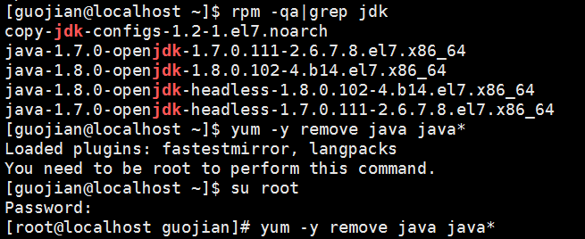
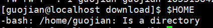
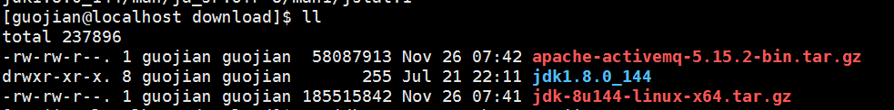
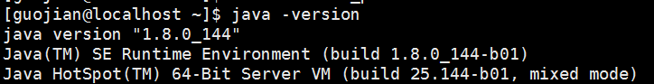

# 准备
**准备环境：centos7**

**jdk1.8的压缩包：jdk-8u144-linux-x64.tar.gz**

在新建的centos7下，我新建了一个用户guojian(我的名字)。

# 卸载OpenJDK

自带的linux下会自带OpenJDK，有时候我们并不了解，所以建议删除它。

使用rpm -qa|grep jdk；检查一下。

发现确实存在两个版本1.7和1.8，使用yum -y remove java java* 进行批量卸载。

提示我们必须使用root用户才能卸载，我们登录root用户执行即可。

yum -y remove java copy-java* 把copy-jdk开头的也卸载掉。 

卸载完成后，使用exit退出root用户。

# 安装jdk1.8

查看一下自己目录的位置：$HOME

我们进入/home/guojian下使用mkdir 分别两个文件夹download(用下上传下载用),usr(作为安装软件的目录)。

用ftp软件工具将下载好的压缩包上传到download下。

然后进行解压。
tar-zxvf jdk-8u144-linux-x64.tar.gz

使用ll命令检查一下，发现解压成功。
然后将文件夹更名为jdk1.8

mv jdk1.8.0_144  jdk1.8

将文件夹移动到/home/guojian/usr下

mv  jdk1.8 /home/guojian/usr

设置环境变量：
在用户guojian的根目录下，即/home/guojian

cat .bash_profile 检查文件是否存在 或者使用ls -a 查看（ .bash_profile是隐藏文件）

使用vim .bash_profile 进行添加或者新建

JAVA_HOME=/home/guojian/usr/jdk1.8

CLASSPATH=$JAVA_HOME/lib/

PATH=$PATH:$JAVA_HOME/bin

export PATH JAVA_HOME CLASSPATH

保存退出。

我们使用java -version检查一下是否配置成功。
发现没有，原因是.bash_profile文件的原因，是用户下的配置文件，每次用户登录的时候自动载入，所以我们需要重新登录一次或者使用source .bash_profile;进行加载。

再次使用java -version 

配置结束。
