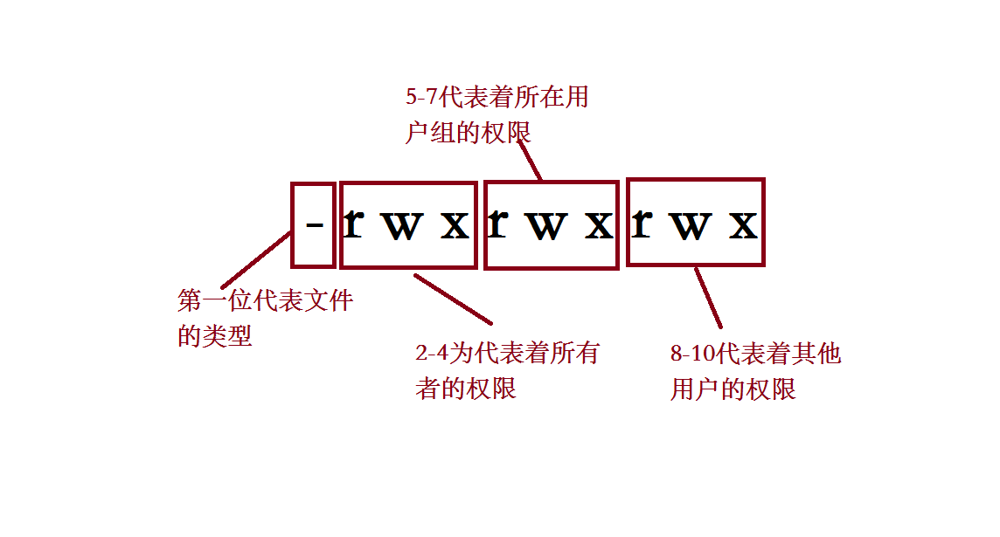

**在linux下我们ll的时候就会看见相应文件的权限，总共有十位。**

# 第一位：

**代表着当前文件的类型。如果是-代表的就是文件，如果是d就代表这文件夹。**

# 第2-9位：

**根据上图描述，其实是分为三组的，分别是所有者、用户组、其他。每个组都有三个权限分别是可读、可写、可执行。**

**平常我们会用 chmod  775 test.txt来修改权限，这个775代表的是什么意思呢。**

**每个组的有三个权限，用二进制来表示，即r：4，w：2，x：1。如果该位置没有权限用“-”（0）来代替。**

**775的含义就是：所有者和所有者的用户组有可读、可写、可执行的权限，其他用户只有可读和可执行的权限。**

**注意这个可执行权限（X）：**

**作用于文件夹：当使用 chmod -R  776  WebRoot时，其他用户是无法进入WebRoot文件夹的，因为没有为他配置可执行的权限，此时X相当于文件夹的钥匙，你没有这个权限，你就访问不了。**

**作用于文件：当使用chmod  774 start.sh，当文件是可执行文件，其他用户只能查看文件，而不能执行.sh的可执行文件。 **

**现实操作中，需要将文件夹和里面的文件进行分别配置可能达到最好的效果。**
