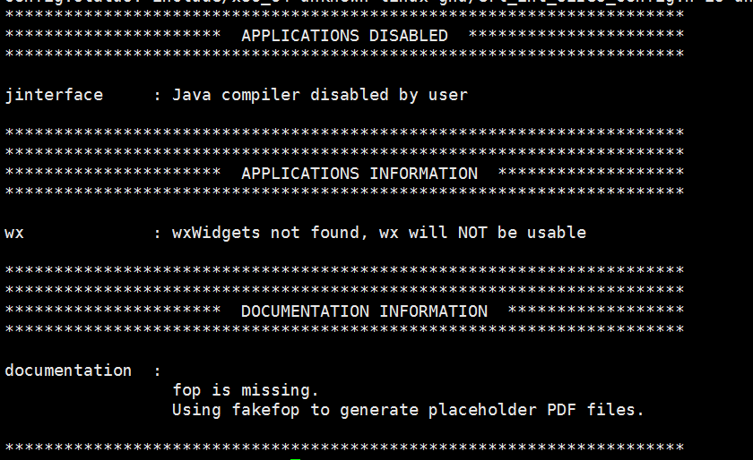
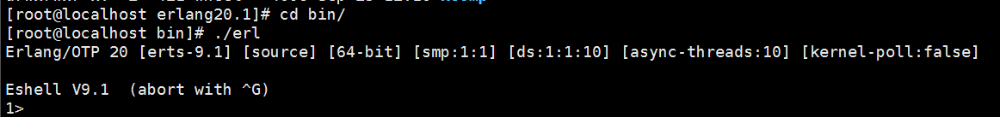
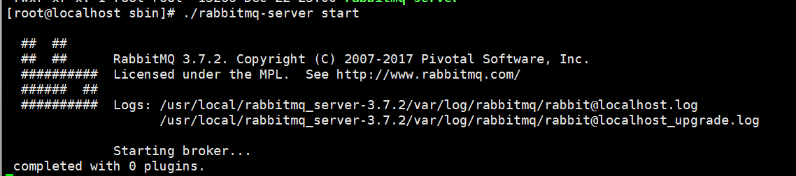
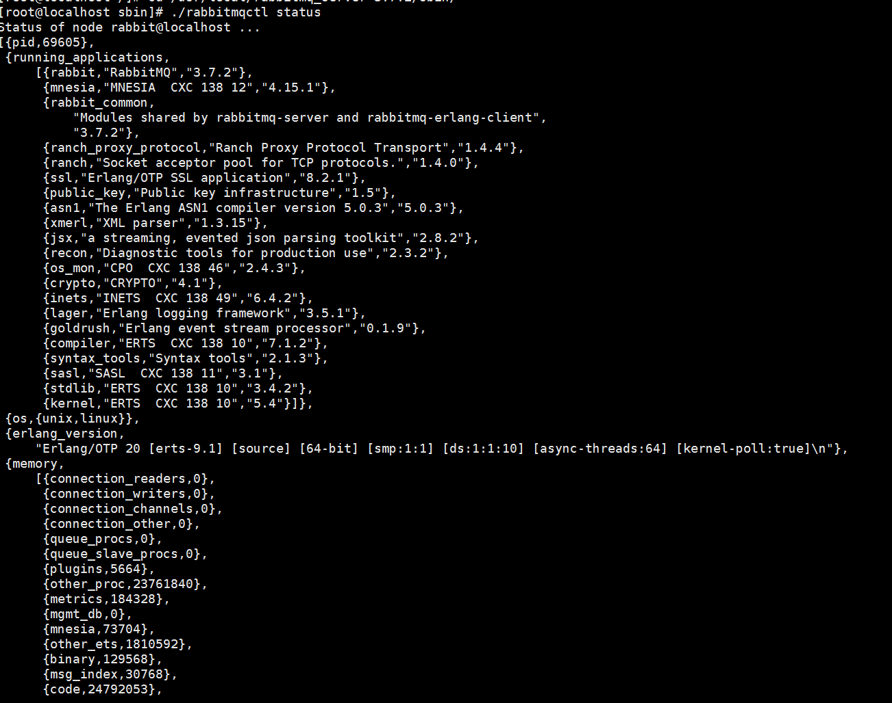
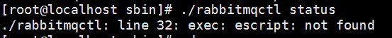
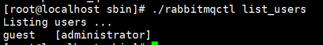
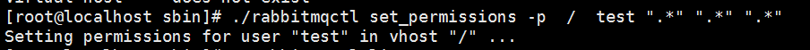
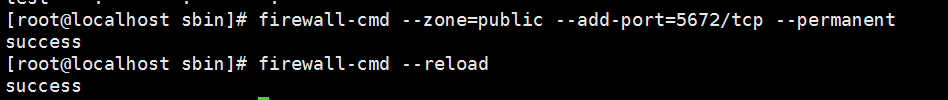

首先应在rabbitMQ官网查看需要下载的版本，我们选择的是3.7.2，根据rabbitMQ的版本在erlang选择支持的版本，这里我们选择的是erlang是20.1。我是新建一个虚拟机进行配置，所以使用的root用户进行文件的安装。

# 安装erlang

**首先现在官网下载erlang**
``` Shell
wget http://www.erlang.org/download/otp_src_20.1.tar.gz
```

**安装erlang依赖包**

``` Shell
yum install -y gcc gcc-c++ unixODBC-devel  openssl-devel ncurses-devel
```

**解压压缩包**

``` Shell
tar -zxvf otp_src_20.1.tar.gz
```

**将解压文件修改名字，并移动到自己的软件安装目录下**

``` Shell
mv otp_src_20.1 erlang20.1
```

**进入erlang20.1目录下**

``` Shell
./configure --prefix=/usr/local/erlang20.1 -with-ssl -enable-rhreads -enable-smp-support -enable-kernel-poll -enable-hipe -without-javac
```





*如果提示以上界面，说明erlang的配置项没有问题，再进行编译*

``` Shell
make && make install
```

验证是否安装成功，进入bin/目录下，查看是否存在erl文件

./erl 



使用halt().退出


**我们为了能让erl全局使用，需设置环境变量，我如果只想在guojian用户下使用环境变量，就需要修改.bash_profile。**

``` Shell
PATH=$PATH:/usr/local/erlang20.1/bin
```

保存退出后，直接使.bash_profile生效
``` Shell
source .bash_profile
```


# 安装rabbitMQ

## rabbit安装部分

我们首先下载下来的文件包rabbitmq-server-generic-unix-3.7.2.tar.xz

首先它是一个XXX.tar.xz的格式，我们先要给他解压成tar格式的

``` Shell
xz -d rabbitmq-server-generic-unix-3.7.2.tar.xz
```

然后再解压tar包

``` Shell
tar -xvf rabbitmq-server-generic-unix-3.7.2.tar
```

移动rabbitmq 到软件的目录

``` Shell
mv rabbitmq_server-3.7.2/ /usr/local/rabbitmq-3.7.2
```

进入rabbitmq-3.7.2的sbin目录下

执行 ./rabbitmq-server start



如果出现rabbitmq的版本信息，说明你的rabbitmq已经启动了。

**查看rabbitmq的状态**
./rabbitmqctl status



如果你输入显示的是如下图所示，说明你没有配置erlang的环境变量，上面有。




## 客户端连接

**查看用户**



我们可以看到有一个用户是guest，权限是administrator。这个地方是什么我们下一章会总体说明。因为guest是默认用户，所以它没有外网访问的权限，我们需要新建一个用户，才能完成不是非本地的连接。

添加一个用户，名为test，密码为test

``` Shell
./rabbitmqctl add_user test test
```

为用户test赋予权限

``` Shell
./rabbitmqctl set_permissions -p / test ".*"  ".*"  ".*"
```



在centos7开放端口，rabbitmq的默认端口是5672

``` Shell
firewall-cmd --zone=public --add-port=5672/tcp --permanent
```

重启生效
``` Shell
firewall-cmd --reload
```



远程客户端访问一下试试吧。

所依赖的jar包

``` xml
<dependency>
      <groupId>com.rabbitmq</groupId>
      <artifactId>amqp-client</artifactId>
      <version>5.1.1</version>
</dependency>
```

``` java 

import com.rabbitmq.client.Channel;
import com.rabbitmq.client.Connection;
import com.rabbitmq.client.ConnectionFactory;

public class Send {
    private final static String QUEUE_NAME = "hello";

    public static void main(String[] argv) throws Exception {
        ConnectionFactory factory=new ConnectionFactory();
        factory.setHost("192.168.14.128");
        factory.setUsername("test");
        factory.setPassword("test");
        factory.setPort(5672);
        Connection connection = factory.newConnection();
        Channel channel = connection.createChannel();
        channel.queueDeclare(QUEUE_NAME, false, false, false, null);
        String message = "Hello World!";
        channel.basicPublish("", QUEUE_NAME, null, message.getBytes());
        System.out.println(" [x] Sent '" + message + "'");
        channel.close();
        connection.close();
    }
}

```

输出：


