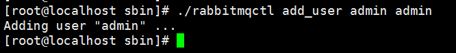
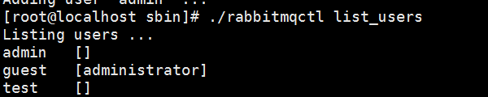
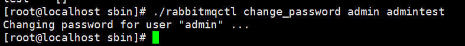
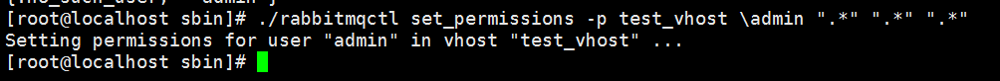
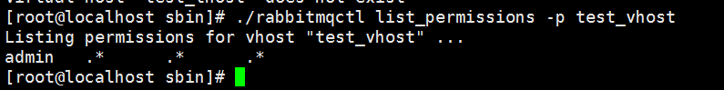
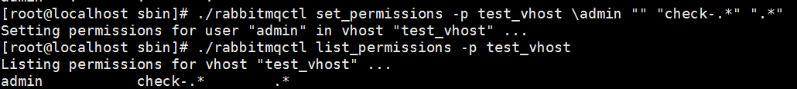
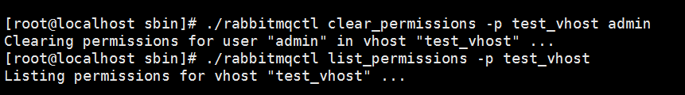
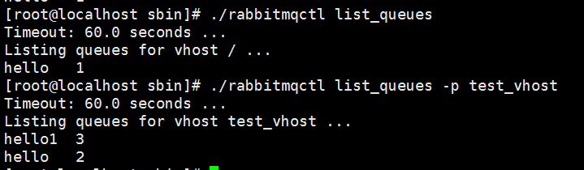
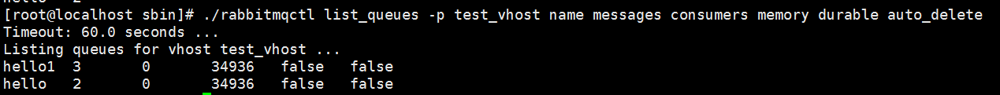
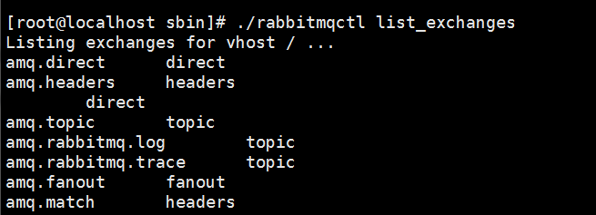

# 服务器管理

启动服务 ./rabbitmq-server 

守护程序启动服务 ./rabbitmq-server -detached

启动守护进程会显示警告：Warning: PID file not written; -detached was passed.在后台启动服务器进程。请注意，这将导致pid不被写入到pid文件中。

停止服务 ./rabbitmqctl stop

停止远程节点 ./rabbitmqctl stop -n rabbit@192.168.14.130

# 管理用户

**添加一个账户为admin,密码为admin的用户**

./rabbitmqctl add_user admin admin 



**查看用户列表**

./rabbitmqctl list_users



**修改用户密码**

将admin用户的密码修改为admintest

./rabbitmqctl change_password admin admintest



# rabbitMQ权限系统


rabbitMQ创建用户，然后为其赋予权限。rabbitmq的权限分为读、写、配置三个方面。RabbitMQ用户一个好的地方就是在于单个用户可以跨越多个vhost用户进行授权。当应用程序需要跨越多个安全域进行通信时(使用虚拟机进行隔离)，这会极大地方便访问控制的管理。

**读-有关消费信息的任何操作，包括"清除"整个队列(同样需要绑定操作成功)。**

**写-发布消息(同样需要绑定操作成功)。**

**配置-队列和交换器的创建和删除。**

每一个访问条目由一下四部分组成：

被授予访问权限的用户。

权限控制应用的vhost。

需要手语的读/写/配置权限的组合。

权限范围-权限控制仅应用于客户端命名的队列和交换器呢，还是仅用于服务器端的命名的队列/队列呢？抑或者两者兼顾？客服端命名意味着由你的应用程序设置交换器/队列的名称;服务器端命名意味着你的应用程序不提供名字而是让服务器随机指派。

谨记：访问控制条目是无法跨越vhost的。举例来说，如果你想要给用户admin在vhost A和vhost B上赋予相同的权限，那么你必须创建两份访问控制目录(每一个vhost一份)。

之前我们创建了一个vhost名为test_vhost,如果想让admin用户赋予完全的访问权限(读、写、配置)。

## 添加
-p test_vhost 为那个vhost设置权限
\admin 哪个用户
".*" 所有的权限
"check-.*" 只匹配名字以"check-"开头的队列和交换器。
"" 不匹配队列和交换器（这就是如何对用户拒绝指定的权限）

".*" ".*" ".*" 配置的顺序依次为配置、写、读。

``` shell
./rabbitmqctl set_permissions -p test_vhost \admin ".*" ".*" ".*"
```



## 查看
检查一下vhost（以test_vhost）下的用户权限。

``` shell
./rabbitmqctl list_permissions -p test_vhost
```



如果在vhost_test下，允许admin用户对任何队列或者交换器可执行读操作，同时限制其只能对名字以"check-"开始的队列和交换器可执行读操作，同时限制这个用户不能进行配置。根据上面的介绍，你应该如此配置。



## 删除

删除test_vhost下的admin的权限设置。

``` shell
./rabbitmqctl clear_permissions -p test_vhost admin
```



## 修改

其实修改就是跟添加是一个语法啦，会覆盖之前的。

# 检查

## 队列


**列出默认的vhost(只是默认的vhost而不是所有的vhost的队列)队列信息和数量**
``` shell
./rabbitmqctl list_queues
```
**列出vhost名为test_vhost队列信息和数量：**
``` shell
./rabbitmqctl list_queues -p test_vhost
```


查看队列的更多信息，举几个比较常用的
name:名称
messages：数量
consumers：附加的消费者数目
memory：占用的内存
durable:队列是否持久化
auto_delete:队列消息没有时是否删除队列

``` shell
./rabbitmqctl list_queues -p test_vhost name messages consumers memory durable auto_delete
```



## 交换器和绑定

**查看默认vhost：**
``` shell
./rabbitmqctl list_exchanges
```
**列出vhost名为test_vhost：**
``` shell
./rabbitmqctl list_exchanges -p test_vhost
```


当然你也可以输出更详细的
<exchangeinfoitem> must be a member of the list [name, type, durable, auto_delete, internal, arguments, policy].


