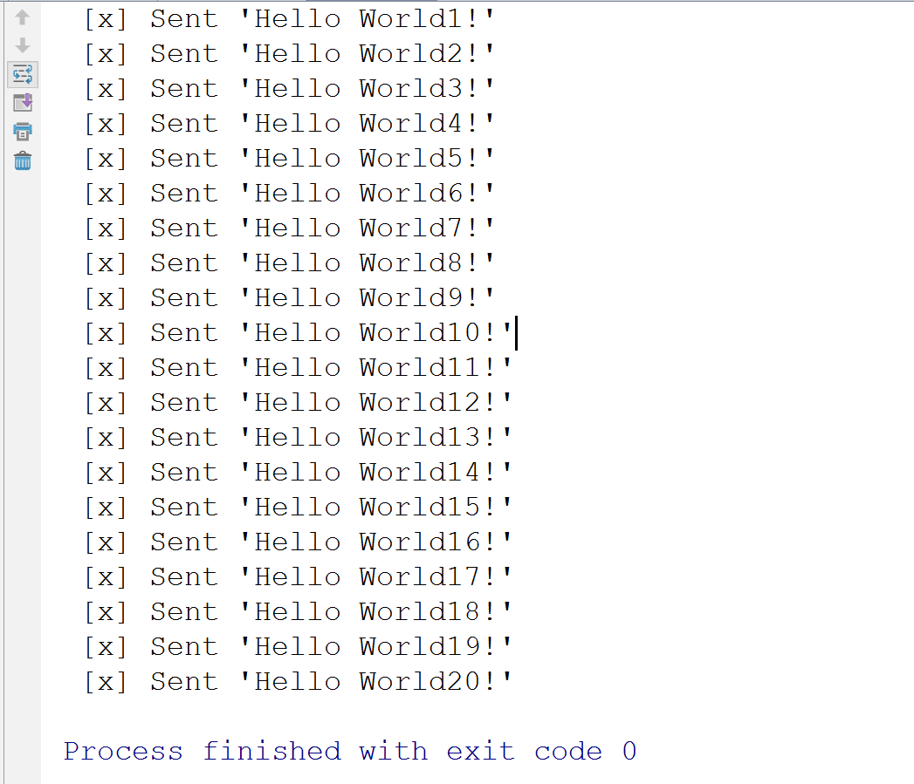
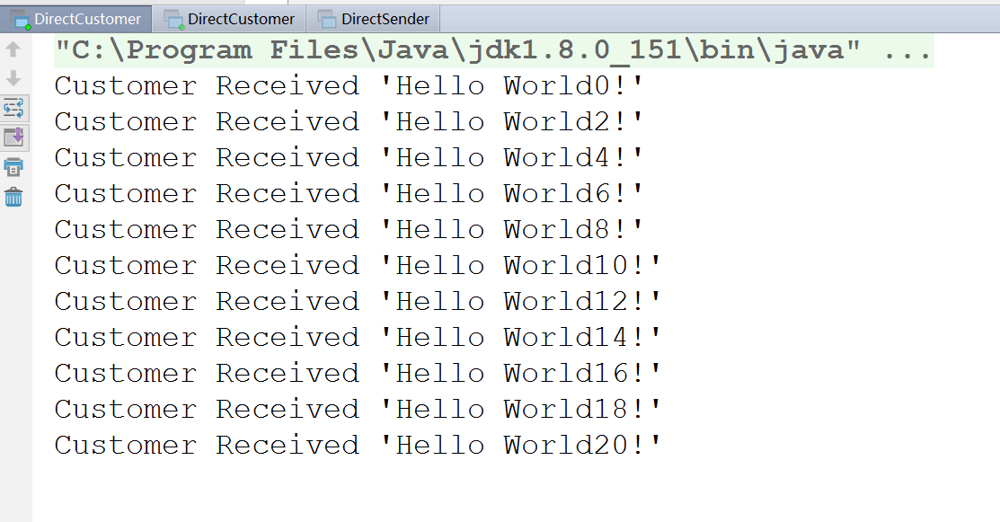
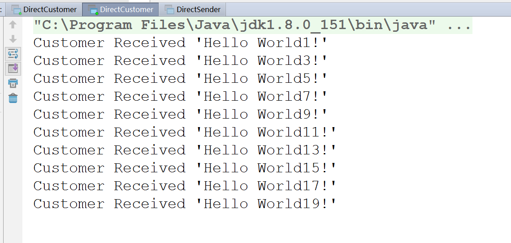

在之前介绍这么多之后，我们也需要进行一下java代码的实现。

# direct交换器

## direct生产者

``` java

import com.rabbitmq.client.AMQP;
import com.rabbitmq.client.Channel;
import com.rabbitmq.client.Connection;
import com.rabbitmq.client.ConnectionFactory;

public class DirectSender {
    
    private final static String QUEUE_NAME = "log-direct";

    public static void main(String[] args) throws Exception {
        ConnectionFactory factory=new ConnectionFactory();
        factory.setHost("192.168.14.128");
        factory.setUsername("admin");
        factory.setPassword("admin");
        factory.setPort(5672);
	//设置vhost
        factory.setVirtualHost("test_vhost");
        Connection connection = factory.newConnection();
        Channel channel = connection.createChannel();

        /**
         * String queue:声明的队列名称
         * boolean durable：是否队列持久化
         * boolean exclusive：是否为私有
         * boolean autoDelete：最后一个消费者取消订阅的时候，对列是否自动移出
         * Map<String,Object> arguments
         */
        channel.queueDeclare(QUEUE_NAME, false, false, false, null);
		
         /**
         *定义交换器的类型
         */
        channel.exchangeDeclare(QUEUE_NAME,"direct");
        
        for (int i=0;i<=20;i++){
            String message = "Hello World"+i+"!";
            channel.basicPublish("", QUEUE_NAME, null, message.getBytes());
            System.out.println(" [x] Sent '" + message + "'");
        }

        channel.close();
        connection.close();
    }
}

```

## direct消费者

``` java

import com.rabbitmq.client.*;
import java.io.IOException;
import java.util.concurrent.TimeoutException;

public class DirectCustomer {
    private final static String QUEUE_NAME="log-direct";

    public static void main(String[] args) throws IOException, TimeoutException {
        ConnectionFactory factory=new ConnectionFactory();
        factory.setHost("192.168.14.128");
        factory.setPort(5672);
        factory.setUsername("admin");
        factory.setPassword("admin");
        factory.setVirtualHost("test_vhost");

        Connection connection=factory.newConnection();
        final Channel channel = connection.createChannel();
		
         /**
         * String queue:声明的队列名称
         * boolean durable：是否队列持久化
         * boolean exclusive：是否为私有
         * boolean autoDelete：最后一个消费者取消订阅的时候，对列是否自动移出
         * Map<String,Object> arguments
         */
        channel.queueDeclare(QUEUE_NAME, false,false,false,null);

         /**
         *定义交换器的类型
         */
        channel.exchangeDeclare(QUEUE_NAME,"direct");

        // 告诉服务器我们需要那个频道的消息，如果频道中有消息，就会执行回调函数
        Consumer consumer=new DefaultConsumer(channel){
            @Override
            public void handleDelivery(String consumerTag, Envelope envelope, AMQP.BasicProperties properties, byte[] body) throws IOException {
                String message=new String(body,"utf-8");
                System.out.println("Customer Received '" + message + "'");
            }
        };

        //订阅队列
        channel.basicConsume(QUEUE_NAME, true, consumer);
    }


}

```

我们这里在消费者和生产者都定义了队列和交换器，如果定义的队列信息一致，那么rabbitmq不会做出任何改变。如果你在运行消费者的时候定义了队列需要持久化，而在生产者的时候定义队列不需要持久化，那么就会出现错误。为了验证我们之前说过的，订阅到rabbitmq队列的多个消费者是顺序接收消息的，所以我们先启动两个消费者，再启动生产者。

**生产了创建了21条数据，并被两个消费者依次消费**








