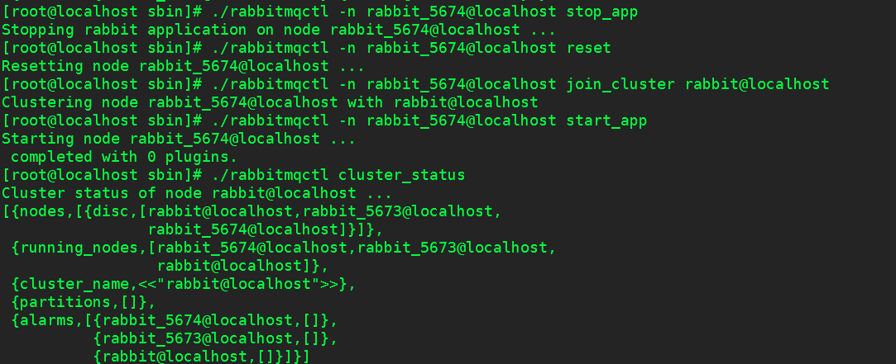
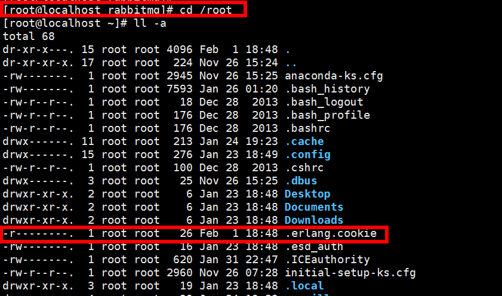
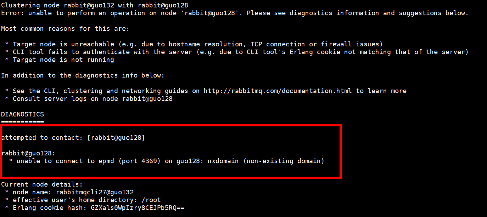

之前我们已经设置了单机版的rabbitmq，并且设置了user、exchange、queue、vhost等。现在我们要在我们的电脑里设置集群啦。我使用的是虚拟机，所以很轻松的就复制了之前的rabbitmq环境来进行集群设置。

# 集群你要知道

*之前我们了解了一些rabbitmq的基础知识，包括单机版安装、rabbitmq的构成等。如果你的rabbitmq服务器遇到内存崩溃了或者断电的情况，那么我们该进行集群啦。*

## 集群架构

到目前为止，我们对于rabbitmq的内部还算不上了解。确实，我们知道队列和交换器的含义，以及如何将它们绑定在一起。也知道该使用哪种类型的交换器。但是背后发生了什么，这是我们不知道的。Rabbitmq是如何记录所有你使用的各种基础构件，同时它们又如何装配成一个消息通讯服务器的呢？

Rabbitmq会始终记录一下四种类型的内部元数据：

- 队列元数据——队列名称和它们的属性(是否可持久化，是否自动删除？)
- 交换器元数据——交换器名称、类型和属性(可持久化等)
- 绑定元数据——一张简单的表格展示了如何将消息路由到队列
- vhost——为vhost内的队列、交换器和绑定提供命名空间和安全属性

<font color=red size=4 >*注意！！队列的元数据不包括队列里面的内容，队列中的消息在重启之后还是会消失的。*</font></br>
<font color=red size=4 >*rabbitmq存储数据有两种方式，一种为disc(硬盘)存储，一种为(ram)内存存储*</font>

在单一节点内，rabbitmq会将所有的这些信息存储在内存中，同时将哪些标记为可持久化的队列和交换器(以及他们的绑定)存储到硬盘上。存储到硬盘上可以确保队列和交换器在重启Rabbitmq节点后重新创建。
当你引入集群时，rabbitmq需要追踪新的元数据类型：集群节点位置，以及节点与已记录的其它类型元数据的关系。集群也提供了选择：将元数据存储到磁盘上(独立节点的默认设置)，或者仅存储在ram中。但是
在我们深入到集群节点和他们如何存储元数据前，我们首先理解在集群环境中队列和交换器的行为。

## 集群中的队列

在将两个节点组成集群的那一刻，事情发生了巨大的变化：不是没一个节点都有所有队列的完全拷贝。在单一节点设置中，所有关于队列的的信息(元数据、状态和内容)都完全的存储在该节点上。<font color=red size=3 >*但是如果在集群中创建队列的话，集群只会在单个节点而不是在所有节点上创建完整的队列信息(元数据、状态和内容)。*</font>所以，只有队列的所有者节点知道有关这个队列的所有信息。所有其他非所有者节点指挥知道队列的元数据和指向该队列存在的那个节点的指针。因此，在集群崩溃时，该节点的队列和关联的绑定就都消失了。附加在那些队列上的消费者丢失了其订阅信息，并且任何匹配该队列绑定信息的新消息也都丢失了。

别担心，你可以让你的消费者重新连到集群并重新创建队列。这种做法仅当队列最开始没有设置成可持久化的时候才是可行的。如果重新创建的队列被标记为持久化了，那么在其他节点上重新声明他们的话会得到一个难看的404 NOT FOUND错误。这样确保了当失败节点恢复后加入集群，该节点上的队列消息不会丢失。想要该制定队列重回集群的唯一方法是恢复故障节点。但是如果消费者尝试重建的队列不是可持久化的，那么重新声明就会成功，你可以准备重新绑定他们并传输数据。

*这样设置队列的原因：*

- 存储空间——如果每个集群节点都拥有所有队列的完成拷贝，那么添加新的节点不会给你带来更多的存储空间。举个例子，如果一个节点可以存储1GB的消息，那么添加两个节点只会给你带来两个一模一样的1GB的信息的拷贝。也就是说，两个节点里面存储的内容是一样的。

-  性能——消息的发布需要将消息复制到每一个集群节点。对于持久化消息来说，每一个消息都会触发磁盘活动。每次新增节点，网络和磁盘负载都会增加，最终只能保持集群性能的平稳，或者更糟，不会使性能更近一步。

通过设置集群中的唯一节点来负责任何特定的队列，只有负责该节点才会因队列消息而遭受磁盘活动的影响。所有其他节点需要将接收的该队列的消息传递给该队列的所有者节点。因此，往rabbit集群添加更多的节点意味着你将拥有更多的节点来传播队列
，这些新增节点为你带来了性能的提升。当负载增加时，rabbitmq集群是性能扩展的最佳方案。

## 分布式交换器

到目前为止，我们一直把交换器描述得如同队列那样是一个活生生的实体。事实上，不同于队列那样拥有自己的进程，交换器说到底只是一个名称和一个队列绑定的列表。当你将消息发布到交换器上的时，实际上是由你所连接的信道将消息上的路由键同交换器的绑定列表进行比较，然后路有消息。正事信道按照绑定匹配的结果，将消息路由到队列。所以信道才是真正的路由器。

*将每个队列想象成节点上运行的进程，每个进程拥有自己的PID。交换器只不过是由路有模式列表和匹配消息应发往的队列进程ID列表。当发布的消息匹配了交换器中的绑定时，实际上是由信道完成了匹配工作，并在匹配之后建立了队列PID的睑裂，然后将消息传递过去。队列的进程ID本质上是其在集群中的Erlang地址*

由于交换器只不过是一张查询表，而非实际上的消息路由器，因此将交换器在整个集群中进行复制会更加简单。举例来说，当创建一个新的交换器时，rabbitmq所要做的是将查询表添加到集群中的所有节点上。这时，每个节点上的每条信道都可以访问新的交换器了。因此。对于默认情况下队列的完整信息存在集群中的单一节点来说，集群中的每个节点拥有每个交换器的所有信息。就可用性来讲，这非常棒，这意味着你不用担心在节点故障时重新声明交换器。只需让故障节点上的生产者重新连接到集群上，它们立即就能开始往交换器上发布消息了。

## 内存节点和磁盘节点

每个rabbitmq节点，不管是单一节点系统或者是庞大的集群的一部分，要么是内存节点(ram),要么是磁盘节点(disc)。内存节点将所有的队列、交换器、绑定、用户和vhost的元数据定义都仅存储在内存中。而磁盘节点则将元数据存储在磁盘中。单节点系统只允许磁盘类型的节点；否则，每次你重启rabbitmq之后，所有关于系统的配置信息都会失效。不过在集群中，你可以选择配置部分节点为内存节点。为什么想要选择将元数据仅存储在内存中？因为它使得相对列和交换器声明之类的操作更加快速。

当在集群中声明队列、交换器或者绑定的时候，这些操作会知道所有的集群节点都成功提交元数据变更后才返回。对于内存节点来说，这意味着将变更写入内存；而对于磁盘节点来说，这意味着昂贵的磁盘写入操作，直到完成之后，节点才能说“完事了”。假设你有五个节点的集群，并且所有的节点都是磁盘节点，则你必须得等待所有这五个节点将元数据写入磁盘后，队列声明才做还能返回。对于队列长存的服务器来说这没有什么大不了的。但是如果在处理繁重的RPC，如果每个RPC客户端正在创建和销毁每秒数以万计的应答队列，那么就会明白磁盘节点会降低性能。内存节点可以提供出色的性能，和磁盘节点能够保障集群配置信息幸免于重启，如何平衡两者。

rabbitmq只要求在集群中至少有一个磁盘节点。所有其他节点可以是内存节点。记住，当节点加入或者离开集群时，他们必须要将该变更通知至少一个磁盘节点。如果只有一个磁盘节点，而且不凑巧的是他刚好又崩溃，那么集群可以继续路由消息，但是不能做一下操作了：

- 创建队列
- 创建交换器
- 创建绑定
- 添加用户
- 更改权限
- 添加或删除集群节点

换句话说，如果集群中唯一的磁盘节点崩溃的话，集群仍然可以保持运行，但是在该节点恢复到集群前，你无法更改任何东西。解决方案是在集群中设置两个磁盘节点，因此他们中至少有一个是可用的，能在任何时候保存元数据的变更。只要一个需要所有的磁盘节点必须在线的操作是添加或者删除节点。当内存节点重启后，它们会连接到预先配置的磁盘节点，下载当前集群的元数据拷贝。如果你只将两个磁盘节点中的一个告诉该内存节点，而不凑巧的是当内存节点供电中断该磁盘节点也发生故障的话，那么内存节点在重启之后就无法找到集群了。所以添加内存节点时，确保要告知其所有的磁盘节点(内存节点唯一存储到磁盘的元数据信息是集群中的磁盘节点的地址)。只要内存节点可以找到至少一个磁盘节点，那么她就能在重启后重新加入集群。


# 在一台电脑上设置集群

- 关闭Management插件

我们在设置集群的时候，需要将management插件进行关闭，因为在你启用的management的时候，在同一台电脑启动多个rabbitmq的节点的时候，management的端口会冲突，management的默认端口号是15672。日志会显示端口号15672端口已被占用。初次设置集群的时候，最好不要用守护进程方式开启rabbitmq(-detached),如果你使用守护进程的方式开启rabbitmq，需要查看日志，因为rabbitmq默认守护进程，不会显示错误信息的。日志路径：rabbitmq所在目录下的/var/log/rabbitmq/rabbit_5673.log(5673是对应的端口)


关闭Management插件

``` xml
./rabbitmq-plugins disable rabbitmq_management
```

## 启动三个节点

首先先启动三个rabbitmq的应用程序，这里我们需要设置rabbitmq的端口号和节点名称，否则都使用默认的会发生端口、节点名称已被使用的异常。首先进入rabbitmq的安装目录下

``` xml

RABBITMQ_NODE_PORT=5672 RABBITMQ_NODENAME=rabbit \./sbin/rabbitmq-server 

RABBITMQ_NODE_PORT=5673 RABBITMQ_NODENAME=rabbit_5673 \./sbin/rabbitmq-server 

RABBITMQ_NODE_PORT=5674 RABBITMQ_NODENAME=rabbit_5674 \./sbin/rabbitmq-server 

```

好了，我们现在启动了三个rabbitmq节点，分别是rabbit、rabbit_5673、rabbit_5674(每个节点后都有系统的主机名，添加在@后)。但是每一个节点都是独立的节点，拥有自己的元数据，并且不知道其他节点的存在。集群中的第一个节点将初始化数据带入集群中，并且无须被告知加入。而第二个和之后的节点将加入它并且获得他的元数据。要加入第二个和第三个节点，首先需要停止Erlang节点上运行的RabbitMQ应用程序，并重设(清空)他们的元数据。这样他们才可以被加入并获取集群的元数据。rabbitmqctl工具会帮你和每个节点通信并完成以上任务。


- 停止端口号为5673的应用程序。

``` xml 
./rabbitmqctl -n rabbit_5673@localhost stop_app
```


- 将重设第二个节点的元数据和状态为清空的状态：

``` xml
./rabbitmqctl -n rabbit_5673@localhost reset
```


- 将其加入集群

``` xml
./rabbitmqctl -n rabbit_5673@localhost join_cluster rabbit@localhost
```


- 重新启动第二个节点的应用程序，它就变成集群中的一元了

``` xml
./rabbitmqctl -n rabbit_5673@localhost start_app
```


- 查看集群信息

``` xml
./rabbitmqctl cluster_status
```


我们可以看到，集群中有两个节点，而且都是运行状态。

我们在将第三个节点添加进来。



## 设置节点类型

我们通过./rabbitmqctl cluster_status命令查看了有关于节点的信息，我们发现我们添加的节点都是disc的，也就是数据都存储在硬盘上的。如何设置节点存储的信息在ram(内存中)呢。

首先我们先停止我们刚才加进来的5674节点，重新将它配制成ram节点，命令也非常简单。为什么我要先配置5672节点为disc之后，在设置为ram呢，其实没有前后关系，只是自己尝试去停止节点之后，再应用节点。

``` java 
./rabbitmqctl -n rabbit_5674@localhost join_cluster --ram rabbit@localhost
```


我们这就可以看到集群5674节点为ram节点了。


# 多服务器集群

*之前我们在一台机器上设置了集群，现在我们在试试在多台机器上设置集群，我们这里使用虚拟机建立三个服务器。集群需要rabbitmq、erlang的版本最好是一模一样，否则可能发生错误。*

首先，我们需要知道rabbitmq集群对延迟非常敏感，应当指在本地局域网内使用。使用集群来提供地理可用性或者通过WAN来路由消息，都会导致超时和怪异的集群行为，因此这是不明智的。

我们虚拟机的ip地址分别为192.168.14.128，192.168.14.132，192.168.14.133。

*因为我们是一台服务器一个rabbitmq服务，那么我们就不用在此之前停止management插件了。*

## 修改Erlang cookie

多服务器集群(一个服务器一个rabbitmq服务)与单机集群(一个服务器多个rabbitmq服务)。使每个节点的Erlang cookie相同，他们就可以互相通信。如果节点的Erlang cookie字符串不相同，那么当Erlang cookie节点尝试相互认证时会导致集群失败。

那么Erlang cookie在哪呢，官网上有介绍，当然也有最简单的办法，就是在先运行一下rabbitmq，然后查看日志，里面有你想要的信息。


在日志中可以看到我们的节点名称、home路径、日志路径等。我们根据home路径可知，.erlang.cookie文件就在root下。



修改一下.erlang.cookie的内容吧，做为测试，我将.erlang.cookie的内容改成AAAAAAAAAAAAAAAAAAAAAAAAA。

- 因为.erlang.cookie是只读的，修改之前我们应该有修改权限

``` shell
chmod 775 -R .erlang.cookie
```

- 修改里面的内容

- 一定要将.erlang.cookie的权限改回只读文件，否则启动的时候rabbitmq会提示你.erlang.cookie的权限不是只读的，保险起见，我们将.erlang.cookie的权限改回与之前一模一样。

``` shell
chmod 400 -R .erlang.cookie
```
同样的方法，将其他两台服务器的.erlang.cookie也改为AAAAAAAAAAAAAAAAAAAAAAAAA。我们的第一步就算是做完了。

<font color=red size=4 >*注意！！修改.erlang.cookie的时候，需要先将rabbitmq的服务停掉，修改过后之后，你会发现你无法使用rabbitmqctl stop的命令停止和rabbitmqctl status命令查看服务状态，都会提示你找不到之前的.erlang.cookie。如果遇到这种情况，可以根据rabbitmq的端口号来结束进程。*</font>

``` shell
kill -9 $(netstat -nlp | grep :5672 | awk '{print $7}' | awk -F"/" '{ print $1 }')  
```

## 修改hostname

因为rabbitmq的hostname不能是系统默认的，所以我们在做集群之前需要先改一下hostname。

查看hostname命令，然后可以可以在/etc/hostname下修改。

``` shell
hostname 
```


<font color=red size=4 >*修改hostname之后需要重新启动，重启后生效。*</font>

然后进行与单服务器集群一样的设置。

``` xml
./rabbitmq-server 
./rabbitmqctl  stop_app
./rabbitmqctl  reset
```

<font color=red size=4 >*但是进行添加节点的时候，发现出问题了，问题如下*</font>

``` xml
./rabbitmqctl join_cluster rabbit@guo128
```



这是因为两个节点需要相互解析，所以最好在每个服务器上都记录一下服务器的ip以及名称。


设置好以后继续执行。

``` xml
./rabbitmqctl join_cluster rabbit@guo128
./rabbitmqctl start_app
```

最后查看一下集群状态，成功！


 


