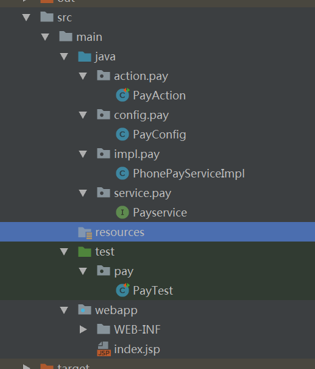
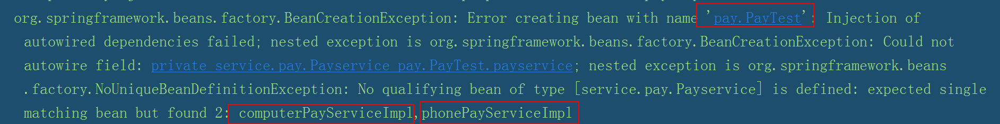
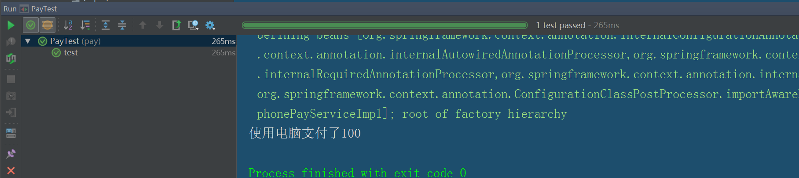
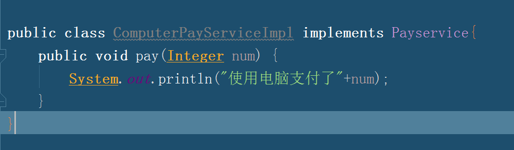
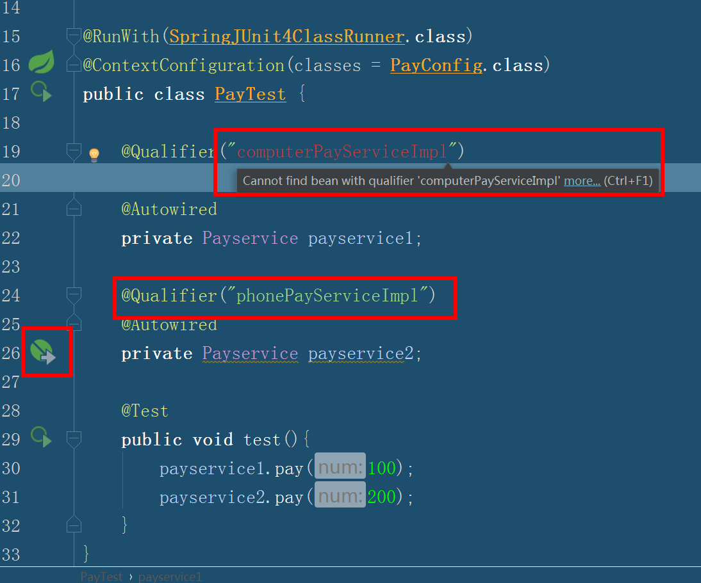
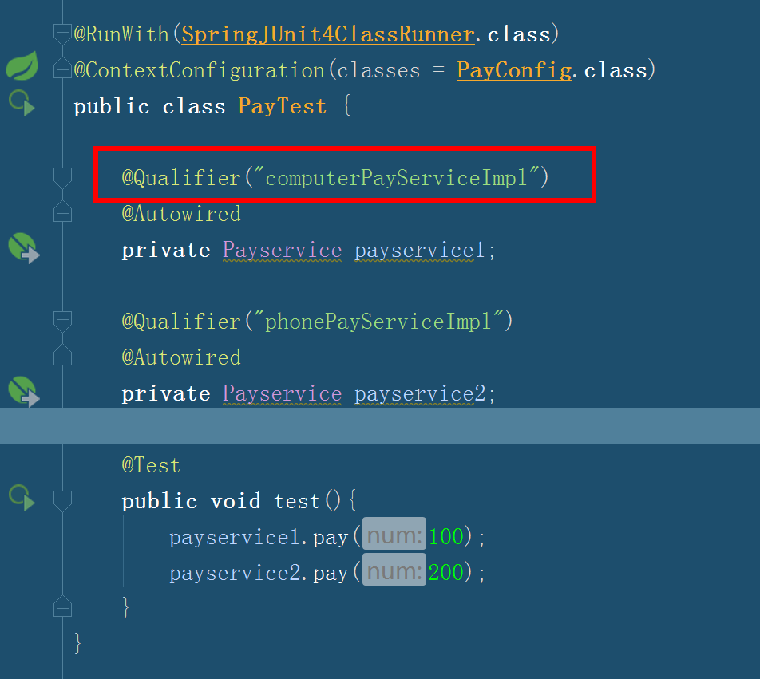

**Spring Context负责创建bean，又使用DI（依赖注入）满足bean之间的依赖。接下来我们谈如何使用。**

环境：

所需manven包
``` xml
<dependency>
  <groupId>junit</groupId>
  <artifactId>junit</artifactId>
  <version>4.10</version>
  <!-- <scope>test</scope> -->
</dependency>
<dependency>
  <groupId>org.springframework</groupId>
  <artifactId>spring-core</artifactId>
  <version>${spring.version}</version>
</dependency>

<dependency>
  <groupId>org.springframework</groupId>
  <artifactId>spring-test</artifactId>
  <version>${spring.version}</version>
</dependency>

```
使用的spring.version 是3.2.9

我们注意到junit 的下面有一个<scope>test</scope>，是什么意思呢。说明这个jar只会在你测试的resourse 下才会被使用，正常的代码区域是不会被引用的。所以，在做测试的情况下如果没有建立测试的resourse的话，需要把这个注掉。

# 使用注解形式：

之前我们一定接触过Spring，多数是用Spring xml的配置进行的。我们这次使用注解方式进行使用。

Spring从两个角度来实现自动化装配：

**组件扫描(component scanning)：Spring会自动发现应用上下文中所创建的bean。**

**自动装配(autowiring)：Spring自动满足bean之间的依赖。**

举个例子： 




如图所示，在java文件夹下建立action包逻辑处理，config 配置文件包，service接口包，以及impl实现类包。然后我们像做项目一样，需要一个支付的模块，分别建立一个pay子包。

先介绍几个spring用到的注解

**@Configuration:spring将这个类设置为config**

**@ComponentScan:这个注解在spring中启动扫描**

**@Component：使用这个注解，就可以使类能够让spring扫描到。**

先看我们的支付接口Payservice，它只有一个方法，就是支付。

``` java

package service.pay;

public interface Payservice {
    void pay(Integer num);
}
```
然后是我们的手机支付的实现类，继承Payservice接口

我们使用@Component使这个类在spring能够发现这个类，并进行创建bean。创建的bean会有名字，如果@Component不写的话，那么就是phonePayServiceImpl，如果写了的话创建的名字就是你写的那个@Component(value = "phonePayServiceImpl")。

``` java
package impl.pay;

import org.springframework.stereotype.Component;
import service.pay.Payservice;
@Component
public class PhonePayServiceImpl implements Payservice{
    public void pay(Integer num) {
        System.out.println("使用手机支付了"+num);
    }
}
```
来写我们的PayConig

@Configuration Spring在启动时会寻找这个注解，知道他是config类，然后再进行相关操作。

@ComponentScan：需要扫描的包，如果不写其他的话，它会扫描的读当前包下的所有文件。我们把PayConfig放在impl.pay下就可以了。如果你想像我一样，将配置类统一管理的话，那么就明确一下包路径。当然你也可以建立一个JavaConfig类，然后设置为它的总包路径impl就可以了。

``` java

package config.pay;

import org.springframework.context.annotation.ComponentScan;
import org.springframework.context.annotation.Configuration;

@Configuration
@ComponentScan(basePackages = "impl.pay")
public class PayConfig {

}
```
现在我们测试一下是否成功

@Autowired 我们完成以上的操作，spring已经发现了需要创建的bean，但是没有将需要创建的bean的其他对象进行装配，这时候使用@Autowired 就可以完成自动装配

``` java
package pay;

import config.pay.PayConfig;
import org.junit.Test;
import org.junit.runner.RunWith;
import org.springframework.beans.factory.annotation.Autowired;
import org.springframework.test.context.ContextConfiguration;
import org.springframework.test.context.junit4.SpringJUnit4ClassRunner;
import service.pay.Payservice;

@RunWith(SpringJUnit4ClassRunner.class)
@ContextConfiguration(classes = PayConfig.class)
public class PayTest {

    @Autowired
    private Payservice payservice;

    @Test
    public void test(){
        payservice.pay(100);
    }
}

```


运行成功。

## 一个接口多个实现类

问题，我们当一个接口有一个实现类的时候，装配成功了。就像之前说的，在PayTest中，我们只是调用了pay接口，它是使用电脑支付、手机支付我们都不知道，完成了解耦。但是如果两个实现类我们建立后，在PayTest会装配到底会装配哪一个实现类呢，我们做一下测试，新建一个实现类computerPayServiceImpl。
``` java
package impl.pay;

import org.springframework.stereotype.Component;
import service.pay.Payservice;

@Component(value = "computerPayServiceImpl")
public class ComputerPayServiceImpl implements Payservice{
    public void pay(Integer num) {
        System.out.println("使用电脑支付了"+num);
    }
}
```
我们再调用一次。




我们发现调用失败了，spring不知道到底该调哪一个。但是这种场景经常出现，我们该怎么办？

这个时候我们就只是单单使用@Autowired这个注解了，还应加入@Qualifier注解，并写上spring创建bean的名字。这样spring就知道应该加载哪个bean了。

``` java
package pay;

import config.pay.PayConfig;
import org.junit.Test;
import org.junit.runner.RunWith;
import org.springframework.beans.factory.annotation.Qualifier;
import org.springframework.test.context.ContextConfiguration;
import org.springframework.test.context.junit4.SpringJUnit4ClassRunner;
import service.pay.Payservice;


@RunWith(SpringJUnit4ClassRunner.class)
@ContextConfiguration(classes = PayConfig.class)
public class PayTest {


    @Autowired
	@Qualifier("computerPayServiceImpl")
    private Payservice payservice;

    @Test
    public void test(){
        payservice.pay(100);
    }
}
```



# 显示配置Bean之java代码

当我们有的时候无法为bean添加@component的方法，有时候这个类不是我们创建的，那么就无法使用自动装配的方式了，显而易见，spring就不会发现这个bean了，那么怎么办，spring有两个解决方式，分别是java显示配置和xml显示配置，现在先说一下使用java显示代码配置。

我们还是这个例子，然后把PhonePayServiceImpl实现类注掉，保证payservice先有一个实现类以便测试。然后将ComputerPayServiceImpl中的@component去掉，这样我们payconfig进行包扫描时，因为ComputerPayServiceImpl没有@component注解，那么spring就不会发现bean。我们测试一下。







测试结果为：

我们重点看到红线标记部分（如果你用的也是idea的话），可以看到要装配computerPayServiceImpl的payservice1提示无法找到这个bean，但是要装配phonePayServiceImpl却能，这就很说明问题了。

这个时候我们在javaConfig下显示的配置bean。

``` java 
package config.pay;

import impl.pay.ComputerPayServiceImpl;
import impl.pay.PhonePayServiceImpl;
import org.springframework.context.annotation.Bean;
import org.springframework.context.annotation.ComponentScan;
import org.springframework.context.annotation.Configuration;
import service.pay.Payservice;

@Configuration
@ComponentScan(basePackages = "impl.pay")

public class PayConfig {


    @Bean(name = "computerPayServiceImpl")
    public Payservice getComputerPayService (){
        return new ComputerPayServiceImpl();
    }

}
``` 

@bean注解：告诉spring这个方法将会返回一个对象，该对象要注册为Spring应用上下文的bean。方法体中包含了最终产生bean实例的逻辑。

默认情况下，bean的ID与带有@Bean注解的方法名是一样的，如下图的话，bean的名字就是getPayService。也可以使用@Bean的name属性指定。




我们也无用运行测试类，直接用idea观察，就会发现，computerPayServiceImpl不是醒目的红色而是绿色了，如果不是用idea，运行一下程序即可。


