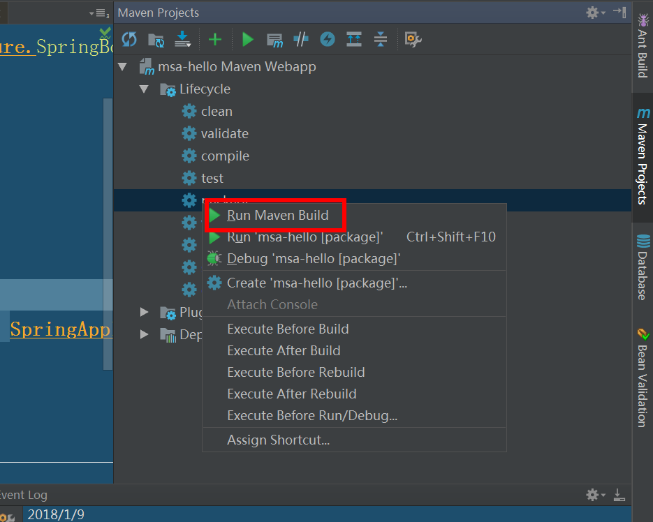
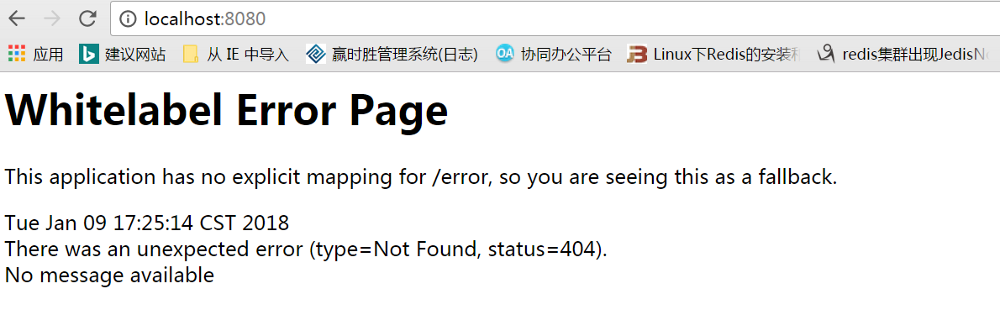
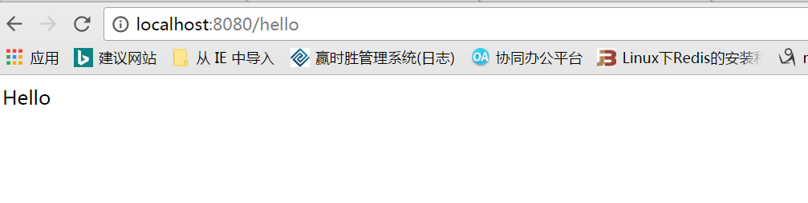

使用idea构建Maven项目 [idea-构建maven web项目](http://guojian.fun/2017/12/11/idea-%E6%9E%84%E5%BB%BAmaven-web%E9%A1%B9%E7%9B%AE/) 

# pom.xml

``` xml

<project xmlns="http://maven.apache.org/POM/4.0.0" xmlns:xsi="http://www.w3.org/2001/XMLSchema-instance"
  xsi:schemaLocation="http://maven.apache.org/POM/4.0.0 http://maven.apache.org/maven-v4_0_0.xsd">
  <modelVersion>4.0.0</modelVersion>
  <groupId>demo.msa</groupId>
  <artifactId>msa-hello</artifactId>
  <!-- 步骤5 -->
  <packaging>jar</packaging>
  <version>1.0-SNAPSHOT</version>
  <name>msa-hello Maven Webapp</name>
  <url>http://maven.apache.org</url>

  <!-- 步骤1 -->
  <parent>
    <groupId>org.springframework.boot</groupId>
    <artifactId>spring-boot-starter-parent</artifactId>
    <version>1.3.3.RELEASE</version>
  </parent>
  <dependencies>

    <!-- 步骤2 -->
    <dependency>
      <groupId>org.springframework.boot</groupId>
      <artifactId>spring-boot-starter-web</artifactId>
    </dependency>

    <!-- 步骤3 -->
    <dependency>
      <groupId>org.springframework.boot</groupId>
      <artifactId>spring-boot-starter-actuator</artifactId>
    </dependency>

    <dependency>
      <groupId>junit</groupId>
      <artifactId>junit</artifactId>
      <version>3.8.1</version>
      <scope>test</scope>
    </dependency>
  </dependencies>

  <build>
    <finalName>msa-hello</finalName>
    <plugins>
      <!-- 步骤4 -->
      <plugin>
        <groupId>org.springframework.boot</groupId>
        <artifactId>spring-boot-maven-plugin</artifactId>
      </plugin>
    </plugins>
  </build>
</project>

```

步骤1：这样设置后，应用才是SpringBoot应用，该配置会继承大量的SpringBoot插件，但是这些插件都未启动。
步骤2：spring boot集成了servlet容器，当我们在pom文件中增加spring-boot-starter-web的maven依赖时，不做任何web相关的配置便能提供web服务。
步骤3：提供大量的生产机特性。
步骤4：添加Maven插件。
步骤5：将maven打包成jar包。

# springBoot程序

``` java 

import org.springframework.boot.SpringApplication;
import org.springframework.boot.autoconfigure.SpringBootApplication;

/**
 * @author  guojian
 * 简单的一个SpringBoot实例
 */
@SpringBootApplication
public class HelloAppalication {

    public static void main(String[] args) {
        SpringApplication.run(HelloAppalication.class,args);
    }

}

```

** 在类中使用@SpringBootApplication注解，表示它是Spring Boot应用**
** 在main()方法中通过SpringApplication的run()方法去运行该类**

# 对外发布RESTAPI 

``` java

import org.springframework.web.bind.annotation.RequestMapping;
import org.springframework.web.bind.annotation.RequestMethod;
import org.springframework.web.bind.annotation.RestController;

/**
 * @author guojian
 * 一个简单的 控制层
 */
@RestController
public class HelloController {

    @RequestMapping(method = RequestMethod.GET,path = "/hello")
    public String hello(){
        return "Hello";
    }
}

```

我们发现其实控制层与之前区别并不是很大，只是将@Controller换成了@RestController，@RestController表示它具备发布REST API的能力，并且将每个REST API的返回值自动序列化JSON格式。

注意控制层需要与你使用@SpringBootApplication注解的类在同一包下，负责无法找到这个controller。如果有疑问，可以看一下我之前写的有关spring全注解开发。

# 运行SpringBoot应用程序

1、IDEA上直接运行

直接启动main函数就好了

2、打成jar包，使用java命令运行

首先将pom.xml中的步骤1改为jar包，然后在如图所示



运行过后会在项目的target目录下生成jar包，然后进入target目录下执行命令

java -jar msa-hello.jar

3、使用maven运行

mvn spring-boot:run

这就需要使用pom.xml中步骤4的插件了，如果你没有，那么就无法执行了


登录浏览器访问一下



这是因为我们找不到路径为空的方法，所以就返回的错误界面。如果出现这个界面说明我们的springBoot发布成功了。




给了指定的路径，我们可以访问到我们想要的内容了


