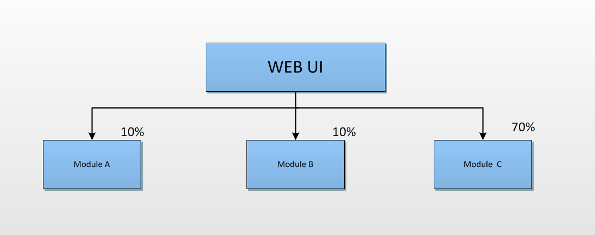

**有关微服务的相关知识我是看《轻量级微服务架构》这本书作为我的微服务启蒙老师。**

# 微服务解决哪些问题

1、传统的架构，是当服务端发出请求后，一个应用程序会有若干个模块组成，Module A,Module B,Module C
但是根据业务逻辑不同，C占用的系统资源比较高，运行一段时间，C就会成为整个系统的瓶颈。我们如何解决呢，就会使用分布式来将请求分流，来降低服务器的压力，使每个服务器的都能正常负载，叫做负载均衡。问题是得到了解决，但是相对于A，B来说，两个占用系统资源小，也同样因为C的原因进行了水平扩展，就会造成系统浪费。假设一下，一个互联网产品，每秒可能一个功能模块会被访问十多万次，水平扩展很有必要，项目中同样有一个模块只有管理员身份才能操作，而具有管理员权限的只有不到50人。那么管理员模块就没必要扩展这么多次，造成不必要的浪费。

2、越大的项目部署起来就需要越长的时间，加入你只改了一段代码，但是却要部署整个应用，部署效率太低。
3、将单个模块服务可能有更适合的语言，就可以使用，而不是想传统项目一样必须都使用java，造成技术选型单一。

# 微服务架构要求：
**1、根据业务模块划分服务类型。**
**2、每个服务可独立部署并且相互隔离。**
**3、通过轻量级API调用服务。**
**4、服务需保证良好的高可用性。**

我们需要根据业务的模块进行划分，就基金系统来说来书用户模块、产品模块、订单模块等。其中，每个模块都可以独立的部署，且相互隔离，每个服务可以独立的启动，不会依赖于其他服务。项目应该少耦合，但是不可能没有耦合，那样就是毫不相关的两个事，如果想根据用户id获取他之前所有的订单，就是耦合，我们应该通过HTTP或RPC的方式来调用，目的是为了降低调用所产生的性能开销。高可用性，就是每个服务都是分布式的，不可能只有一个，当这个服务无法响应时，可以调用没有发生故障的服务。

# 微服务的特点 

1、服务颗粒化
服务之间的颗粒度要尽可能的小，但是服务之间又不能有过多的依赖。

2、责任单一化
用户模块只负责用户相关的功能，做到"单一职责原则"。什么是"单一职责原则"，我们平常做项目的时候，会有User类，以及他的功能类来处理相关逻辑，为什么不把他们放在一起呢，就是因为"单一职责原则"，POJO类只负责管理属性，功能类只负责处理逻辑。

3、运行隔离化

每个服务相互隔离，互不影响。每个服务都运行在自己的进程中，一个进程内部资源是共享的，不同的进程资源是不共享的，一个服务出现了问题，不会影响到其他的服务。

4、管理自动化

随着业务越来越多，服务的数量越来越多，需要对服务提供自动化部署与监控预警的能力。

# 微服务技术选型

1、通过SpringBoot开发服务
2、使用Docker封装服务
3、使用Zookeeper注册服务
4、使用Node.js调用服务
5、使用Jenkins部署服务

