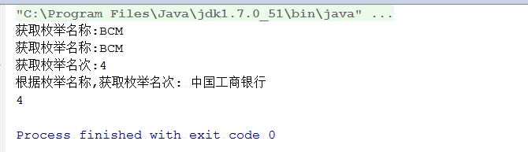

**在java开发中，在数据比较少，并且不容易改变的时候，枚举是一个非常好的当字段表的方式。相对与HashMap，它更加灵活，可以根据场景自定义方法，而且没有key、value的局限性，可以定义多个属性。**

以下是在实际应用中的实践。


``` java
public enum EmBankInfoType {                                                                             
    ICBC("001", " 中国工商银行", "工商银行"),                                                                      
    ABC("002", " 中国农业银行", "农业银行"),                                                                       
    BOC("003", " 中国银行", "中国银行"),                                                                         
    CCB("004", " 中国建设银行", "建设银行"),                                                                       
    BCM("005", " 交通银行", "交通银行"),                                                                         
    CMB("006", " 招商银行", "招商银行"),;                                                                        
    //银行编码                                                                                               
    private final String code;                                                                           
   
    //银行全称                                                                                               
    private final String bankFullName;                                                                   
	
    //银行名称                                                                                               
    private final String bankName;                                                                       
   
    private EmBankInfoType(String code, String bankFullName, String bankName) {                          
        this.code = code;                                                                                
        this.bankFullName = bankFullName;                                                                
        this.bankName = bankName;                                                                        
    }                                                                                                    
    
    public static EmBankInfoType of(final String code) {                                                 
        return of(code, false);                                                                          
    }                                                                                                    
   
    public static EmBankInfoType of(final String code, boolean acceptNull) {                             
        for (EmBankInfoType em : EmBankInfoType.values()) {                                              
            if (em.code.equals(code)) {                                                                  
                return em;                                                                               
            }                                                                                            
        }                                                                                                
        if (acceptNull) {                                                                                
            return null;                                                                                 
        }                                                                                                
        throw new RuntimeException("无法查找枚举值: " + EmBankInfoType.class.getSimpleName() + ", " + code);    
    }                                                                                                    
    
    public String getCode() {                                                                            
        return code;                                                                                     
    }                                                                                                    
   
    public String getBankFullName() {                                                                    
        return bankFullName;                                                                             
    }                                                                                                    
   
    public String getBankName() {                                                                        
        return bankName;                                                                                 
    }                                                                                                    
}
```
***枚举中有一个属性是ordinal,它是返回该枚举的位置(从0开始计算),实际上比较两个枚举是否相当EmBankInfoType.of("005").compareTo(EmBankInfoType.of("001")),也就是比较的ordinal.
如果我们想判断两个枚举类型是否相等,那么就使用System.out.println(EmBankInfoType.of("005").compareTo(EmBankInfoType.of("001")));原理就是判断两个枚举的位置是否相等***
``` java
public class EnumTest {
    public static void main(String[] args) {
       
        //自定义方法
        System.out.println("获取枚举名称:"+EmBankInfoType.of("005").name());
        System.out.println("获取枚举名称:"+EmBankInfoType.of("005").toString());
        System.out.println("获取枚举名次:"+EmBankInfoType.of("005").ordinal());
        
        System.out.println("根据枚举名称,获取枚举名次:"+EmBankInfoType.valueOf("ICBC").getBankFullName());
    
        System.out.println(EmBankInfoType.of("005").compareTo(EmBankInfoType.of("001")));
    }
}
```



