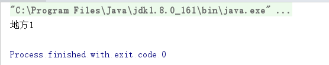

我们在正常编写代码的时候，经常会有复制对象的需求。我们会使用=进行赋值，但是没有人说过=可以复制，为什么呐。因为有个对象student，将student1=student，你再修改student里的属性place的时候，student1的place也会改变。那是因为这两个对象的在jvm中的指向是同一个，并没有新建对象，这样在代码处理上就会出现问题。

首先，看一下源码：

``` java 
 public class Object  {
  	protected native Object clone() throws CloneNotSupportedException;
 }
```
第一：Object类的clone()方法是一个native方法，native方法的效率一般来说都是远高于Java中的非native方法。这也解释了为什么要用Object中clone()方法而不是先new一个类，然后把原始对象中的信息复制到新对象中，虽然这也实现了clone功能。（JNI是Java Native Interface的 缩写。从Java 1.1开始，Java Native Interface (JNI)标准成为java平台的一部分，它允许Java代码和其他语言写的代码进行交互。JNI一开始是为了本地已编译语言，尤其是C和C++而设计的，但是它并不妨碍你使用其他语言，只要调用约定受支持就可以了。使用java与本地已编译的代码交互，通常会丧失平台可移植性。但是，有些情况下这样做是可以接受的，甚至是必须的，比如，使用一些旧的库，与硬件、操作系统进行交互，或者为了提高程序的性能。JNI标准至少保证本地代码能工作在任何Java 虚拟机实现下。）

第二：Object类中的 clone()方法被protected修饰符修饰。这也意味着如果要应用 clone()方 法，必须继承Object类，在 Java中所有的类是缺省继承 Object类的，也就不用关心这点了。然后重载 clone()方法。还有一点要考虑的是为了让其它类能调用这个 clone类的 clone()方法，重载之后要把 clone()方法的属性设置为 public。

第三：Object.clone()方法返回一个Object对象。我们必须进行强制类型转换才能得到我们需要的类型。

实现Cloneable接口 

首先，看一下源码：　　

public interface Cloneable { 
}
Cloneable接口仅仅是一个标志，而且这个标志也仅仅是针对 Object类中 clone()方法的，如果 clone 类没有实现 Cloneable 接口，并调用了 Object 的 clone() 方法（也就是调用了 super.Clone() 方法），那么Object 的 clone() 方法就会抛出 CloneNotSupportedException 异常。

什么是浅复制和深复制：
我们知道了复制的本质是克隆，那什么是浅复制和深复制呢？我们来举个例子。

``` java 
public class User implements Cloneable{
    
    private String name;
    
    private Place place;
    
    public User(String name, Place place){
        this.name=name;
        this.place=place;
    }
    
    public String getName() {
        return name;
    }
    public void setName(String name) {
        this.name = name;
    }
    public Place getPlace() {
        return place;
    }
    public void setPlace(Place place) {
        this.place = place;
    }
    
    @Override
    public User clone(){
        try {
            return (User)super.clone();
        } catch (CloneNotSupportedException e) {
            e.printStackTrace();
        }
        return null;
    };
}

```

我们来运行测试一下。

``` java 
public class Test {
    public static void main(String[] args)  {
        Place place=new Place();
        place.setPname("地方");
        User user=new User("test", place);
        User user1=user.clone();
        user1.getPlace().setPname("地方1");
        System.out.println(user.getPlace().getPname());
    }
}
```

我们的user，进行了克隆生成了user1，修改user1中Place对象中的pname属性。正常情况下，user中Place对象中的pname属性是不应该改变的，但是我们看一下运行结果却也改变了，变成了"地方"。这就是浅复制，object.clone()的方法其实就是浅复制，user对象本身确实是克隆出来的，但是里面的对象place对象还是之前的对象，并没有新建，所以就会出现这种情况。



其实重写clone()方法的时候，不一定只允许super.clone()。官网说，重写后的clone方法

X.clone()!=X;复制的对象不能与之前的对象相等。

X.clone().getClass()==X.getClass() 复制的对象必须和之前的对象类型相同。

我们要考虑到浅复制给我们带来的风险是什么，如果有风险，我们要不替换方案，要不使用深复制，如何使用深复制呢？

现在我有两个办法：

1、用序列化的方式，将对象序列化再反序列化，返回之后是深度复制

2、第二种用jackson将类转成josn格式，再转回来也可以进行深度复制。


