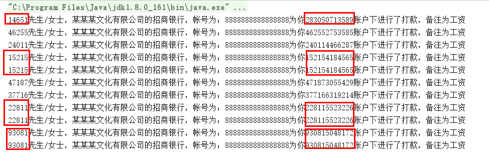
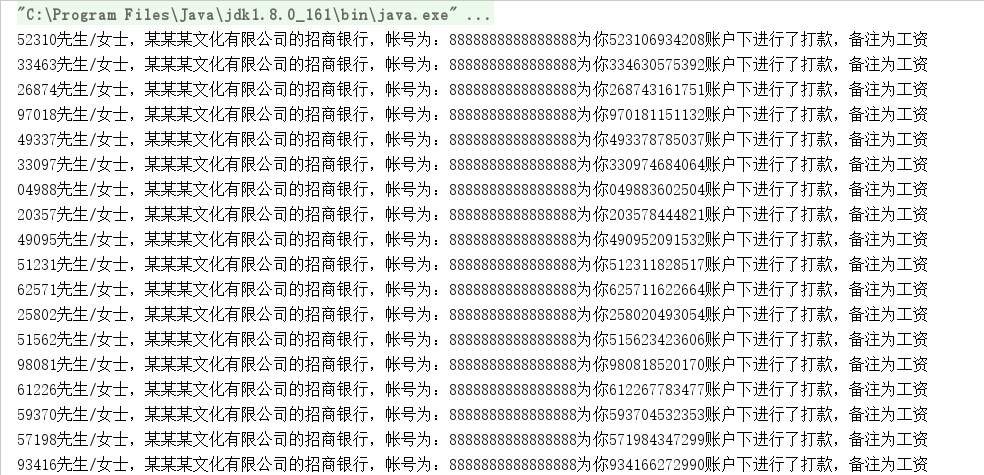

今天开始说一下原型模式，我们现在有一个系统，是一个工资提醒系统，如果发工资了，就给员工发送一条短信提醒一下，这样显得人性化么。有很多公司使用我们的系统。

今天是"某某某文化公司"发工资的日子，我们通常会有一个Company代表BO。

``` java 

public class Company {
    
    private String companyName="某某某文化有限公司";
    
    private String companyAccount="8888888888888888";
    
    private String companyBank="招商银行";
    
    public String getCompanyName() {
        return companyName;
    }
    
    public void setCompanyName(String companyName) {
        this.companyName = companyName;
    }
    
    public String getCompanyAccount() {
        return companyAccount;
    }
    
    public void setCompanyAccount(String companyAccount) {
        this.companyAccount = companyAccount;
    }
    
    public String getCompanyBank() {
        return companyBank;
    }
    
    public void setCompanyBank(String companyBank) {
        this.companyBank = companyBank;
    }
}

```

还有一个就是工资信息类，也就一个简单的pojo类。它包括发工资的公司名称、公司帐号
``` java 
public class SalaryMessage{
    
    public SalaryMessage(Company company){
        this.companyName=company.getCompanyName();
        this.companyAccount=company.getCompanyAccount();
        this.companyBank=company.getCompanyBank();
    }
    
    /**
     * 公司名称
      */
    private String companyName;
    /**
     * 公司帐号
     */
    private String companyAccount;
    /**
     * 所属银行
     */
    private String companyBank;
    
    /**
     * 用户名称
     */
    private String userName;
    
    /**
     * 用户帐号
     */
    private String  userAcount;
    
    
    public String getCompanyName() {
        return companyName;
    }
    
    public void setCompanyName(String companyName) {
        this.companyName = companyName;
    }
    
    public String getCompanyAccount() {
        return companyAccount;
    }
    
    public void setCompanyAccount(String companyAccount) {
        this.companyAccount = companyAccount;
    }
    
    public String getCompanyBank() {
        return companyBank;
    }
    
    public void setCompanyBank(String companyBank) {
        this.companyBank = companyBank;
    }
    
    public String getUserName() {
        return userName;
    }
    
    public void setUserName(String userName) {
        this.userName = userName;
    }
    
   
    
    public String getUserAcount() {
        return userAcount;
    }
    
    public void setUserAcount(String userAcount) {
        this.userAcount = userAcount;
    }
}
```
发工资的问题：
1、我们开始为员工们发工资，正常的员工信息是从数据库中取出来的，但是我们没有，只能随机造出来了。
2、而且由于我们发送短息的系统老旧，而且员工人数很多，单线程是无法满足需求的，只能使用多线程。
3.为了更好的观察，我们客户的名称就是银行卡号的前5位，也可以将客户名称当作客户在公司里的编码。

我们先建立负责发短信的线程类。

``` java 

public class SendThread implements  Runnable{
    private SalaryMessage salaryMessage;
    
    public SendThread(SalaryMessage salaryMessage){
        this.salaryMessage=salaryMessage;
    }
    @Override
    public void run() {
        sendMessage(this.salaryMessage);
    }
    
    public  void sendMessage(SalaryMessage salaryMessage){
        StringBuilder stringBuilder=new StringBuilder();
        stringBuilder.append(salaryMessage.getUserName()).append("先生/女士，").append(salaryMessage.getCompanyName()).append("的").append(salaryMessage.getCompanyBank()).append("，帐号为：")
                .append(salaryMessage.getCompanyAccount()).append("为你").append(salaryMessage.getUserAcount()).append("账户下进行了打款，备注为工资");
        System.out.println(stringBuilder);
    }
}

```

我们再进行客户端的实现。
``` java 
public class Client{
    
    private static int MAX_COUNT = 100;
    
    public static void main(String[] args) {
        SalaryMessage salaryMessage = new SalaryMessage(new Company());
        for (int i=0;i<MAX_COUNT;i++){
            String account=getRandAcount(12);
            String userName=account.substring(0,5);
            salaryMessage.setUserAcount(account);
            salaryMessage.setUserName(userName);
            Thread t1=new Thread(new SendThread(salaryMessage));
            t1.start();
        }
        
    }
    
    //获得指定长度的随机字符串
    public static String getRandAcount(int maxLength){
        String source=null;
        source ="1234567890";
        StringBuffer sb = new StringBuffer();
        Random rand = new Random();
        for(int i=0;i<maxLength;i++){
            sb.append(source.charAt(rand.nextInt(source.length())));
        }
        return sb.toString();
    }
    
   
}

```

我们使用运行一下这段代码，看看结果是什么样的。



我们看一下代码，正确的方式是名称和卡号的前五位是对应的。因为是多线程，每个线程多会对salaryMessage进行修改，使对象的值进行变化。我们为了使线程之前相互不影响，只能new多个salaryMessage对象时传入Company信息。因为salaryMessage对象中的信息在这次业务处理中是不变的，我可不可以不用每次都传入重复的Company对象呢？答案是可以，这时候就使用了原型模式。

我们修改一下我们的SalaryMessage类，使它继承Cloneable接口,并且重写clone()方法。

``` java 

public class SalaryMessage implements  Cloneable{
    
    public SalaryMessage(Company company){
        this.companyName=company.getCompanyName();
        this.companyAccount=company.getCompanyAccount();
        this.companyBank=company.getCompanyBank();
    }
    
    /**
     * 公司名称
      */
    private String companyName;
    /**
     * 公司帐号
     */
    private String companyAccount;
    /**
     * 所属银行
     */
    private String companyBank;
    
    /**
     * 用户名称
     */
    private String userName;
    
    /**
     * 用户帐号
     */
    private String  userAcount;
    
    
    public String getCompanyName() {
        return companyName;
    }
    
    public void setCompanyName(String companyName) {
        this.companyName = companyName;
    }
    
    public String getCompanyAccount() {
        return companyAccount;
    }
    
    public void setCompanyAccount(String companyAccount) {
        this.companyAccount = companyAccount;
    }
    
    public String getCompanyBank() {
        return companyBank;
    }
    
    public void setCompanyBank(String companyBank) {
        this.companyBank = companyBank;
    }
    
    public String getUserName() {
        return userName;
    }
    
    public void setUserName(String userName) {
        this.userName = userName;
    }
    
   
    
    public String getUserAcount() {
        return userAcount;
    }
    
    public void setUserAcount(String userAcount) {
        this.userAcount = userAcount;
    }


    @Override
    public SalaryMessage clone(){
        SalaryMessage salaryMessage =null;
        try {
            salaryMessage = (SalaryMessage)super.clone();
        } catch (CloneNotSupportedException e) {
            e.printStackTrace();
        }
        return salaryMessage;
    }
    
}

```

再修改一下我们的客户端


``` java 
public class Client{
    
    private static int MAX_COUNT = 100;
    
    public static void main(String[] args) {
        SalaryMessage salaryMessage = new SalaryMessage(new Company());
        for (int i=0;i<MAX_COUNT;i++){
            SalaryMessage cloneSalaryMessage=salaryMessage.clone();
            String account=getRandAcount(12);
            String userName=account.substring(0,5);
            cloneSalaryMessage.setUserAcount(account);
            cloneSalaryMessage.setUserName(userName);
            Thread t1=new Thread(new SendThread(cloneSalaryMessage));
            t1.start();
        }
        
    }
    
    //获得指定长度的随机字符串
    public static String getRandAcount(int maxLength){
        String source=null;
        source ="1234567890";
        StringBuffer sb = new StringBuffer();
        Random rand = new Random();
        for(int i=0;i<maxLength;i++){
            sb.append(source.charAt(rand.nextInt(source.length())));
        }
        return sb.toString();
    }
    
   
}
```



注意：salaryMessage = (SalaryMessage)super.clone();Object.clone()这个方法实现的是浅复制哦，在使用的时候一定要注意深复制和浅复制。之前写过类似的文章。


原型模式的优点

● 性能优良

原型模式是在内存二进制流的拷贝，要比直接new一个对象性能好很多，特别是要在一
个循环体内产生大量的对象时，原型模式可以更好地体现其优点。

● 逃避构造函数的约束

这既是它的优点也是缺点，直接在内存中拷贝，构造函数是不会执行的。优点就是减少了约束，缺点也是减少了约束，需要大家在实际应用时考虑。

原型模式的使用场景

● 资源优化场景
类初始化需要消化非常多的资源，这个资源包括数据、硬件资源等。

● 性能和安全要求的场景
通过new产生一个对象需要非常繁琐的数据准备或访问权限，则可以使用原型模式。

● 一个对象多个修改者的场景
一个对象需要提供给其他对象访问，而且各个调用者可能都需要修改其值时，可以考虑
使用原型模式拷贝多个对象供调用者使用。


