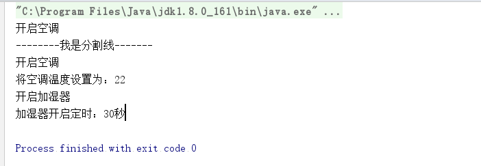

我们现在处于物联网时代了，许多东西都可以在手机上进行操控。

空调

``` java 
public class AirConditioner {
    
    public void  turnOn(){
        System.out.println("开启空调");
    }
    
    public void setTemperature(int temperature){
        System.out.println("将空调温度设置为："+temperature);
    }
    
    public void  turnOff(){
        System.out.println("关闭空调");
    }
    
}

```

加湿器

``` java 

public class Humidifier {
    
    public void  work(){
        System.out.println("开启加湿器");
    }
    
    public void setTiming(int time){
        System.out.println("加湿器开启定时："+time+"分");
    }
    
    public void  turnOff(){
        System.out.println("关闭热水器");
    }
    
}

```

有时我们想用遥控器一样，进行远程控制。比如，还没到家的时候，家里太热，我想把空调打开，空气太干，我想将加湿器打开，并且我还不想让房间空气太潮湿，设置定时启动30分钟。这一个夏天，我每天都会这么做，我并不想一步一步地做出来，我想用一个命令解决所有问题。同时，当我离家的时候我想将空调和加湿器关掉，同样也是一个按钮解决，这样就可以避免少关掉一个等问题。

这个时候，我们将我们的需求设置成一个一个的命令，就像遥控器的按钮一样，点击就会执行。我们设计出了我们的命令类，他来负责发布我们的命令，定义我们的家用电器加湿器、空调，供子类使用。顶一个抽象方法execute()，由子类实现。


``` java 
public abstract class Command {
    
    protected AirConditioner airConditioner=new AirConditioner();
    
    protected Humidifier humidifier=new Humidifier();
    
    public abstract void execute();

}
```

Invoker相当于遥控器，负责执行工作，setCommand()负责接收我们的工作，action()负责执行工作。

``` java 
public class Invoker {
    
    private Command command;
    
    public void setCommand(Command command){
        this.command=command;
    }
    
    //执行客户的命令
    public void action(){
        this.command.execute();
    }
    
}
```

我们首先来一个简单的命令，就是单纯的打开空调。

``` java 
public class AirConditionerOpen extends Command{
    
	@Override
    public void execute() {
       super.airConditioner.turnOn();
    }
}
```

我们设置一个命令为"回家"，这个命令可以将空调打开，温度设置为22度，将加湿器打开，并且定时运行30分钟。

``` java 
public class BackHome  extends  Command{
    @Override
    public void execute() {
        super.airConditioner.turnOn();
        super.airConditioner.setTemperature(22);
        super.humidifier.work();
        super.humidifier.setTiming(30);
    }
    
}
```

我们运行一下

``` java 
public class Client {
    public static void main(String[] args) {
        Invoker invoker=new Invoker();
        Command airConditionerOpen= new AirConditionerOpen() ;
        invoker.setCommand(airConditionerOpen);
        invoker.action();
        System.out.println("--------我是分割线-------");
        Command backHome=new BackHome();
        invoker.setCommand(backHome);
        invoker.action();
    }
}
```



● Receive接收者角色

该角色就是干活的角色，命令传递到这里是应该被执行的，具体到例子就是我们的空调和加湿器。

● Command命令角色

需要执行的所有命令都在这里声明。

● Invoker调用者角色

接收到命令，并执行命令。在例子中，遥控器就是这个角色。


