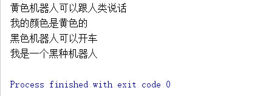
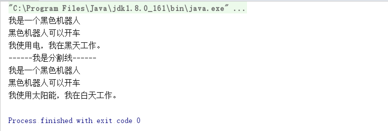

  现在在看《设计模式之禅(第二版)》，想让自己对设计模式有着更深入的理解。


# 工厂模式 #

  现在人工智能越来越火爆，为了我们的生活中会出现很多机器人。假设以后机器人将根据颜色进行分类，每个机器人我们都有颜色以及他的工作。

接口Robot是对所有机器人的总称。

``` java 
public interface Robot {
    
    public void  getColor();
    
    public void  work();
    
}
```

我们来定义一下黑色机器人，黄色机器人。

``` java 
public class BlackRobot implements Robot {
    
	@Override
    public void getColor() {
        System.out.println("我的颜色是黑色的");
    }
    
    @Override
    public void work() {
        System.out.println("黑色机器人可以开车");
    }
    
}
```

``` java 

public class YellowRobot implements Robot {
    
    @Override
    public void getColor() {
        System.out.println("我的颜色是黄色的");
    }
    
    @Override
    public void work() {
        System.out.println("黄色机器人可以跟人类说话");
    }
}
```

我们现在使用抽象类AbstractRobotFactory定义一下工厂的整体功能。一个工厂可以建造这些机器人，建造黑色机器人的时候，我们应该只说要建造黑色机器人就可以了，而不是说“要建造一个颜色为黑色，可以开车的”黑色机器人。我们发现工厂生产机器人的方法输入参数类型应该是
Robot接口的实现类(也就是BlackRobot、YellowRobot)。


``` java 

public abstract class AbstractRobotFactory {
    public abstract  <T extends Robot> T createRobot(Class<T> c);
}

```

注意，我们在这里采用了泛型（Generic），通过定义泛型对createHuman的输入参数产生两层限制：
● 必须是Class类型；
● 必须是Human的实现类。

我们现在有一个工厂，让他实现创造机器人的接口。

``` java 
public class RobotFactory extends  AbstractRobotFactory {
    
    @Override
    public <T extends Robot> T createRobot(Class<T> c) {
        Robot robot=null;
        try {
            robot= (Robot) Class.forName(c.getName()).newInstance();
        } catch (Exception e) {
            e.printStackTrace();
        }
        return (T) robot;
    }
    
}
```

工厂建立好了，我们来用工厂来造机器人吧。

``` java 

public class Test {
    public static void main(String[] args) {
       RobotFactory humanFactory=new RobotFactory();
       Robot yellowMan=humanFactory.createRobot(YellowRobot.class);
       yellowMan.work();
       yellowMan.getColor();
       
       BlackRobot blackMan=humanFactory.createRobot(BlackRobot.class);
       blackMan.work();
       blackMan.getColor();
       
    }
}

```

让我们来看一下生成的机器人。




# 简单/静态工厂模式 #

我们之前用到了抽象类，是因为我们可能有多个工厂，使用一个抽象工厂类对工厂进行约束，如果原则上我们不考虑有多个工厂，只会有一个工厂的话，就不需要使用抽象类了。并且将在方法前面加上static静态标识。

``` java

public class RobotFactory {
    public static  <T extends Robot> T createHuman(Class<T> c) {
        Robot robot=null;
        try {
            robot= (T) Class.forName(c.getName()).newInstance();
        } catch (Exception e) {
            e.printStackTrace();
        }
        return (T) robot;
    }
}

```

``` java 
public class Test {
    public static void main(String[] args) {
        Robot yellowRobot= RobotFactory.createHuman(YellowRobot.class);
        yellowRobot.getColor();
        yellowRobot.work();
    
        Robot blacdRobot= RobotFactory.createHuman(BlackRobot.class);
        blacdRobot.getColor();
        blacdRobot.work();
    }
}

```

这种模式是工厂模式的弱化，调用者进行调用的时候简单，所以叫做简单工厂模式，也叫做静态工厂模式。


# 抽象工厂模式 #

我们高高兴兴的做完了之前的机器人，突然又有需求了，现在提倡新能源，而且太阳能转化率变高了，我们需要设定机器人分为白天工作和晚上工作，白天工作的供电为太阳能，晚上的需要用使用供电的。我们只能从之前的机器人上继续改造，因为推翻实在是太费资源了。

首先，每个几个机器人都需要分太阳能和电能源的，我们在接口里面增加工作时间的接口doTime()。

``` java
public interface Robot {
    
    public void  getColor();
    
    public void  work();
    
    public void  doTime();
    
}
```

因为现在黑色的机器人需要分为太阳能、电两种能源，但是他们的getColor()和work()还是一样的，所以我们将BlackRobot改造成抽象类。

``` java
public abstract class AbstractBlackRobot implements Robot{
    
    @Override
    public void getColor() {
        System.out.println("我是一个黑色机器人");
    }
    @Override
    public void work() {
        System.out.println("黑色机器人可以开车");
    }
    @Override
    public abstract void doTime();
    
}

```

我们现在创造太阳能的黑色机器人、黄色机器人，用电的黑色机器人、黄色机器人。（黄色机器人根据黑色机器人自己创造吧。。）

太阳能黑色机器人

``` java

public class SunBlackRobot  extends  AbstractBlackRobot{
    @Override
    public void doTime() {
        System.out.println("我使用太阳能，我在白天工作。");
    }
}
```

充电黑色机器人

```java 

public class CellBlackRobot extends AbstractBlackRobot{
    
    
    @Override
    public void doTime() {
        System.out.println("我使用电，我在黑天工作。");
    }
}

```

我们现在来做黑色机器人的工厂,同理创造黄色机器人工厂。

```java

public class BlackRobotFactory {
    
    public Robot createSunBlockRobot(){
        return new SunBlackRobot();
    }
    public Robot createCellBlackRobot(){
        return new CellBlackRobot();
    }
}

```

我们来使用黑色机器人工厂来创造黑色机器人吧。

``` java 

public class Test {
    public static void main(String[] args) {
        BlackRobotFactory blackRobotFactory=new BlackRobotFactory();
        Robot cellBlackRobot= blackRobotFactory.createCellBlackRobot();
    
        cellBlackRobot.getColor();
        cellBlackRobot.work();
        cellBlackRobot.doTime();
    
        System.out.println("------我是分割线------");
        Robot sunBlockRobot=blackRobotFactory.createSunBlockRobot();
    
        sunBlockRobot.getColor();
        sunBlockRobot.work();
        sunBlockRobot.doTime();
    }
}

```


使用场景：

1.我们系统有ios，linux，windows系统都有txt查看器，图片查看器，但是他们每个txt查看器，图片查看器的实现都不一样，这时候就需要调用不同的工厂来实现。你选择了ios的工厂，就会有自己的txt查看器和图片查看器。
2.每个产品，如太阳能黑色机器人、充电黑色机器人有相同的方法，有的方法实现是一样的，又有一些方法实现是不同的，这样使用抽象工厂模式很有效。


抽象工厂的优缺点：
优点：封装性，每个产品的实现类不是高层模块要关心的，我们只要知道工厂类就可以建造出一个需要的对象，省时省力。


