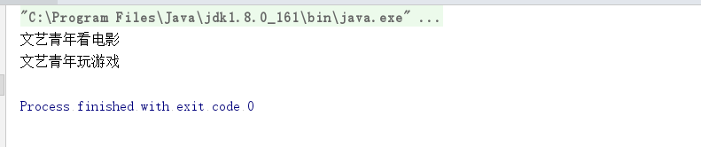
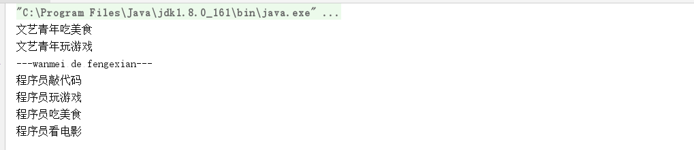
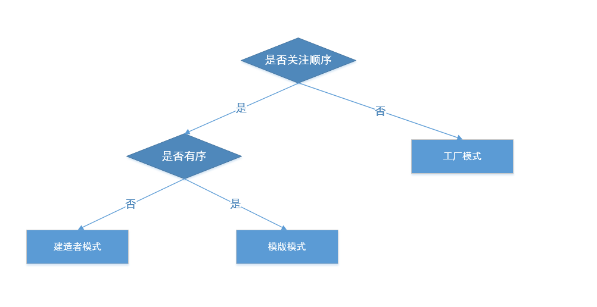

之前我们在做模版模式的时候，关键词就是每个子类都有相同的实现并且顺序一致，这样我们可以提取到父类上，并使用final防止子类复写。

现在我们的周末有很多选择，可以去看电影、吃大餐、玩游戏，当然还有我最喜欢地去加班。我们可以把所有事情都干了，也可以干其中的几个，你可以先看电影，然后吃大餐，再去玩游戏；也可以玩游戏、看电影；或者像我一样，只选择加班。它们之间没有必然的联系，也无顺序可言。我们来设计我们的抽象类,我们使用一个list里面代表我们需要干什么。


``` java 

public abstract class AbstractPerson {
    
   private List<String> sequence=new ArrayList<String>();
    /**
     * 看电影
     */
    protected abstract void watchMovie();
    
    /**
     * 吃大餐
     */
    protected abstract void eatDeliciousFood();
    
    /**
     * 玩游戏
     */
    protected abstract void playGame();
    
    /**
     * 去工作
     */
    protected abstract void goWork();
    
	/**
     * 周末做事
     */
    protected void  doThing(){
        for (String str :sequence){
            if (str.equals("watchMovie")){
                this.watchMovie();
            }
            if (str.equals("eatDeliciousFood")){
                this.eatDeliciousFood();
            }
            if (str.equals("playGame")){
                this.playGame();
            }
            if (str.equals("goWork")){
                this.goWork();
            }
        }
    }
    
   
	final void setSequence(List<String> list){
        this.sequence=list;
    }
    
}

```

我们通常会有一类人，叫做文艺青年，他们干什么都很文艺。还有那就是程序员，他们干什么都没女朋友..

``` java 

public class ArtisticPerson  extends AbstractPerson {
    
    @Override
    protected void watchMovie() {
        System.out.println("文艺青年看电影");
    }
    
    @Override
    protected void eatDeliciousFood() {
        System.out.println("文艺青年吃美食");
    }
    
    @Override
    protected void playGame() {
        System.out.println("文艺青年玩游戏");
    }
    
    @Override
    protected void goWork() {
        System.out.println("文艺青年去工作");
    }
    
}

```

``` java 
public class ProgrammerPerson extends AbstractPerson {
    @Override
    protected void watchMovie() {
        System.out.println("程序员看电影");
    }
    
    @Override
    protected void eatDeliciousFood() {
        System.out.println("程序员吃美食");
    }
    
    @Override
    protected void playGame() {
        System.out.println("程序员玩游戏");
    }
    
    @Override
    protected void goWork() {
        System.out.println("程序员敲代码");
    }
}
```

这个周末我们的文艺青年，去看电影和玩游戏。

``` java 

public class Test {
    public static void main(String[] args) {
        AbstractPerson artisticPerson=new ArtisticPerson();
        List<String> list =new ArrayList<String>();
        list.add("watchMovie");
        list.add("playGame");
        artisticPerson.setSequence(list);
        artisticPerson.doThing();
    }
}

```




现在我们应该改进一下，我们需要一个建造者，我们只要告诉他我们是什么人，我需要的顺序是什么，就可以进行这一天的活动了。做法跟之前工厂模式的factory极其相似，只不过我们在还需要传入一个顺序的参数，并且设置到我们的Sequence里面。

``` java 
public class PersonBuilder {
    
    public <T extends AbstractPerson> T createPerson(Class<T> c,List<String> list){
        AbstractPerson abstractPerson=null;
        try {
            abstractPerson= (AbstractPerson) Class.forName(c.getName()).newInstance();
        } catch (Exception e) {
            e.printStackTrace();
        }
        abstractPerson.setSequence(list);
        return (T) abstractPerson;
    };

}
```

同时，我们应该对干什么的排序进行规范，我们新建一个Director类来保存我们的顺序。

``` java 

public class Director {
    
    /**
     *  方法1:1.吃美食,2.玩游戏
     */
    public static List<String> method1(){
        List<String> list=new ArrayList<>();
        list.add("eatDeliciousFood");
        list.add("playGame");
        return list;
    }
    
    
    /**
     *  方法2:1.去工作,2.玩游戏,3.吃大餐,4.看电影
     */
    public static List<String> method2(){
        List<String> list=new ArrayList<>();
        list.add("goWork");
        list.add("playGame");
        list.add("eatDeliciousFood");
        list.add("watchMovie");
        return list;
    }

}

```

我们来再来试一试吧，建造一个文艺青年来吃美食、玩游戏，再建造一个程序员来工作、玩游戏、吃大餐、看电影。

``` java 
public class Client {
    public static void main(String[] args) {
        PersonBuilder personBuilder=new PersonBuilder();
        AbstractPerson artisticPerson=personBuilder.createPerson(ArtisticPerson.class,Director.method1());
        artisticPerson.doThing();
        System.out.println("---wanmei de fengexian---");
        AbstractPerson programmerPerson=personBuilder.createPerson(ProgrammerPerson.class,Director.method2());
        programmerPerson.doThing();
    }
}

```


使用场景：
● 相同的方法，不同的执行顺序，产生不同的事件结果时，可以采用建造者模式。
● 多个部件或零件，都可以装配到一个对象中，但是产生的运行结果又不相同时，则可
以使用该模式。
● 产品类非常复杂，或者产品类中的调用顺序不同产生了不同的效能，这个时候使用建
造者模式非常合适。

区别：
建造者模式最主要的功能是基本方法的调用顺序安排，也就是这些基本方法已经实现了，通俗地说就是零件的装配，顺序不同产生
的对象也不同；而工厂方法则重点是创建，创建零件是它的主要职责，组装顺序则不是它关心的。建造者和模版模式，区别就是掌管顺序的方法一个是无序的，一个是有序的。




