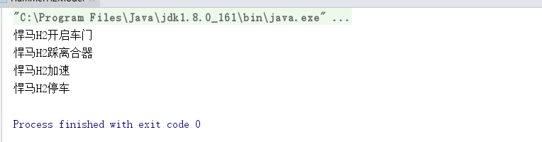
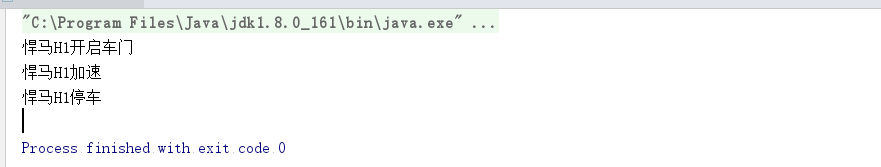
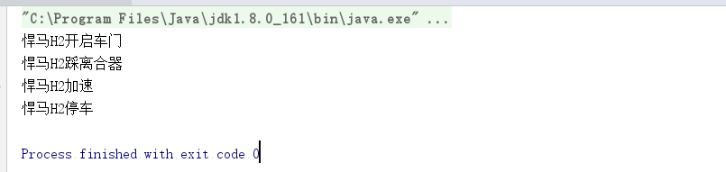

在这之前我学习了单例模式和工厂模式，现在开始接触模版模式。场景：现在我们建立一个汽车悍马汽车模型，它旗下有很多车型，每个车都得启动，踩离合，加速，刹车等动作,我们开车的动作，启动、踩离合、加速、刹车这样的顺序进行启动的。

我们来建立悍马的抽象类来定义悍马车的动作。

``` java
public abstract class HummerModel {
    
	/**
     * 汽车启动
     */
    protected abstract void start();
    
	/**
     * 踩离合
     */
    protected abstract void stepClutch();
    
	/**
     * 停车
     */
    protected abstract void accelerate();
   
	 /**
     * 加速
     */
    protected abstract void stop();
    
    public abstract void run();
}

```

我们来创造悍马H1和悍马H2两个车型

``` java 
public class HummerH1Model extends  HummerModel {
    @Override
    protected void start() {
        System.out.println("悍马H1开启车门");
    }
    
    @Override
    protected void stepClutch() {
        System.out.println("悍马H1踩离合器");
    }
    
    @Override
    protected void accelerate(){
        System.out.println("悍马H1加速");
    
    };
    
    
    @Override
    protected void stop() {
        System.out.println("悍马H1停车");
    }
    
    @Override
    public void run() {
        start();
        stepClutch();
        accelerate();
        stop();
    }
}

```

```
public class HummerH2Model extends  HummerModel {
    @Override
    protected void start() {
        System.out.println("悍马H2开启车门");
    }
    
    @Override
    protected void stepClutch() {
        System.out.println("悍马H2踩离合器");
    }
    
    @Override
    protected void accelerate(){
        System.out.println("悍马H2加速");
        
    };
    
    @Override
    protected void stop() {
        System.out.println("悍马H2停车");
    }
    
    @Override
    public void run() {
        start();
        stepClutch();
        accelerate();
        stop();
    }
}

```

我们发现，这个是常识，不管有多少个模型，开车的顺序必须是一样的，必须是启动、踩离合，加速、停止这样的顺序，每个run()都会方法都是一样的。我们每次为了减少错误，都会复制run()方法，即使我们很不情愿。有什么办法能解决这个场景吗？有，那就是模版模式，我们改造一下抽象类。

``` java 
public abstract class HummerModel {
    
    /**
     * 汽车启动
     */
    protected abstract void start();
    
    /**
     * 踩离合
     */
    protected abstract void stepClutch();
    
    
    /**
     * 停车
     */
    protected abstract void accelerate();
    
    
    /**
     * 加速
     */
    protected abstract void stop();
    
 
    public final void run(){
        start();
       	stepClutch();
        accelerate();
        stop();
    };
    
}

```


我们run()方法里面的顺序一样，将run()方法提到抽象类中进行实现，这样每个类继承就可以不用每个模型都重新写一样的过程了。加上final表示不可让子类覆盖？为什么，加入H2悄悄的覆盖了父类的方法，那么H2模型生产出来的全是故障车啦！！！

我们运行一下，看看结果是否有变化。

``` java 
 public static void main(String[] args) {
    HummerModel hummerModel=  new HummerH2Model();
    hummerModel.run();
 }
```



后来我们发现一个问题，汽车出现自动档汽车了！！虽然自动档汽车的顺序是不变的，依旧是启动，加速，停止，但是自动档的汽车是不需要踩离合的，那怎么办，我们的设置是必须踩离合啊！！！我们只好再次修改一下我们的抽象类了，让它可以根据场景判断是否踩离合。

我们首先加一个变量，来表示是否有离合器，默认是有离合器的。

``` java 
private Boolean hasClutch=true;
```

写一个方法，设置汽车没有离合器。

``` java 
protected void hasNoClutch(){
     this.hasClutch=false;
  }
```
改写一下我们的run()方法，有离合器的时候我们才使用，没有的时候我们不使用离合器。

``` java 
public final void run(){
     start();
     if (this.hasClutch){
         stepClutch();
     }
     accelerate();
     stop();
};
```

假设H1模型就是自动挡（没有离合器）,H2模型是手动档（有离合器）。

``` java 
 public static void main(String[] args) {
      HummerModel hummerModel=  new HummerH1Model();
      hummerModel.hasNoClutch();
      hummerModel.run();
    }
```




``` java 
public static void main(String[] args) {
        HummerModel hummerModel=  new HummerH2Model();
        hummerModel.run();
    }
```



总结：
使用场景：
模板方法模式确实非常简单，仅仅使用了Java的继承机制，但它是一个应用非常广泛的模式。其中，AbstractClass叫做抽象模板，它的方法分为两类：
● 基本方法
基本方法也叫做基本操作，是由子类实现的方法，并且在模板方法被调用。
● 模板方法
可以有一个或几个，一般是一个具体方法，也就是一个框架，实现对基本方法的调度，完成固定的逻辑。

注意：为了防止恶意的操作，一般模板方法都加上final关键字，不允许被覆写。

优点：
● 封装不变部分，扩展可变部分
把认为是不变部分的算法封装到父类实现，而可变部分的则可以通过继承来继续扩展。
在悍马模型例子中，是不是就非常容易扩展？例如增加一个H3型号的悍马模型，很容易呀，增加一个子类，实现父类的基本方法就可以了。
● 提取公共部分代码，便于维护
我们例子中刚刚走过的弯路就是最好的证明，如果我们不抽取到父类中，任由这种散乱的代码发生，想想后果是什么样子？维护人员为了修正一个缺陷，需要到处查找类似的代码！


