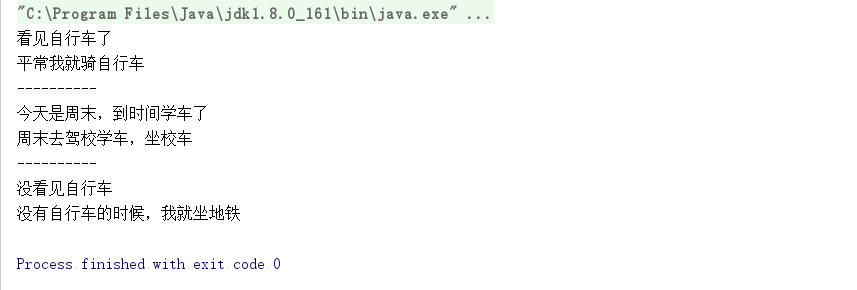

现在的生活中我们有很多种交通工具可以选择，就拿我来说，离单位比较进，所以上班的时候选择使用共享单车，但是共享单车你是知道的，周围可能会没有，这时候只能选择去坐地铁。现在周末正在学车，得去驾校，驾校的校车非常方便，我就会选择做校车。这种选择就是一种策略。

首先我们定义策略的接口，就一个方法operate();

``` java
public interface IStrategy {
    public void operate();
}
```

``` java 
public class Mobike implements IStrategy{
    @Override
    public void operate() {
        System.out.println("平常我就骑自行车");
    }
}
```

``` java 

public class SchoolBus implements IStrategy{
    @Override
    public void operate() {
        System.out.println("周末去驾校学车，坐校车");
    }
}
```

``` java 
public class Subway implements IStrategy{
    @Override
    public void operate() {
        System.out.println("没有自行车的时候，我就坐地铁");
    }
    
}
```

我们需要一个类来装我们的策略，就是context，方便我们来使用。

``` java 
public class Context {
    private IStrategy strategy;
    
    public Context(IStrategy strategy){
        this.strategy=strategy;
    }
    
    public void operate(){
        this.strategy.operate();
    }
    
}
```

``` java 
public class Client {
    
    public static void main(String[] args) {
        Context context;
        System.out.println("看见自行车了");
        context=new Context(new Mobike());
        context.operate();
        System.out.println("----------");
        
        System.out.println("今天是周末，到时间学车了");
        context=new Context(new SchoolBus());
        context.operate();
        System.out.println("----------");
    
        System.out.println("没看见自行车");
        context=new Context(new Subway());
        context.operate();
        
    }
    
}

```




策略模式使用的就是面向对象的继承和多态机制，非常容易理解和掌握，我们再来看看策略模式的三个角色：
● Context封装角色
它也叫做上下文角色，起承上启下封装作用，屏蔽高层模块对策略、算法的直接访问，封装可能存在的变化。
● Strategy抽象策略角色
策略、算法家族的抽象，通常为接口，定义每个策略或算法必须具有的方法和属性。
● ConcreteStrategy具体策略角色
实现抽象策略中的操作，该类含有具体的算法。